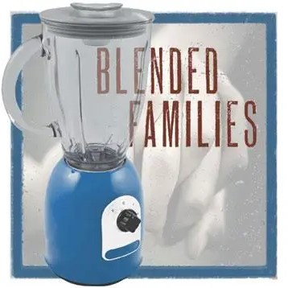

# Managing Blended Families

In the "Where's the Lemonade" podcast, blending families is explored with a delightful twist, akin to creating a
smoothie with different ingredients. Darren & Paige joyfully share anecdotes about navigating the mix of personalities, 
like finding the right balance of fruits and nuts (We have both in our family) in a blender. Listeners are treated to a 
refreshing take on the challenges and triumphs of merging households, making it a flavorful journey full of laughter and love.

