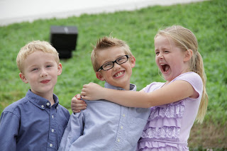
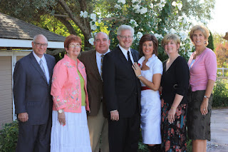
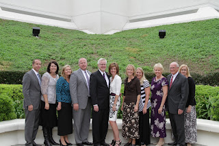





---

<html><head></head><body>
<figure data-trix-attachment="{&quot;contentType&quot;:&quot;image&quot;,&quot;height&quot;:213,&quot;url&quot;:&quot;https://4.bp.blogspot.com/-_e2NFStE1uQ/XKA-Jjo5SmI/AAAAAAAEybI/UVySI7gctnc7PUxJuUhpUxuzPsrBzPi0QCLcBGAs/s320/IMG_0079.JPG&quot;,&quot;width&quot;:320}" data-trix-content-type="image" data-trix-attributes="{&quot;caption&quot;:&quot;The Three Amigos - 2012&quot;}" class="attachment attachment--preview"><figcaption class="attachment__caption attachment__caption--edited">The Three Amigos - 2012</figcaption></figure> It can be really difficult blending families, imagine what is like to blend with 10 siblings. Blending includes not just your kids it includes your siblings and parents as well. In this episode, we look at the pitfalls and the success of joining a big family that already has a history with your spouse's former spouse.

<strong> Joining the extended family </strong> 
<ul><li>Being accepted in the family can be difficult or easy depending on the family.</li><li>Your spouse has a history with their siblings and parents. You will now become part of that history.</li><li>Family dynamics are different in each family.</li><li>You have to find where you fit in the family.</li></ul>
<strong> Being Dropped into family relationships </strong> 
<ul><li>Consider the size of the family. Darren’s family has 6 siblings, Paige’s has 4 siblings.</li><li>The sibling placement makes a difference as well. Darren was in the middle, Paige was the baby by 6 years.<ul><li>Darren’s younger siblings remember his first wife when they were young teenagers. They grew up knowing her. 20 years of history.</li><li>Paige’s siblings were already grown and some had kids of their own when Paige first got married.</li></ul></li><li>Siblings and parents are concerned.<ul><li>Families looking up social media, Google search, and people finder, etc</li><li>Darren’s sister had been divorced for some time and had been dating for many years and was concerned. She told him to make sure he found someone that was financially secure, had strong/similar morals and did not need to be emotionally rescued. Paige had 1 1/2 out of 3 ;) Everyone needs to rescued to some extent after divorce.</li><li>Siblings can be very protective of you and your kids. They don’t want to see you hurt again.</li></ul></li><li>Replacing your spouse’s ex in their family (You cannot replace them,&nbsp; you are an addition)<ul><li>When asked about the transition, Darren's siblings said it was difficult because they knew and liked her.</li><li>One of the sisters-in-law mentioned she knew Darren’s ex for 20 years, vacationed together, were pregnant together, experienced several things together. She said she likes Paige just as much as Darren’s Ex. We all had a good laugh about that when we saw Paige's reaction.&nbsp;</li><li>Hard sometimes to hear siblings talking together about family trips or events that you have not been part of.</li></ul></li></ul>
<strong> What we learned from our experiences </strong> 
<ul><li>Be patient you need to build new memories with the new siblings.</li><li>Be okay with people bringing up memories of your spouse ’s ex. This is part of your spouse’s history and you will hear stories about vacations they had with the family and fun times together etc. This is something you have to just swallow your pride and try and enjoy hearing about your spouse's former life.</li><li>If possible, meet the family one-on-one. With large families, it can be overwhelming to meet everyone at once and be thrown directly into the mix. Meeting one sibling at a time can be more manageable.</li><li>It takes an effort to build relationships with your spouse's siblings. Take time to make opportunities to build memories.</li></ul>
 

 

<strong> Funny Moment of the Week </strong> 

 Paige tries to scare the kids after watching America's Got Talent with the "Scared Riana".

 

<figure data-trix-attachment="{&quot;contentType&quot;:&quot;image&quot;,&quot;height&quot;:213,&quot;url&quot;:&quot;https://1.bp.blogspot.com/-Mqhol4vUQZI/XKA-KKrqLsI/AAAAAAAEybM/tScIYIXcj7QNw1fO_aCIJpesgVIE9ZUlgCLcBGAs/s320/IMG_1052.jpg&quot;,&quot;width&quot;:320}" data-trix-content-type="image" data-trix-attributes="{&quot;caption&quot;:&quot;Darren &amp; Paige and her siblings&quot;}" class="attachment attachment--preview"><figcaption class="attachment__caption attachment__caption--edited">Darren &amp; Paige and her siblings</figcaption></figure>

 

<figure data-trix-attachment="{&quot;contentType&quot;:&quot;image&quot;,&quot;height&quot;:213,&quot;url&quot;:&quot;https://3.bp.blogspot.com/-pbnDDVRqHHc/XKA-JsLru3I/AAAAAAAEybE/9lluc4ZZ14AbBArDz8ZHig_ye3uqDlApQCLcBGAs/s320/IMG_0024.jpg&quot;,&quot;width&quot;:320}" data-trix-content-type="image" data-trix-attributes="{&quot;caption&quot;:&quot;Darren &amp; Paige and his siblings&quot;}" class="attachment attachment--preview"><figcaption class="attachment__caption attachment__caption--edited">Darren &amp; Paige and his siblings</figcaption></figure>

 

  

<strong>
  <a href="https://www.patreon.com/wheresthelemonade" target="_donate" rel="payment" title="★ Support this podcast on Patreon ★">★ Support this podcast on Patreon ★</a>
</strong></body></html>

 Podcast Transcript 

