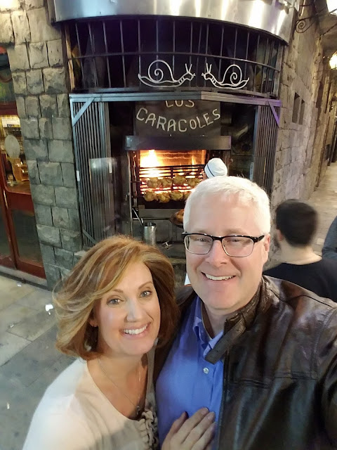





---

<html><head></head><body>
<figure data-trix-attachment="{&quot;contentType&quot;:&quot;image&quot;,&quot;height&quot;:640,&quot;url&quot;:&quot;https://3.bp.blogspot.com/-RouwHhwSrpQ/XNDdA5u9-YI/AAAAAAAE_ZA/V0VM7KK5AwA3LiWH1NpMXsw8ReeblAXnQCEwYBhgL/s640/20161019_213729.jpg&quot;,&quot;width&quot;:480}" data-trix-content-type="image" class="attachment attachment--preview"><figcaption class="attachment__caption"></figcaption></figure>

 

Every marriage includes different times when you have to compromise. In a blended family, there are even more opportunities to practice your compromising skills. In this episode, we explore different kinds of compromise and how best to work through the hard decisions you have to make.

<strong> Blended Family Compromises </strong> 
<ul><li>Small things<ul><li>Whose pots and pans to keep</li><li>Storage Bins</li><li>Socks in the sock basket</li><li>Soda at Dinner at a restaurant</li></ul></li><li>Where to live</li><li>Work</li><li>Schools to go to</li><li>Church</li><li>Sports&nbsp;</li><li>Bedroom</li></ul>
<strong> Why Compromise (Win-Win, Win-Lose, and Lose-Lose) </strong> 
<ul><li>You have to.</li><li>You can't both get exactly what you want you will have to give and take.</li><li>Some people are saying don't compromise because if you compromise then neither person is happy.</li><li>Some have come up with different names for the same thing. Solution, Deal, etc..</li><li>Examples of compromise<ul><li>Win-Win</li><li>Win-Lose</li><li>Lose-Lose&nbsp;</li></ul></li></ul>
<strong> Making Compromises Tips </strong> 
<ul><li>Communicate Your Needs Clearly</li><li>Listen (Without Interrupting)</li><li>Carefully weight Your Options</li><li>Put Yourself in Your Partner's shoes (Get in the Trenches)</li><li>Consider What is Fair</li><li>Make a Decision and Stick With It</li><li>Check-In with One Another</li></ul>
<strong> Funny Moment of the Week </strong>Darren leaves his suit in a hotel mimicking David's mistake from the Heritage trip.<strong>&nbsp; </strong> 

 

  

<strong>
  <a href="https://www.patreon.com/wheresthelemonade" target="_donate" rel="payment" title="★ Support this podcast on Patreon ★">★ Support this podcast on Patreon ★</a>
</strong></body></html>

 Podcast Transcript 

