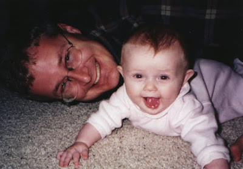





---

<html><head></head><body>

 

 

<figure data-trix-attachment="{&quot;contentType&quot;:&quot;image&quot;,&quot;height&quot;:278,&quot;url&quot;:&quot;https://3.bp.blogspot.com/-JTAKnM3pnEk/XNt_aI_41rI/AAAAAAAE_ic/15uYjrjlBPIbYwUaExrahPSHGAIFZlUewCLcBGAs/s400/Scan0003.jpg&quot;,&quot;width&quot;:400}" data-trix-content-type="image" class="attachment attachment--preview"><figcaption class="attachment__caption"></figcaption></figure>

 

 

 

Your history has a profound effect on who you are. When you are in a second marriage that includes your relationship with your previous spouse. Sometimes learning about your spouse's previous relationships can be difficult, but we have found over the years that it has given us a better understanding of each other, where we have come from and what has shaped and molded each of us.

<strong> Why your previous life is important </strong> 
<ul><li>The experiences that you have had made you who you are.</li><li>Understanding your spouse's previous experiences is important to understand them, their triggers, and why they do what they do.</li><li>Don't say previous life, previous marriage. Might be sensitive to your kids</li><li>The kids' life and who they are is made up of the experiences with their parents. You cannot erase them.&nbsp;</li><li>Remember when you try to erase or talk bad about your ex-spouse you are trying to erase part of your child. This can be very isolating and damaging to your relationship with your child.</li></ul>
<strong> Fitting in and Accepting your new spot </strong> 
<ul><li>Accepting your spouse's previous life.</li><li>Finding out how you fit into the traditions that have been established.</li><li>Inside Jokes</li><li>Games that are a family tradition<ul><li>Monopoly</li><li>Spoons</li><li>Nerts</li></ul></li><li>Stories of vacations,&nbsp; funny stories, sad stories</li><li>Pictures looking at old pictures of when the kids where younger with your ex-spouse.&nbsp;<ul><li>When the kids where born</li><li>The first day at school, other special events</li><li>The homes that you lived in.</li></ul></li><li>Put on your big girl panties and do what is best for your kids.</li></ul>
<strong> Celebrating&nbsp; </strong> 
<ul><li>Put up pictures of your previous life so the kids can see. They are not all over the house but the kids can see that we have not erased their childhood</li><li>Kids have pictures in their rooms of their parents.</li><li>Adopting places that you eat and restaurants<ul><li>Sushi for Darren's kids</li><li>Lincoln Chinese for Paige's Kids</li></ul></li><li>Traditions in General</li><li>Ask your spouse about their Ex and what it was like to live with them.</li><li>Talk openly and freely without getting offended if your spouses want to know or don't want to know.</li><li>Be cognizant if your reminiscing is bothering your spouse. Don't spend too much time on this. Over time this should be easier to talk about it.</li></ul>
<strong> Funny Moment of the Week.</strong>

Alexa interrupting family prayer. Very hard to finish prayer without laughing.

  

<strong>
  <a href="https://www.patreon.com/wheresthelemonade" target="_donate" rel="payment" title="★ Support this podcast on Patreon ★">★ Support this podcast on Patreon ★</a>
</strong></body></html>

 Podcast Transcript 

