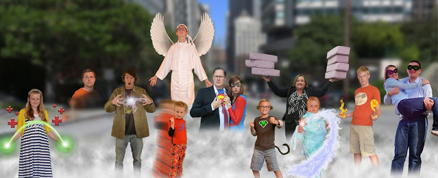
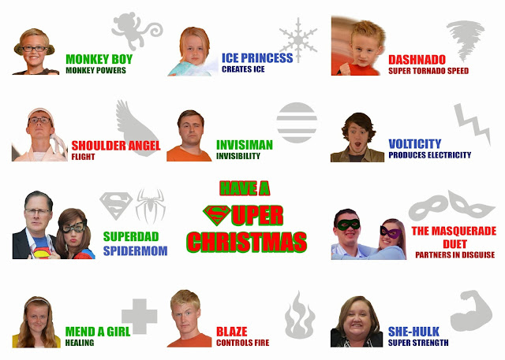





---

<html><head></head><body>
  

<figure data-trix-attachment="{&quot;contentType&quot;:&quot;image&quot;,&quot;height&quot;:260,&quot;url&quot;:&quot;https://3.bp.blogspot.com/-5ifY6Zxu-Fw/XOI0k7wRW0I/AAAAAAAE_tc/wnfTtwJN960EhuMoUrSbvvtMV4u-rsVHgCLcBGAs/s640/ChristmasPicture.png&quot;,&quot;width&quot;:639}" data-trix-content-type="image" data-trix-attributes="{&quot;caption&quot;:&quot;Christmas Card 2013&quot;}" class="attachment attachment--preview"><figcaption class="attachment__caption attachment__caption--edited">Christmas Card 2013</figcaption></figure>

 

 

&nbsp;

<strong> Treat each kid uniquely </strong> 
<ul><li>Lunches. Darren made everyone the same thing. Paige asked the kids what they liked.</li><li>You need to find out what they like and don't like.</li><li>Sometimes a mall food court is the best option to take the family out.</li><li>Give kids the opportunity to choose dinner.</li><li>Discipline is different for each kid.&nbsp;<ul><li>The rules are the same but our reaction and discipline are different for each kid.</li><li>The goal is to help the individual kid and keep some peace and tranquility in the house.</li></ul></li></ul>
<strong> Go One-on-One</strong>
<ul><li>Sam gets a lot of one on one time.</li><li>The other kids not as much. We want all of the kids together.<ul><li>We have had opportunities to be one one one. (Field Trips, trip to the grocery store, etc..)</li><li>Date night with their kids</li><li>Individual spontaneous time is just as good as a fully planned out activity.</li></ul></li><li>12-year-old trip with Dad.</li><li>Individual trip when kids are adults - We try and make the opportunity when we can.</li><li>Cook dinner with one of the kids on Thursday nights.</li><li>Watch a show together.</li><li>How do you teach to share when you want your kids to be individuals in a blended family.</li></ul>
<strong> Be a Team</strong>
<ul><li>Make sure that each member knows that they are part of a team.<ul><li>Individualism is important but not at the cost of the family.</li><li>Kids can be so unique or individualized that they do not see themselves as part of the family.</li></ul></li><li>Examples on being a team<ul><li>Cleaning the kitchen, the back yard, clean out the car.</li></ul></li><li>Everyone has a unique role that they play. Make sure they feel like they are part of a team and not just an individual.</li><li>Sometimes it is too bad that the kids don't like doing something. They are part of the family.<ul><li>The kids might be resentful at first but in the end, they are grateful.</li></ul></li></ul>
<strong> Don't Play Favorites</strong>
<ul><li>We joke about this a lot.<ul><li>Every day, our favorite changes depending on what they are bringing to the family.</li></ul></li><li>Family gifts or souvenirs from travels. The kids notice who is getting what.<ul><li>Equity and uniqueness are key.</li><li>Make sure you don't just peanut butter everyone with the same thing.</li><li>Most meaningful is individualized.&nbsp;</li><li>Christmas ornaments. (Grandma's give the same, parents try to be unique)</li></ul></li><li>Funny moment of the Week</li></ul>
Madeline trying to mimic one of the acts on America's got Talent (Courtney Hadwin). Nothing like your 14-year-old daughter trying to sing a classic rock song she has never heard.

 

<strong> Links </strong> 
<ul><li><a href="https://www.google.com/url?q=http://refreshedmag.com/4-ways-to-make-every-kid-in-a-large-family-feel-special/%23.XN8J_FNlCdM&amp;sa=D&amp;source=hangouts&amp;ust=1558207378707000&amp;usg=AFQjCNHQFUTG-pFNTdqnSyP0aMLRHMbXdA">http://refreshedmag.com/4-ways-to-make-every-kid-in-a-large-family-feel-special/</a></li><li><a href="https://www.google.com/url?q=https://www.parents.com/parenting/better-parenting/advice/6-small-ways-to-make-each-of-your-kids-feel-special/&amp;sa=D&amp;source=hangouts&amp;ust=1558207445790000&amp;usg=AFQjCNFx_Jnp8qLBRzE6rWQXNnh3EVNo7w">https://www.parents.com/parenting/better-parenting/advice/6-small-ways-to-make-each-of-your-kids-feel-special/</a></li></ul>
<figure data-trix-attachment="{&quot;contentType&quot;:&quot;image&quot;,&quot;height&quot;:457,&quot;url&quot;:&quot;https://2.bp.blogspot.com/-9SVUBZMulMo/XN8U3s-DmNI/AAAAAAAE_pU/LNjEM-7oBr8_PEBOTovfTkN4aQ7CZJQ4wCEwYBhgL/s640/back%2Bof%2Bcard%2B%25281%2529.jpg&quot;,&quot;width&quot;:640}" data-trix-content-type="image" class="attachment attachment--preview"><figcaption class="attachment__caption"></figcaption></figure>

  

<strong>
  <a href="https://www.patreon.com/wheresthelemonade" target="_donate" rel="payment" title="★ Support this podcast on Patreon ★">★ Support this podcast on Patreon ★</a>
</strong></body></html>

 Podcast Transcript 

