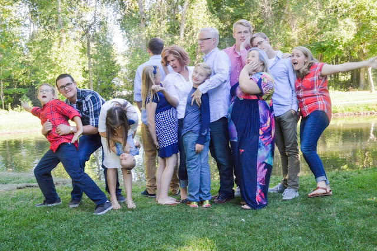





---

<html><head></head><body>
<a href="https://1.bp.blogspot.com/-1RV-sXPCIV8/XRLbFx__5nI/AAAAAAAFA0k/cHjZIc2qaFA5ZDFj4-6BWrwd7ZU44kHRwCLcBGAs/s1600/family2016-all.jpg"> </a><figure data-trix-attachment="{&quot;contentType&quot;:&quot;image&quot;,&quot;height&quot;:426,&quot;url&quot;:&quot;https://1.bp.blogspot.com/-1RV-sXPCIV8/XRLbFx__5nI/AAAAAAAFA0k/cHjZIc2qaFA5ZDFj4-6BWrwd7ZU44kHRwCLcBGAs/s640/family2016-all.jpg&quot;,&quot;width&quot;:640}" data-trix-content-type="image" class="attachment attachment--preview"><figcaption class="attachment__caption"></figcaption></figure>

 

How do you discipline children in a blended family? How do you combine your two styles? How do you teach children across multiple households? There are many techniques and opinions on this subject. Now you get to hear our perspective on how we learned how to navigate this treacherous part of blending families.&nbsp;

<strong> What is Discipline </strong> 
<ul><li>Quick Definition – Discipline = Rules + Consequences</li><li>Discipline is different than punishment</li><li>Punishment vs Consequences</li><li>Realize Discipline will be different for the kids in their different homes</li><li>Blending families means blending discipline</li></ul>
<strong> Blending Families (Combining two different discipline styles) </strong> 
<ul><li>Nacho Kids – Not your kids you cannot discipline</li><li>Bio Parent vs Step Parent</li><li>Same rules different punishments (Consequences)</li><li>Different rules in the same house. Rules for my kids are different than your kids</li><li>Realize that when combining families, discipline will be different at first. You need to come together.</li></ul>
<strong> Two Households Two Disciplines (Rules and Consequences) </strong> 
<ul><li>Inconsistency between homes</li><li>Punishments that span the different homes</li><li>Different rules in different homes</li></ul>
<strong> Discipline Tips (What worked &amp; What didn't) </strong> 
<ul><li>Consistency is key</li><li>Don’t threaten with outrageous consequences</li><li>“Wait until your dad comes home”</li><li>“You have 5 seconds to improve” Counting Down, Counting Up</li><li>Kind, firm and consistent</li></ul>
<strong> Funny Moment of the week </strong> 

Our best friends down the street send their daughter on a humanitarian trip to Peru and ended up eating Guinea Pig. She has Guinea Pigs as pets at home.&nbsp;

 

  

<strong>
  <a href="https://www.patreon.com/wheresthelemonade" target="_donate" rel="payment" title="★ Support this podcast on Patreon ★">★ Support this podcast on Patreon ★</a>
</strong></body></html>

 Podcast Transcript 

