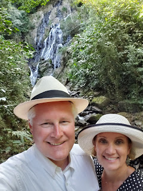
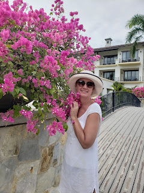
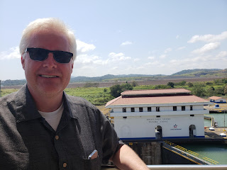
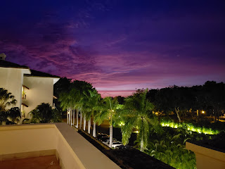





---

<html><head></head><body>
 <figure data-trix-attachment="{&quot;contentType&quot;:&quot;image&quot;,&quot;height&quot;:320,&quot;url&quot;:&quot;https://1.bp.blogspot.com/-WtM8nXOwq-U/XHRA6u2w2RI/AAAAAAAExx8/AF5qpyr_P_g9W34_edkeJDnx6aV6xl2KACKgBGAs/s320/20190127_152753.jpg&quot;,&quot;width&quot;:240}" data-trix-content-type="image" data-trix-attributes="{&quot;caption&quot;:&quot;Anton Valley Panama&quot;}" class="attachment attachment--preview"><figcaption class="attachment__caption attachment__caption--edited">Anton Valley Panama</figcaption></figure>  <strong>Why we go on trips?</strong>
<ul><li>Your life does not start alone, you are dropped off in the middle of a bunch of stuff!</li><li>There is no beginning with just the two of you.</li><li>Important to disconnect from everyone and everything.</li><li>Second Marriages don’t have a real honeymoon time.&nbsp;</li><li>Things we have learned about spending time together alone.<ul><li>Understanding what helps the other person relax (Paige read a book, Darren Program)</li><li>Finding out what we enjoy together</li><li>Finding out what annoys the other</li></ul></li></ul>
<strong> Trip Highlights</strong>
<ul><li>Panama, why? It was warm and we have not been there yet and not too expensive.</li><li>Riding horses on the beach.</li><li>We stayed in Rio Hato Buenaventura. Marriott Plug.</li><li>We went to Anton Valley, ate at an incredible restaurant in Casa de Lourdes.</li><li>Darren got a speeding ticket. Not his first in a foreign country.</li><li>Came up with the idea of doing a podcast</li><li>We spend time (not too much) talking about our future long term and short term.<ul><li>Where we want to live?</li><li>Family Reunions</li></ul></li><li>Falling in love all over again. Focused attention on each other and nothing else.<ul><li>The most important relationship is our relationship.</li><li>The kids feel and notice how much we are in love.</li></ul></li></ul>
<strong> Funny Moment</strong>
<ul><li>On this last trip, Darren was told he can go on the old person elevator at the Panama Canal.</li></ul>
<figure data-trix-attachment="{&quot;contentType&quot;:&quot;image&quot;,&quot;height&quot;:320,&quot;url&quot;:&quot;https://1.bp.blogspot.com/-6NlBPc3KUHA/XHRAvp8PnsI/AAAAAAAExx4/xy81JQAEAHITFT7vFnICIz7kO3qW8UNagCKgBGAs/s320/20190128_163123.jpg&quot;,&quot;width&quot;:240}" data-trix-content-type="image" data-trix-attributes="{&quot;caption&quot;:&quot;Beautiful Flowers and a Beautiful Lady&quot;}" class="attachment attachment--preview"><figcaption class="attachment__caption attachment__caption--edited">Beautiful Flowers and a Beautiful Lady</figcaption></figure>  

 

<figure data-trix-attachment="{&quot;contentType&quot;:&quot;image&quot;,&quot;height&quot;:240,&quot;url&quot;:&quot;https://4.bp.blogspot.com/-nTuTUpnjuY0/XHRBZ171d3I/AAAAAAAExyE/azH7HSX1mkYRDrOWmDyWJGh8w-IfvqyJgCKgBGAs/s320/20190129_130501.jpg&quot;,&quot;width&quot;:320}" data-trix-content-type="image" data-trix-attributes="{&quot;caption&quot;:&quot;Miraflores Panama Canal&quot;}" class="attachment attachment--preview"><figcaption class="attachment__caption attachment__caption--edited">Miraflores Panama Canal</figcaption></figure>

 

<figure data-trix-attachment="{&quot;contentType&quot;:&quot;image&quot;,&quot;height&quot;:240,&quot;url&quot;:&quot;https://2.bp.blogspot.com/-0OY5X-3WbuU/XHRBZ0so71I/AAAAAAAExyE/X03ufZ2j4E83viGgX8AtGXYPy9RU8KtrACKgBGAs/s320/20190128_190128.jpg&quot;,&quot;width&quot;:320}" data-trix-content-type="image" data-trix-attributes="{&quot;caption&quot;:&quot;Buenaventura Rio Hato Panama Sunset&quot;}" class="attachment attachment--preview"><figcaption class="attachment__caption attachment__caption--edited">Buenaventura Rio Hato Panama Sunset</figcaption></figure>  

 

 

  

<strong>
  <a href="https://www.patreon.com/wheresthelemonade" target="_donate" rel="payment" title="★ Support this podcast on Patreon ★">★ Support this podcast on Patreon ★</a>
</strong></body></html>

 Podcast Transcript 

1

This is Darren and this is Page,and this is where's the lemonadewhere we try and figure outwhat to do with those lemonsthat are thrown at us or thrown at us.

Makes them lemonade, maybe.

I guess it depends on the week for sure.

This weekwe're talking about spending time alone.

My favorite kind of time. Yeah.

Together. Yeah, that's important.

Together?

Yeah.

Recently we took a trip to Panama alone.

We did. It was great.

Well, alone together. Alone together? Yes.

It was fabulous.

So we we learned early on in our marriagethat we want toalways take the opportunityto be together alone without kids. Yes.

Very important.

I mean, super importantwhen we have ten kids,even if we only had two kids, though,it would still be important to.

Absolutely.

And we've had the luxuryof being able to take tripsboth near and far together. Yes.

And this last one in Panama Citywas really important for us.

We needed a break and we almost didn't go.

We did. It was kind of a last minute trip.

Yeah, like three weeks went and it wasit was like, hey, we've got this one weekthat we can do this.

Let's do it. Yeah.

And we literally crammed itin to, in betweenone of our daughtershaving a baby and work and Yeah, yeah.

But it was well worth it.

And we learned early on in our marriageat this time that we got to spend alonewas extremely important.

Yes. Because when you arein a second marriage, there is no justthe two of us starting out like you arewhen you know your first marriageand you get to start that honeymoon phase.

And there really isn't a honeymoon phasefor second marriages, when you say.

Yeah,

I would agree. In fact, it's interesting.

I watch young couplesand they get to grow up together.

Yeah.

And they get to learn from each other.

And we don't have that.

We are already somewhat grown.

Somewhat. Yes, very somewhat grown.

I'll just leave it at that. Exactly.

And so we have to learn about each otherand there's still more growingthat we get to do together. Right.

Which is really wonderful, I think.

Yeah. Yeah. And so that's why these tripsare really important.

And it's important for to disconnectfrom everyone and everything.

And we're really good at. Oh, yes, we are.

Yeah. In fact, we don't call the kids. No.

And we've gotten better over the years.

When we first used to go,we did call the kidsand check in and no,we don't do that anymore.

No, we go out.

They're a little bit older now.

They are.

They are.

But but also, I think it's importantthat we get to pretendlike we have no responsibilitiesfor a week.

We do.

We pretend that there's no kids,no exes, no bills.

You know,we always have to come back to reality.

In fact, I remember one of our tripsspecifically, we were driving backfrom San Francisco back to

Folsom,wherewe live, and it's about a two hour drive.

And the closer and closerwe got to home, the more quiet you became.

Yes, I feel the weight,you know, gaining on my shouldersas we start to head back home,as we get closer and closer,the burn and you kind of getting grumpyto what mean?

Yeah.

And I was like, I don't knowif I want to go on these trips.

If I come back with a grumpy wife.

It's hard when you I mean, especiallysince we have such an amazing timewhen we're on these trips togetherbecause we're such good vacationers.

We really are.

We should write a bookabout how to vacation, honey.

Yes, we should.

But it is when wewhen we're heading backto our responsibilities,which I love our life and I love our homeand I love our reality,but it's still a lot of responsibilitiesthat we have with work and kids.

And we started thinking about everything.

Yes, very little overwhelmingthinking of my to do list when,you know, for a week on our trips,the only to do list is to relaxand to have fun, maybe shower every oncein a while if we can squeeze it out.

Yeah.

Put some clothes oninstead of bathing suits.

Yes, but yeah.

So I do get a little melancholywhen we get closer to home,but not so much anymore. Now.

And the first couple of yearsit was like that.

I was really worried.

I said, We can't go on.

We can't vacation all the time.

We have to pay the bills.

Sometimes. Yes, we do. We do.

So yeah, that'swhy it's important for us to go away toto be alone, to connect with each otherand to disconnect.

Yeah. And learn about each othereven more.

Yes. Yeah.

I mean, it's been seven and a half years.

We've been married now, and I learnedsomething new every time that we go.

All good things, right?

Oh, Oh, great things. Yes.

Oh, great.

I wish you could see his face right now.

I think he's being sarcasticjust a little bit.

So one thing that you learned about methat I really appreciated,that you at leastyou were open to it.

And it was how I relax.

Oh, my goodness.

Yes. Our first our first beach vacation,because our first vacation alonewas to London and Poland.

It was actually a work trip for youthat I was that I tagged along.

But our first relaxing vacationwhere I didn't have anyany connectivity to work or anything.

Yes, our first.

And it wasn't just go, go, go.

Yeah.

We head to the beach.

And you brought your computer?

My laptop? Yeah.

That was a little surprising for me.

And I.

You know,you said you're not doing work, are you?

I said no.

Yeah, that is true.

But I felt like there was,you know, a certain, um.

Come on, spit it out.

I can't think of the word.

But anyway, there is a certain expectationof what it means to relax.

And I guess and having a computeris not one of those things.

And so I had my bookand you had your computer,and I explained to you for me to relax.

I'm a software engineer,

I'm sorry, I'm a programmer, and

I don't get to do a lot of itat work anymore.

And one of the things I really enjoy doingis solving problems.

I enjoy sitting down with a programand solving a problemand making it my own.

And that's really relaxing to me.

It's just it just kind of just helps mecalm down where you love to read.

Yes, well, I don't read too muchwhen we're at home in our everyday life.

I don't read too much at all time.

Yeah, but when we go on a trip, yes,

I always choose a book or two and.

Yeah, read a book, you know,read for a little bit, take a nap,get a pina colada,take a swim, read, nap, repeat, you know.

Exactly.

And yeah, when you pull out your laptop,

I was a little shocked.

But you're not anymore. No, no. And I.

I understandnow that that is how you relax.

And even if you were doing work, as longas you were relax, I wouldn't even care.

I mean, I just.

I want us to be relaxedand to be distressed,and then this last year, it was great.

It was great.

And you asked about the program

I was working on and what it was doing,and I appreciated that.

Even though I know you really didn't care,you showed that you cared.

Yes. Yes.

Sometimes we have to pretendto be interestedin each other's interest, right?

Yeah, exactly.

Like like the book that she's reading now.

This is kind of funnybecause normally I would say

I'm not a great nonfiction person, right?

I don't re

I read so much for were or fiction per se.

I read so much for work. Yes.

That I'm kind of tired of reading.

But when you're reading thereand I'm programing, I'll stop and say,

How's your book? Yes,

I'm really interested.

I want to find out, you know,if she really did kill her husband,maybe I've beenmaybe you've been readingtoo many of these mystery,you know, Black Widow novelsthat I need to be concerned a little bit.

Just always eat the food first.

Yes, that's right.

So, no, you do you like to get intothe book that I'm reading

And I like to hear about whatever programor coding that you're working on.

And I like seeing you excitedabout something.

Yeah, it makes me happy.

Yeah, I think that's what we've learned onthese trips is we've learnedand found out what each other personenjoys and we've got to experiencethat together. Yes.

And wefind out what we enjoy togetherand what we enjoy.

Separate. Separate.

So just because I enjoy reading a bookdoesn't mean you have to read a bookand know profoundabout a way to enjoy it with you. Yes.

Without reading it right by us.

I love talking to you. Yes, we do.

We enjoy talking.

Have ever since we first met.

Yeah. Where that was never closeddown. Restaurants? Yes.

Never a problem having a conversation.

Yeah.

And always learning more about each other.

And we learn sometimethat we might annoy each other. Yes.

I mean, I don't think I've ever annoyed,you know, no one ever.

Never.

So we were talking about, you know, whatwe've learned on on these trips.

Sometimes I can readwhen Page is tired of looking at castles.

Yes. Or we've already seen

X number of cathedrals in Europe.

Do we need to see one more day? Yes.

Or are we done?

Darren, is Mr.

History buff and wants to learn moreand more and moreand more and after,you know, beautiful castle number four.

I'm Castle go I'm history nowand and I I've learned to recognize thatso we mix things up on vacationsa little bit more and yesand we find really fun thingsto do with each other.

And I think the reason why we vacationso well together iswe're always putting each other first.

Yes. Yes.

And we're very considerate.

I think that sometimesthat gets lost in marriages.

I think so.

We're always very considerateand polite and,you know, understanding of each other.

And like we said before, sometimeswe have to fake interest and that's okay.

You know, fake it till you make it right.

That's right.

And then I truly

I mean, I truly believe that youbecause I know I knowyou like that on programingbecause you've asked me aboutthose programs even after we've got home.

How did that go? Right. Yeah.

So I don't know thatit's like you like them.

It's more that you want to see me happy.

Yeah, for sure.

And what you're interested in.

I want to be part of.

So, you know, and I think that that'shelped our relationship as well is we,you know, I'm interestedin what you're doing at work.

I'm interested in the peoplethat you're working with.

And especially, you know,

I like to hear any social gossip.

Bring it my way.

Oh, I really wishyou could just be in a lot of meetings.

I mean, so you could say, Hey,look at this.

You know,they acted exactly how you saidthey were going to act.

Yeah.

Or something like that. Exactly.

So but yeah, so.

So let's talk about our trip to Panama.

Well, I mean, what did you like?

You know what?

What was it that drew us to Panama?

Well, I know people when we told peoplewe're going to Panama, the seem to be the,you know, collective,you know, response was why Panama?

And I mean, I guess because I mean,we have been fortunate enoughwe have traveled a lot.

You travel a lot with work.

And sometimes I tag along.

We rack up a lot of points.

And so weyou know, we take trips that way.

And so we have been to many placesand we wanteda relaxing vacation,relaxing vacation, and we wanted a warmclimate to go to.

Yes. It's it's wintertime,even though we do live in California.

And our cold is definitely not, you know,no, it's not other people's cold,but we wanted something warm.

And so Panama, it wasn't too far.

We didn't want to have to travelfor 24 hours or, you know,we didn't want to go too far.

We want someplace not too expensive.

And we wanted someplace warm.

Right.

Panamafit the number that we hadn't been to.

Yes, because we've been to Costa Ricaa couple of years ago.

Loved the coastlinethat yeah, Panama is close to Costa Rica.

And we heard good things about her,good things about it.

And so and we we were excitedabout seeing the Panama Canal.

Yeah. Which was really cool.

It was really cool.

So that was why we chose Panama. Yeah.

You know what?

And it turned out to be much betterthan I expected.

Yes. Yeah.

We stayed at a resort outside of Panama

City about two and a half hours.

It took us to drive it.

Yeah, in a placecalled Rio haTO at the Bend Ventura.

Maria?

Yeah, I am a total marriot.

Yes, you are right.

So, Maria. All the way.

All the way.

Yeah.

So we had a weekstay at this beautiful resort.

Two and a half hours outside of anywhere,right out along this, a beautiful beach.

And we were shockedwhen we first got there.

There was no one there. Yeah,it was pretty empty. Pretty.

And this is their high season.

So I was like, Whoa,you know what's going on?

We talked towe talked to the people there,and we found out that, um,and we found out on the weekendit was much more crowdedbecause all the people that lived in

Panama City would come outto the resorts on the weekendbecause it's their summer time. Yes.

They're not the kids are not in school.

Yeah, this is summer for them.

So for the whole week we were thereonly two of the days it was a crowd.

The rest of the timewe basically had the beach to ourselves.

Yeah, it was amazing.

And the weather there was. It was perfect.

I don't think we've ever beenon a vacation where the weather was.

I mean, the high was 88, the low was 75.

Yeah, 75.

Always a breeze.

Yeah.

And very low humidity.

I mean it was incredible. Yeah. No rain.

I kept hoping for a nice big thunder.

You did. You wanted a storm,you wanted us.

I didn't get it, but.

Oh, beautiful, beautifulsunsets.

And we had a lot of fun.

They have a lot of activities in inbeen in Ventura.

We went horsebackriding one day along the beach.

Something I've never done before.

That was super cool. Yeah.

My horse was stubborn, though.

Your horse was.

My horse was very obedient.

And your horse just wantedto give you problems.

Yes, and it did. It wouldn'tgo in the water at all.

It stayed away from the water.

And Paige is out there gallopingin the water, like, Wait, what's going on?

So, yes, that was that was a lot of fun.

That was one of the only activitiesthat we did, though, that we did.

We normally do a lot of other things,but we just didn't want to.

This time we did.

We just decidedwhen we went to the office,the activity office, to talk to the peopleand she wasn't there.

Yeah. And we thought,okay, we'll come back.

And then as we left, we went, Dowe want to fill our days with activitiesor do we just want to relax? Oh,we just relax.

It was awesome. Yeah.

We said one day we sat by the pooland the other four dayswe sat by the beachand we walk over to the pooland take a dip.

It was.

Yeah, it was.

It was a great, great trip.

And then one day we went, um.

Was it Sunday?

Yeah, Sunday, Yeah, yeah, Sundaywe went to church,which, oh, that's something we always liketo do in a foreign country.

Yes, that's always very cool.

Is go to church and meet the locals thereand just it's a wonderful experience.

Yeah.

And afterwards we,we met some ex-pats that werethere, talked to them about Panama.

Yeah, those are exciting things for me.

I love learning about the people that livethere that are from another country,listening to their experienceand talking to the locals as well.

Yeah, they tell us good places to eat.

Yes, that's what I always like.

We always get kind of thethe scoop this in the low down right.

And then after that we went up to thisgreat little village called Anton Valley.

That place was cool.

It was in a what was it called?

A cauldron of cauldron, dormant volcano.

Yes. Yes.

It was beautiful. Absolutely gorgeous.

It was.

Oh, and you know what we forgot to mentionwhile the pope was there?

Oh, that's right. So, yeah.

So we arrivewe arrive in the evening about 7:00,and there are posters of everything.

I guess it was World Youth Week. Yes.

And the pope was thereand several cardinals.

And fascinating, because when we wentand rented our car, they said,you do not want to drive downtown Panama.

All these streets are shut down.

I said, What's goingon? It's just the pope is here.

Haven't you seen all the postersall over the place? Yeah.

And there werethere were posters everywhere. There were.

And as we drove through the Anton Valley,there were flags.

There are these small little villagesthat had yellowand white flagsthat were, you know, a visiting the pope.

So they were hopingthe pope would drive to Anton Valleyand see their little village and stop.

And everythingwas just absolutely gorgeous.

It was it was really cool. And wewent a little hike there.

We saw a waterfall.

Yeah. Great. Beautiful waterfalls.

That was really cool.

In the jungle. In the jungle.

And it had a had a little poolthere, right?

A natural. Yeah, a natural pool.

We didn't swim in it, but we went and tooka look at it and it looked pretty cool.

It was pretty cool.

And then we ateat this beautiful little restaurant.

Little chateau.

A little, Yeah.

Casa de Lourdes. Yes.

She was a, um.

A chef.

A chef? A yeah, a michelin chef in Italy.

And she moved to Panamaand she moved into Anton Valley,and she establishedthis little bed and breakfast thereand this wonderful restaurant.

The rest, the food was incredible.

It just incredible foodand the scenery there.

She built this Tuscan retreat therein in the cauldron of this volcanosurrounded by jungle.

It was absolutely a wonderful,wonderful time.

It was cool.

And then we went to the zoo. Yeah, Zoo.

Our standards of zoos are differentthan the standards of zoos.

You know, San Diego

Zoo was a great zoo, right?

Yes, But this zoo.

Oh, no, no. Yeah, it wasn't.

It was interesting.

Had peacocks and they had had some monkeysand had a jaguar.

A Jaguar. That was probably the highlight.

But yeah, it was, it was kind of funny.

But, but the people in therewere having picnics and playing soccer.

It was kind of a little, you know,we were really the only foreigners there.

Yes. Yeah,it was for the locals. Yes, for sure.

But it was What a wonderfula wonderful time.

And then after spending the dayin Anton Valley,we drove back about an hourand a half, two hour drive.

Let's talk about that deer.

Let's not forgetwhat happened on the way back to.

Well, let me tell you let me tell yousomething about the Panamericanthat's called the Pan-American Highway.

Yes, right.

It's supposed to run all the way from

Alaska, all the way downto Patagonia in South America.

But there's a part of itthat's blocked now in Panama.

It's in the Panama Panama

Colombian border.

And I also learned something elsebecause I got to drive on the Pan-American

Highway, which is exciting for mebecause I love to try.

They change the speed limit often on thiswithout notifying us.

Well, no, there was one sign.

There was a lot of signage, though.

No, there wasn't.

So it went from 100 kilometersan hour down to 80 kilometers an hour.

And I was going 102 kilometers an hour.

And it's funnybecause the policeman, he just standsin the middle of the freeway. Yes.

And he points at youand then you pull over. Yes.

And so he pointed at us, hey, we just hadto experience Panama its fullness. Yes.

And so this this policeman pulls us over,asks for our passports.

We were not we didn't have with us.

They were in our hotel.

We're in our hotel room in a safe, whichwe thought was the right thing to do.

But we found out that you're actuallysupposed to have your passport with you.

I should have known that.

So he he was and he did not speak English.

And he was he was very upset with usbecause we didn't have our passports.

Right.

And he wrote 88 of his papers in 102.

So that's how I knew

I was going. 102. Yes.

And so he very angrilywrote us a speeding ticketthat gave us no direction on how to pay.

It says nothing about where to pay it, howto pay it, how much to pay says nothing.

And all I had was in our license platefor the rental car.

So I'm expecting a billfrom the rental car sometime probably.

And just just like every other rental carthat I've been in.

Just so our listeners knowthat this is like a collectionthat Darren is, you know, starting we have

I think we got a ticket in Italy.

We got a ticket in France.

I didn't get that one in Belgium.

I just got yelled at You just got yelledat by the policeman, They're idiots.

But yes.

So we've had a few a few.

He's, he has a little bit of an LED foot,let's just say that.

Just a little bit. Just a little bit.

But no, that wasthat was a little bit of a nervousexcitement there for a few minutes.

I wasn't nervous at all.

But you were nervous?

I thought I was nervous.

He asked for our passportsand we didn't have them.

And he got so angry.

I was a little nervous.

I thought we were going to bein the Panama jail.

And and, you know, I.

He didn't ask us for a bribe.

He did not ask us for a bribe,which I appreciate, you know,because you hear about the horrorstories in Mexico or Guatemala.

And but Panama seemed to be very safe.

Yes, it did.

And there were cops all over the place.

There were speed traps all over.

So if you are driving onthe Panamerican go, this goes speed limit.

Yes. Yeah. Try and find out what it is.

Yes, exactly.

Find out what it is or make suresomeone at least is going faster than.

Yes, follow someone else. Yeah. So.

And while we were there in Panama,we talked about this podcast.

Yeah.

You know, this is another thingthat we always do on these trips. Yes.

We always spend some time talking aboutthings outside of the normal.

Yeah. Yeah.

And this time we decidedwe'd already talked a little bitabout a podcast and then we kind ofoutlined it and decidedwe're we're going to go forwardand go for it, we're going to do it.

So it was a productiveit was it was productive.

We we talk a lot about on our trips.

We talk aboutour future long term, shortterm, where we want to livewhen the kids are gone.

You know, we talkif we'll ever get to retire, Oh, yeah.

No, I don't think that's going to happen.

No. So that's why we have ten kids.

I'm just going to have we're goingto rotate around the kids.

Yeah, Yeah.

I'm sure they're alland they're all excited about that.

Good thingwe don't take callers on our show.

Good thingthey would all be calling in right now.

What? What are you talking about?

They'd all be saying,

No, so-and-so gets the tape.

You know, so-and-so gets the tape.

You know, I remember one of our timesthat we were alone by ourselves and wewe said, Hey, we want to make sure thatit was really early on in our marriage.

We want our kids to knowthat we are a family. Yes.

And we established a routineon going on family reunions.

Yes. Of every four years going someplacespecial.

Everyone's invited and we'll supply a way,you know, a place to stay and.

Right. And things like that.

And what I found is us do it. Yes.

Just planning thatand letting the kids know.

It's been amazingwatching how the kids interact.

Yeah, there is no your kids and my kidsor step siblings with with our kids.

No, they really want to be together.

Yeah. Which is really amazing to me. Yeah.

And I'm so happy.

I'm so happy that they, they all get alongand and want to be together.

I think that has to do with ustalking aboutthat almost seven years agowhen we first talked about this,what can we do to help thisgroup of people?

Right. They're all thrown together.

All right.

Because of us, we fell in love, right?

That, you know,how can they be a cohesive family?

And we plan that.

So these times that you have to be alone,the times that you have todo this can spark some really creativeand great ideas beyond your normal dayto day stuff that you do.

And I think being alone with each other,it helps us focus on one anotherand it helps us kind offall in love with each other againbecause with our crazy lifethat we haveand we do have a crazy busy life,you can get bogged downin the details of dayto day life and distractions,and I think it's really importantfor any marriage that you spend time aloneworking on your relationshipand focusing on each other.

Yeah, I think it's done wonders for us.

So twice a yearwe we go, yes, right somewhereit doesn't have to be far andyou don't have to spend a lot of money.

You can even just send your kids away.

Yes, we've done that.

We we've had a staycation before.

Yeah.

Where we just stayed at homeand just spend time together.

Right? Right.

And you don't call called in sick or,you know,took vacation daysat work and just, you know,spend time together, spend time together.

It's important to close down restaurantsbecause we're talking.

That's right.

That's right.

But is it to end? And datenight is important.

If you can't get away on a trip for morethan, you know, a couple of days,you know, a regular date night,which we try and do.

Yeah, we're pretty good at.

I mean, we also do lunches, too.

Yeah.

I was going to say that's I don't I guessdate night isn't as important for usbecause we do have time alone togetherduring the day.

Since you work so close to our home,we have lunches together frequent.

I could go home for a long lunch.

Yes, Yes.

So we do get to see each otherfrequently during the day.

And so anyway, that's.

That's another blessing we have inour life that you work so close to home.

It is.

And you know, one thing I've noticedby spending that time with you,

I've really learned to appreciatewho you are and the things that you likeand the interest Me,

I like seeing you smile.

I'm so glad.

That makes me happy. Yeah.

And I know that.

I know that you like to see me happy.

And I like to see you happy, too.

So I think one of the greatest thingsthat we learn from these trips is reallythat if we show how muchwe love each other and our kids knowhow important these trips are to us, thatthey see thatand they can show that in their own lives.

What you know, what it's like to havea good, strong relationship.

Yeah, definitely, Definitely.

And we've seen that with it with the kids.

They they tend to they love that we'rea family, that we're cohesive that way.

Yeah, I agree.

All right.

Well,are we going to share a funny moment?

So I guess I guess we should.

So we're always going to sharea funny moment at the end of our podcast.

So this funny moment happenedat the Panama Canal.

It did, which is a really cool place.

It was we get we ate at a restaurantwhere we could sit and look out the windowand watch the shipscome through the locks.

That was really cool.

So anyway, we were at the top floor.

There's four floors,we're at the very top floor.

And and we headed towards the elevatorwhere there was a big groupheading towards the elevator.

And the the workerthere was kind of shooingeverybody away from the elevator, saying,you know, use the stairs, use the stairs.

And then she saw Darren.

Darren has white hair.

He has had white hair for 20 years.

Just turned 50 this year.

But he's had white hairfor for a long time.

And so they they said, oh, no, sir,you can you can use the elevator.

Older people can use it. Yeah.

I wasn'tusing the elevator from that point.

I know. Darren was like,

I'm taking the stairs.

It's like,okay, past all those young people around.

Yeah, I'm like,

I would use the elevator, but whatever.

So yeah, I just think that's really funny.

It was funnywhen people think that you're olderthan you are because of your white hair,

You know, I remember one of thoseone of those moments.

It's when Sam, I took him to Home Depot.

Yeah. And the.

We were going to go makebirdhouses.

Do you remember that? Yes.

And someone said, Oh,your grandpa brought you to.

I went, This is not funny.

It is a no, not at all.

It's a little funny.

So. Well, if people want to see you righthere, they can go to our Facebook page.

The Where's Lemonade Facebook page.

And they canthey could see how young you look.

That's right.

How young I look.

And you'll see some of the photos from ourfrom our trip up there andsome fun times.

On our next episode,we're going to talk about traditions,combining some, creating some and droppingsome, even the bad ones.

What bad ones? I feel bad ones.

