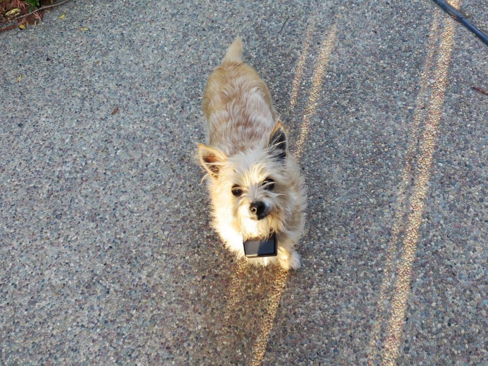
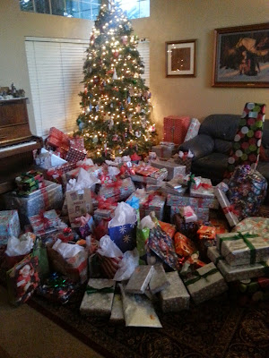





---

<html><head></head><body>
<figure data-trix-attachment="{&quot;contentType&quot;:&quot;image&quot;,&quot;height&quot;:427,&quot;url&quot;:&quot;https://lh3.googleusercontent.com/-MYjtri8Tw3c/XUMjlDaNdcI/AAAAAAABamc/bwT2Qitf6EMuYeGW4Ug_J6UP9IOZ2wzwACK8BGAs/s640/2019-08-01.jpg&quot;,&quot;width&quot;:640}" data-trix-content-type="image" class="attachment attachment--preview"><figcaption class="attachment__caption"></figcaption></figure>

 

Right after a divorce is hard for everyone. You and your kids will be going through all ranges of emotion. You have a tendency to act based on those emotions of fear, guilt, sadness, and anger. Many times, this leads to uncharacteristically doing things you would not normally do. Like, getting a dog even though you are allergic, or skydiving, or heading to Disneyland. In this episode, we explore those first few months after a divorce and how to try to not overindulge your kids.

<strong> The Emotional part of Divorce </strong> 
<ul><li>Your kids will be mad at you. They are going to be angry at the situation or at you, your ex-spouse or both.</li><li>You will be mad at you ex. When you are co-parenting things will happen that just make you mad.</li><li>Emotions during a divorce are mostly negative. There might be some relief, but in general, most of the emotions are sad and negative.</li><li>You need to find things that bring happiness and joy into the situation, for your kids and you.<ul><li>Do not force family time on your kids&nbsp;</li><li>Create opportunities</li></ul></li><li>Self-care is important at this time, but remember your kids need stability and reassurance from you. They need your emotional support. Find a good balance.</li><li>Kids need security&nbsp;<ul><li>Security comes from knowing what is expected of them and having a stable home environment — not one that is based on emotions alone.</li></ul></li></ul>
<strong> Watch out for Overindulgence </strong> 
<ul><li>Divorce Dog, Skydiving</li><li>Disneyland Dad syndrome</li><li>What is overindulgence?<ul><li>No rules, no chores or&nbsp; no discipline</li><li>Giving lavish gifts</li><li>Seeking pleasure while minimizing any disappointments</li></ul></li><li>So it is ok to go to Disneyland, but do the kids have chores at home?</li><li>Are they showing gratitude?</li><li>Do the kids learn about consequences to their actions both good and bad?</li><li>Are the kids living in a complete Fantasyland that will create little monsters later on?</li><li>You need to consider what is going on with the kids at both houses. Are they doing chores in both homes? Don't overload them with the same chores back to back.</li><li>Do not get in a competition with gift-giving with your ex-spouse.<ul><li>First Christmas together example</li></ul></li></ul>
<strong> Co-Parenting is Different than Parenting </strong> 
<ul><li>You cannot parent the same way you did before.</li><li>We tend to be more lenient, especially with the older kids, because you are afraid the kids will want to live with the other parent.</li><li>Watch out about parenting out of a position of fear. You will always be afraid.</li><li>It feels like and we act like it is a competition for the love of our children.</li><li>Divorce changes the environment and you must adjust how you will parent from this point forward.</li></ul>
<strong> Tips </strong> 
<ul><li>Create opportunities for the kids to be involved and to be together as a family</li><li>Don't push your kids into doing things they don't feel comfortable with</li><li>Have fun with your kids&nbsp;<ul><li>Take them to activities</li><li>Work with them</li><li>Work together to get something done and then have fun</li></ul></li><li>Remember your relationship with your kids is going to change. Your parenting will change too.</li></ul>
 

<strong> Links </strong> 
<ul><li><a href="https://goodmenproject.com/families/dont-become-disneyland-dad-divorce-bbab/">https://goodmenproject.com/families/dont-become-disneyland-dad-divorce-bbab/</a></li><li><a href="https://dadsdivorce.com/articles/understanding-the-disneyland-dad/">https://dadsdivorce.com/articles/understanding-the-disneyland-dad/</a></li></ul>
<figure data-trix-attachment="{&quot;contentType&quot;:&quot;image&quot;,&quot;height&quot;:888,&quot;url&quot;:&quot;https://lh3.googleusercontent.com/UrXax2WE5f7D16-OTcDUdMmvHMIaY7Z03zp1mYLLD42SPjlo_UKlMqYP5Yi-uBGrsiDGRYpPTsOQanqj1AX8_1NjAfwYC7ldSVUPabbcJ4NhZHk0IwV6Uck9JMWOsPsc3qOw8dshuJ5h5KwfKZGohtmTcXkv6o-PwxkWAkebxCw9HGGQTcQGbnqqHocloH0SpLYzfxaYl-V3GufN8MrpYfUgdxVyt8Y86YJePpyi4qwVaydilJJ0GBduRTKpzuZKhdJyv_Zm2IpUAYgcq3c4e1eZkMqHZxEpBPMQ1ymnY8o4lO6O75oZi243dexXcvpTXTD_r2s079Z3J_4tPyC9VuWUmG5zaFiNXlBDGvddoNbjMpUOkI7CH5JPqoT63RIGra2K_YIsCWLZP6Az38Xi7VRyAiWviNu9sh6udKJjkX2ucUI2qxOZWYYZQ_-59g_xiuwpBHBxmCoLqjkXWaOPmlWWTgnaXk0RSTyJc7SOs6DBtFFcXrf7-UN73lcsxvuLbq9DTSyK3jWLuERwOTVmoUliJ2EBVN8J-XgNmFOt8d2BQx9GLsHu7rldK20B2e8yeQUIzPBP7nzUzKtXMN7MvJSPtecJ-6yXrDgpSUHWRLLu61GmeGZYuI4PznMMtjzry8B2vHUD5EV-DJeq-cRDyW2qY4Y3RyAV=w1184-h888-no&quot;,&quot;width&quot;:1184}" data-trix-content-type="image" class="attachment attachment--preview"><figcaption class="attachment__caption"></figcaption></figure> Tina the Divorce Dog

 

<figure data-trix-attachment="{&quot;contentType&quot;:&quot;image&quot;,&quot;height&quot;:400,&quot;url&quot;:&quot;https://4.bp.blogspot.com/-ZTT5AYO3L0M/XHxkgZtIZwI/AAAAAAAEyEY/ATypPlalFQcL9VBmG9PGVMTylvFB60NXQCKgBGAs/s400/20131225_072419-001.jpg&quot;,&quot;width&quot;:300}" data-trix-content-type="image" class="attachment attachment--preview"><figcaption class="attachment__caption"></figcaption></figure> Overindulgent Christmas

  

<strong>
  <a href="https://www.patreon.com/wheresthelemonade" target="_donate" rel="payment" title="★ Support this podcast on Patreon ★">★ Support this podcast on Patreon ★</a>
</strong></body></html>

 Podcast Transcript 

