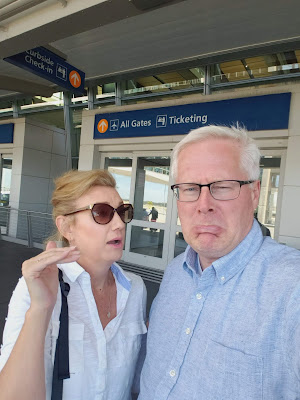





---

<html><head></head><body>
<figure data-trix-attachment="{&quot;contentType&quot;:&quot;image&quot;,&quot;height&quot;:400,&quot;url&quot;:&quot;https://1.bp.blogspot.com/-sTyTyMtgWq0/XVsbRK2lt_I/AAAAAAAFC0U/XBrAWszRt7QCRczsW9M-EeF8G8V1FIMOwCLcBGAs/s400/20190819_120208.jpg&quot;,&quot;width&quot;:300}" data-trix-content-type="image" class="attachment attachment--preview"><figcaption class="attachment__caption"></figcaption></figure>

<figure data-trix-attachment="{&quot;contentType&quot;:&quot;image&quot;,&quot;height&quot;:400,&quot;url&quot;:&quot;https://1.bp.blogspot.com/-lGrmIGzNnaE/XVsbRDMqP-I/AAAAAAAFC0Q/m-mef8SnT48z1wP1eS5VGAssZlfo6CuEACLcBGAs/s400/20190819_120222.jpg&quot;,&quot;width&quot;:300}" data-trix-content-type="image" class="attachment attachment--preview"><figcaption class="attachment__caption"></figcaption></figure>

&nbsp;

 

 

 

 

 

 

 

 

 

 

 

 

 

 

 

 

 

 

 

 

 

 

 

Time apart can be hard and taxing on a marriage. But there are many situations where it is inevitable. Time apart comes in many forms, work travel, traveling to see kids, a spouse in the military, it all takes a toll on your marriage and your relationship. In this episode, we talk about the dangers of being apart and some tips to overcome the side effects.&nbsp;

<strong> Situations of being apart </strong> 

 
<ul><li>Spouse travels for work</li><li>Spouse travels to see their kids or a long commute to get them or take them back to their ex</li><li>Spouse lives in another location</li><li>Spouse deployed</li><li>You or your spouse work long hours or opposite schedules</li></ul>
 

<strong> Perils of being apart </strong> 
<ul><li>Disconnecting emotionally</li><li>Missing out on what is going on at home</li><li>Feelings of resentment (I am doing all the hard things at home while you are out to eat at fancy restaurants)</li><li>Upon returning, the person at home feels in charge and the other disrupts the flow</li><li>Changes made while you're gone</li><li>Overwhelmed feelings by being alone and no one to share in the burdens</li><li>anxiety&nbsp;</li><li>There is a physical toll on the person traveling</li><li>Watch out for emotional isolation&nbsp;</li><li> </li></ul>
 

<strong> How to Protect your Marriage </strong> 
<ul><li>The divorce rate is higher in couples that travel or spend alot of time apart</li><li>Connect every day - skype, text during the day</li><li>Make sure you are sharing all the little things, but be careful not to just share all the bad that happened - makes spouse that is gone feel helpless</li><li>Don't romanticize your spouse's life</li><li>If possible travel together</li><li>Watch a show together&nbsp;</li><li>Skype in for the nightly routine</li><li>Don't spend time alone with coworkers or friends of the opposite sex</li><li>Don't impulse buy to fill a void</li><li>Make sure you leave on a good note - pre-separation anxiety causes fights</li><li>Leave notes for them to find</li><li> </li></ul>
 

Lemonade moment of the week

&nbsp;- Paige fixed the AC

<strong> Links </strong> 
<ul><li><a href="https://thepointsguy.com/2014/02/the-hardest-part-about-having-a-traveling-spouse/">https://thepointsguy.com/2014/02/the-hardest-part-about-having-a-traveling-spouse/</a></li><li><a href="https://smallbiztrends.com/2017/04/bring-your-spouse-on-a-business-trip.html">https://smallbiztrends.com/2017/04/bring-your-spouse-on-a-business-trip.html</a></li><li><a href="https://medium.com/@mountainsunmoved/my-husband-works-his-butt-off-for-our-family-c181243a0e48">https://medium.com/@mountainsunmoved/my-husband-works-his-butt-off-for-our-family-c181243a0e48</a></li><li><a href="https://www.focusonthefamily.com/marriage/how-to-keep-business-travel-from-killing-your-marriage/">https://www.focusonthefamily.com/marriage/how-to-keep-business-travel-from-killing-your-marriage/</a></li></ul>
 

 

 

 

  

<strong>
  <a href="https://www.patreon.com/wheresthelemonade" target="_donate" rel="payment" title="★ Support this podcast on Patreon ★">★ Support this podcast on Patreon ★</a>
</strong></body></html>

 Podcast Transcript 

