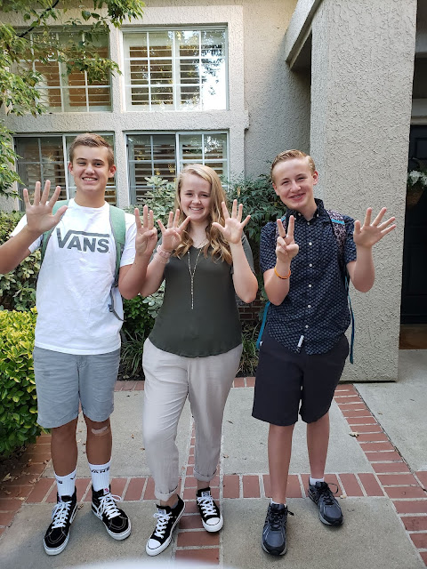





---

<html><head></head><body>
<a href="https://1.bp.blogspot.com/-HjAuYtEbvh8/XWWAq4sgE7I/AAAAAAAFC9Y/Ea_il9ji5Jcw52GMMlmKJUcj07xIFnxigCLcBGAs/s1600/20190812_073018.jpg"> </a><figure data-trix-attachment="{&quot;contentType&quot;:&quot;image&quot;,&quot;height&quot;:640,&quot;url&quot;:&quot;https://1.bp.blogspot.com/-HjAuYtEbvh8/XWWAq4sgE7I/AAAAAAAFC9Y/Ea_il9ji5Jcw52GMMlmKJUcj07xIFnxigCLcBGAs/s640/20190812_073018.jpg&quot;,&quot;width&quot;:480}" data-trix-content-type="image" class="attachment attachment--preview"><figcaption class="attachment__caption"></figcaption></figure>

 

 

The fall brings kids going back to school or even leaving home to go to College for the first time. In this episode, we talk about the perils of back to school in a blended family and the emotions of sending kids off to college for the first time.

<strong> &nbsp;Kids back to School </strong> 
<ul><li>Boohoo, Woohoo Breakfast celebration.</li><li>The emotions of the kids being gone</li><li>When your youngest goes off to kindergarten or first grade.</li><li>Who am I?, What do I like to do? For 15 years I have raised kids now what</li><li>Getting the kids back on a schedule (Bedtime and wakeup)</li><li>Practicing instruments</li><li>Limited screen time</li><li>Homework</li><li>Extra-curricular activities</li><li>Overprescribed kids too many sports, clubs, activities</li></ul>
<strong> Blended Families </strong> 
<ul><li>Coordinating schedules across houses</li><li>Car-pool coordination</li><li>Homework between houses</li><li>An unclear division of responsibilities;&nbsp;</li><li>keeping all parties abreast of what's going on;&nbsp;</li><li>the logistics of hauling stuff back and forth between houses;</li><li>parents agreeing on how to manage increasingly common cases of learning difficulties such as Attention Deficit Disorder.</li><li>"The event of divorce for children, while distressing, is not the thing that causes distress for the child in the long run," Harris says. "Ongoing conflict is what most significantly affects the child's well-being. (The parents) have to figure out how to co-parent in a way to reduce conflict."</li></ul>
 

<strong> When Your Kid Leaves for College </strong> 
<ul><li>When a kid leaves the home there is a hole in the family for some time</li><li>The hole is filled over time. Sometimes pretty fast</li><li>When Jake left we ripped out his carpet and painted his room the same day</li><li>Dallin's room became a playroom almost instantly</li><li>Every time a kid left the house Paige wanted to have a baby</li><li>Taking the kid to college can be hard to coordinate with your ex. Don't put the kids in the middle. It is not part of your parenting agreement.</li><li>Who pays for college?</li></ul>
<strong> Links </strong> 
<ul><li><a href="https://www.oregonlive.com/kiddo/2014/09/back_to_school_for_blended_fam.html">https://www.oregonlive.com/kiddo/2014/09/back_to_school_for_blended_fam.html</a></li></ul>
  

<strong>
  <a href="https://www.patreon.com/wheresthelemonade" target="_donate" rel="payment" title="★ Support this podcast on Patreon ★">★ Support this podcast on Patreon ★</a>
</strong></body></html>

 Podcast Transcript 

