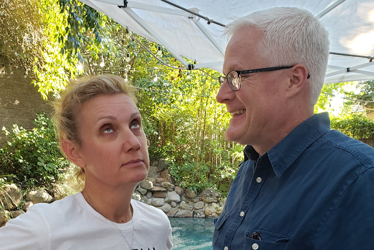





---

<html><head></head><body>
<a href="https://1.bp.blogspot.com/-5iOX6v0a1mg/XW8CryY9KJI/AAAAAAAFDh8/BL_Z6n8j08Q07d4iz2_vlgEFArk9ZGpOwCLcBGAs/s1600/WTL-45.png"> </a><figure data-trix-attachment="{&quot;contentType&quot;:&quot;image&quot;,&quot;height&quot;:429,&quot;url&quot;:&quot;https://1.bp.blogspot.com/-5iOX6v0a1mg/XW8CryY9KJI/AAAAAAAFDh8/BL_Z6n8j08Q07d4iz2_vlgEFArk9ZGpOwCLcBGAs/s640/WTL-45.png&quot;,&quot;width&quot;:640}" data-trix-content-type="image" class="attachment attachment--preview"><figcaption class="attachment__caption"></figcaption></figure>

 

Paige went to "Education Week" and attended several marriage relationship classes. In this episode, Paige talks to Darren about what she learned on how we can avoid toxic behavior in our relationship and strengthen our marriage.

<strong> Toxic Behavior </strong> 
<ul><li>Vision for your marriage. Good communication, and fun.</li><li>Risk factors and danger signs. Conflict is not always bad. Certain patterns of conflict are bad.</li></ul>
<strong> Danger signs&nbsp; </strong> 
<ul><li>Escalation - Back and forth, negatively driven by defensiveness. The topic does not matter it matters how you discuss it</li><li>Invalidation - Partners put down the thoughts, feelings or characters of their partner</li><li>Negative interpretations - We assume our partner is just being mean. Give them the benefit of the doubt</li><li>Avoidance and withdrawal - One partner avoids talking about important issues, shuts down</li></ul>
 

<strong> How to stop or prevent danger signs </strong> 
<ul><li>Couples don't know how to get out of an argument</li><li>Call time out</li><li>You have to bring it back up within 24 hours</li><li>A person that calls time out must call time in</li><li>In a time out get your mind off the fight. Watch a funny show, meditate, etc..</li><li>Think what is behind your angry, 99% of the time it is hurt feelings</li><li>Do NOT spend the time out planning your attack on your partner or ruminating about them</li><li>Being effective is more important than being right</li></ul>
 

<strong> Cues of things going wrong </strong> 
<ul><li>What are the cues that the conversation is about to go off the rails</li><li>Eye rolling</li><li>Thinking that your spouse is ridiculous</li><li>Crying. Darren not as much as Paige</li><li>Most couples talk about important issues only when they are fighting about them</li><li>Triggering events</li><li>Issues</li><li>Hidden issues - unexpressed needs that fuel the conflict</li><li>How to talk about issues without turning it into a fight</li><li>When we are hurt we often act out with our gut, not our head</li></ul>
<strong>
  <a href="https://www.patreon.com/wheresthelemonade" target="_donate" rel="payment" title="★ Support this podcast on Patreon ★">★ Support this podcast on Patreon ★</a>
</strong></body></html>

 Podcast Transcript 

