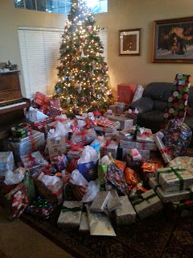
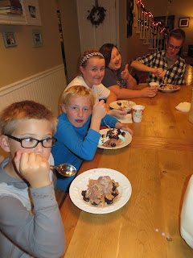
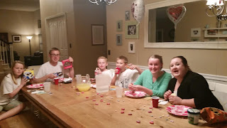
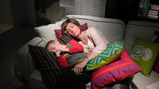





---

<html><head></head><body>
<figure data-trix-attachment="{&quot;contentType&quot;:&quot;image&quot;,&quot;height&quot;:320,&quot;url&quot;:&quot;https://4.bp.blogspot.com/-ZTT5AYO3L0M/XHxkgZtIZwI/AAAAAAAEyEY/ATypPlalFQcL9VBmG9PGVMTylvFB60NXQCKgBGAs/s320/20131225_072419-001.jpg&quot;,&quot;width&quot;:240}" data-trix-content-type="image" data-trix-attributes="{&quot;caption&quot;:&quot;Too many Christmas Presents&quot;}" class="attachment attachment--preview"><figcaption class="attachment__caption attachment__caption--edited">Too many Christmas Presents</figcaption></figure>  

<strong>Why Traditions are important</strong>
<ul><li>They give us a foundation to build our lives on</li><li>They give us a sense of roots and belonging</li><li>We asked the kids what they thought<ul><li>The Younger kids had a different perspective than the older kids&nbsp;</li><li>They can only remember the traditions that we currently have</li><li>They have some that are doubled up</li></ul></li><li>Older kids remember<ul><li>Some of the traditions when we were still married to their parents. Some we have dropped</li><li>Some of the traditions that we continue to do give them a sense of belonging to this new family</li></ul></li><li>Building Traditions in Blended Families<ul><li>Keep Traditions (Combining)</li><li>Choose one over another</li><li>Creating new ones</li></ul></li></ul>
<strong> Keeping Traditions </strong> 
<ul><li>Keeping both traditions for the same event</li><li>Sausage Fondue and Eggs Benedict - combined Christmas breakfast</li><li>Sausage Fondue is from Paige’s first husbands family</li><li>Giving the kids an ornament is from Paige’s first husbands family</li><li>Acting out the Nativity</li><li>Fondue on Christmas Eve</li><li>Easter baskets&nbsp;</li><li>Carving Pumpkins. Only kids like, we wouldn't mind if it went away ;)</li></ul>
<strong> Choosing one over another </strong> 
<ul><li>Opening Christmas Presents<ul><li>opening Christmas presents one at a time</li><li>this took 6 hours the first time to open presents.</li><li>we wanted to be the Disneyland parents the first Christmas. Yes, we tried to buy our kids acceptance of the blended family</li></ul></li><li>Christmas Dinner<ul><li>dropped Darren's typical dinner and went with Paige's</li></ul></li></ul>
<strong> Creating new ones </strong> 
<ul><li>We tried a new tradition of going to a tree farm to get a Christmas tree for a few years.<ul><li>ended up at&nbsp; home depot to get a tree</li><li>we now have a fake tree.</li></ul></li><li>Ice cream for dinner (fail, everyone was sick). Dinner for dessert</li><li>Monday night swim parties</li><li>Swimming at Christmas</li><li>Ikea Scavenger Hunt</li><li>Valentine days auction</li><li>Dancing before bed</li><li>Reading Scriptures never really took hold until Dallin challenged us to read scriptures consistently, which is now 5 years and going</li><li>Ice Skating at Christmas every year (No one totally enjoys this, everything hurts and we are cold, but it is fun. ;)</li><li>Cooking competition</li></ul>
<strong> The most important thing about Traditions </strong> 
<ul><li>It is never too late to start. This is for blended and traditional families</li><li>Some things are kids said:<ul><li>Julianne said, “I was a hardcore traditionalist when I was little. If we altered traditions, especially after my parent's divorce, it was hard for me.&nbsp; After our families blended, they were combined and formed so well.&nbsp; I am so grateful for all our fun traditions, especially our new ones. ”</li><li>Jacob said, “Doing fun things together has really made a difference with our family. I see a lack of that with other families”</li><li>Amanda Said, “When it comes down to it, traditions don't really matter, what matters is the meaning behind them, which is being a family and being together and that is where you guys have excelled and made all of us feel so loved and welcomed and part of something bigger than we were before.”</li></ul></li></ul>
<strong> The funny moment this week. </strong> 

After church on Sunday, we were talking about what we learned. Madeline mentioned Christ taught when someone slaps you, you need to turn the other cheek. As she said this she pretended to slap her brother. He moved at the perfect time and got a good little slap. She then said, "Sam, turn the other cheek!" He, in turn, said that he learned in Church how to control his anger and that he hoped Madeline could learn how to control her anger. It was pretty funny and we all laughed so hard that we could not finish dinner.

<strong> Links for this week </strong> 
<ul><li><a href="https://www.wheresthelemonade.org/2019/03/dallins-shrimp-scampi-recipe.html">Dallin's Shrimp Scampi</a></li><li><a href="https://www.wheresthelemonade.org/2019/03/sausage-fondue.html">Lloyd Sausage Fondue</a></li><li><a href="https://www.wheresthelemonade.org/2019/03/ikea-scavenger-hunt.html">Ikea Scavenger Hunt</a></li></ul>
 

 

<figure data-trix-attachment="{&quot;contentType&quot;:&quot;image&quot;,&quot;height&quot;:320,&quot;url&quot;:&quot;https://2.bp.blogspot.com/-EWkoSVTlBvs/XHxm6uweAvI/AAAAAAAEyEk/ytmzlsLylCIrTcHuivbF-tzJ-3F3t6FTgCEwYBhgL/s320/IMG_3675-001.JPG&quot;,&quot;width&quot;:240}" data-trix-content-type="image" data-trix-attributes="{&quot;caption&quot;:&quot;Ice Cream for Dinner&quot;}" class="attachment attachment--preview"><figcaption class="attachment__caption attachment__caption--edited">Ice Cream for Dinner</figcaption></figure>  

 

<figure data-trix-attachment="{&quot;contentType&quot;:&quot;image&quot;,&quot;height&quot;:180,&quot;url&quot;:&quot;https://1.bp.blogspot.com/-9qtkHCphyVY/XHxnV4QBQUI/AAAAAAAEyEs/vIIg7oIbZAMSkMonsgezEvLjn0f3dFUkgCEwYBhgL/s320/20150219_183937.jpg&quot;,&quot;width&quot;:320}" data-trix-content-type="image" data-trix-attributes="{&quot;caption&quot;:&quot;Valentines' Day Auction&quot;}" class="attachment attachment--preview"><figcaption class="attachment__caption attachment__caption--edited">Valentines' Day Auction</figcaption></figure>

 

<figure data-trix-attachment="{&quot;contentType&quot;:&quot;image&quot;,&quot;height&quot;:180,&quot;url&quot;:&quot;https://2.bp.blogspot.com/-HJegJNSe1FA/XHxoC0nVA8I/AAAAAAAEyE0/vQh1e6bwRD0lGZwBh7EhowHracjlRGmeACEwYBhgL/s320/IMAG0093.jpg&quot;,&quot;width&quot;:320}" data-trix-content-type="image" data-trix-attributes="{&quot;caption&quot;:&quot;IKEA Scavenger Hunt&quot;}" class="attachment attachment--preview"><figcaption class="attachment__caption attachment__caption--edited">IKEA Scavenger Hunt</figcaption></figure>

 

 

 

 

 

  

<strong>
  <a href="https://www.patreon.com/wheresthelemonade" target="_donate" rel="payment" title="★ Support this podcast on Patreon ★">★ Support this podcast on Patreon ★</a>
</strong></body></html>

 Podcast Transcript 

1

Hello, this is Darren and this is Page.

And this is where the lemonadewhere we talk about what happenswhen life throws you lemons.

Make some lemonade.

Maybe some weeks. It's lemon squares.

Yeah, some weeks it's just lemons.

Yeah.

Todaywe're going to talk about eggs Benedictand sausage fondue and traditions.

There's a lot of them.

We surveyed our kids about traditionsthis week.

We did.

We sent an email to all of the older kids.

And you talk to the younger kidsbecause I was out of townand we got responses from some of our kidsbecause we wanted to knowhow they felt about the traditionsthat we have going on in our family.

And we didn't get them from everyone,though.

Well, no,not all of our kids respond, nor willthey ever respond to pretty much anything.

And you know exactly who you are.

Different personalities, very bright,

I guess. So.

Our kids have different personalities.

They do.

And we love all of theirjust cute little quirks.

So we do. We do. We still love them.

What we found mostlyis that our younger kidsreally haven't seen or recognizeanything different as far as traditionsgo, because they were so youngwhen we got married.

Yeah.

And so when we when you ask themabout traditions, it's what they know.

Like they don't really knowwhat used to happenwhen you were married with your first.

They don't remember that. Yeah.

Or what You know seeing them usedto remember when I was married to his dadbecause they were little, they were fouror five and six when we got married.

So they just know what we do now.

Right.

But the older kids remember bothtraditions that they used to have when,you know, when you werewhen their parents were marriedand the new traditionsthat they're seeing now.

So they remember both.

And they said that they appreciate thatwe've incorporated some of the things thatthey grew up with into other traditionsand traditions that we have now.

Yeah. Yeah.

So when you blend a family,you have three things that you can dowith traditions, right?

Yeah, You can keep and basically combinesome of your traditions.

You can choose one over the otherand you can create new ones as a family.

And I think you have to adopt a attitudeof accepting all three.

If you come inand just say, We're just all goingto create all of our own new stuffbecause we're a new family.

You're going to lose contacts with yourwith your kids becauseyou're telling them that their historythat they have before is not important.

Right? I told Leigh agree with that.

We have to keep some roots for them.

Right. Well, that goes intowhy our traditions important.

So what do you think?

I think that traditions therea foundation for your familyand the kids kind of rely on, Oh,this is going to happen.

This is what our family does. Consistency.

Yeah, Yeah.

That's important in blended familiesto have consistency.

We know that, right?

Oh, yeah, absolutely.

Well, and it also gives thema touch of their roots, right?

They know where they come from.

A solid base.

Some of our older kidsthat have left the house, they feel likethey're kind of missing that nowbecause there is no homethat they grew up in anymore.

It's gone.

Some of the traditions are gone.

And one of our kidsactually mentioned that to mewhere, you know,

I don't feel like I'm really connected.

Like I wanted to be all right.

So we took that into considerationwhen we are adopting traditionsand getting rid of them.

So it's importantthat every single kid that you havehas some part of them that is manifestin the traditions that that you have.

Yeah, I totally agree.

So let's talk about some of these things.

Let's talk about keeping traditionslike combining.

Okay. Okay.

So the name of our podcastthis week is Eggs Benedict and Sausage

Fondue, right?

Yeah. Why is that dairy?

Why is that?

Because Christmas morning breakfast,we have tradition that my first wifeand I established, which was Eggs

Benedict at Christmas morning.

And in your family we had sausagefondue, which I have no ideawhy it's called fondue.

It is not fondue.

You don't dip anything in it.

It is a so good, though.

It's a sausage, bread, egg, cheese,heart attack in a pan.

We need to help explain thata little bit more.

It is Wonder bread, sausage,

Velveeta, cheeseand cream of mushroom soup, basically.

And lots of cream.

Yeah, and it is amazing,but you can only eat it once a year.

Yes, because you'd be in the airif you ate it more than naturally.

But that tradition actually started withnot your family,but with your first husband's family.

Yeah.

When I married my first husband,his family had been doing Christmasmorning breakfast, the sausage fondueas long as he could remember.

And my family growing up,we didn't really have atraditional Christmas breakfast,so that was an easy one for us to adopt.

And so, yeah, we grew upmy kids grew up having sausagefondue for breakfast.

So it's interesting that we both adoptedsomething that came that traditionscame from different places.

Yours, from your ex-husband'sfamily and minethat I created with my first wife.

But we both agreed pretty early on thatfirst Christmas we're going to do bowls.

Oh yeah. I was like,

I'm not getting rid of my sausage fondue.

Right.

And and, you know, there's no way

I was getting rid of Eggs Benedict.

But the kids appreciated that both sidesof the family appreciated that a lot.

In fact, now you can't really tellif you asked the kids who likes what.

It's kind of mixed between between them,but they all appreciatethat we put the effort forth to validatewhere their heritage came from.

Yeah.

And they expect both now,like they would probably freak outif we only had one or the other.

They definitely expectboth on Christmas morning.

Now, you can't do every traditionwhere you have both.

No, you cannot.

You cannot. That would be really hard.

Some other traditions that I didn't havebut you had was giving the kids ornamentsevery year.

Yeah.

So that once againwas from my first husband's family.

He grew up his parents on Thanksgiving,gave the kids an ornamentfor Christmas that year, and it typicallyhad something to do with maybe somethingthey did that year or, you know,some some neat memory for the kids.

So when I married my husband,he had 25 ornamentsto start our Christmas tree,you know, off with.

So I thought that was really neattradition.

And I kept that up with my own kids andthey got an ornament every single year.

So and then we've adopted thatsince we've gotten married.

And now my kids on Thanksgiving expectan ornament.

Yep. Yep. And yeah, a lot of fun.

It has been a lot of fun.

And when we, you know, decorate the tree,we have a lot of ornaments, don't we?

But yes, we do.

We have a lot of ornaments.

It's not the prettiest tree in the world.

It is not pretty at all,but it is memory filled.

Yeah. In fact, it's really great.

The kids actually lovegoing through the ornamentsbecause they hang up their own ornamentsand they talk about what happenedthat year.

And it's really fun toto listen to them talk and reminisce.

And after aboutan hour and a half of this and a half,the ornaments are only put on the tree.

Then we quickly put the rest on the tree.

Yes, but it's been it's been a fun time

Even now with only the threelittle ones in the house.

I shouldn't really call them little ones.

They're teenagers.

And one of them's taller than you.

So true. And the other one's on his way.

Yeah.

So I it's it's fun to watch them.

And that tradition is a great traditionbecause it gives themthat solid foundation. Yes.

And I still give the kidsthat are out of the house.

We still give them an ornamentevery year or two.

Yes, we do, but not grandkids.

We're not going to because, oh,my goodness,if you don't have any grandkids,we're going to have ten kids.

I know.

So, yeah,we have to draw the line somewhere. Yeah.

So that's where we draw the line.

So the other thing that my family alwaysdid and yours was kind of happenstanceevery once in a whilewas the Nativity play acting?

The Nativity? Yeah.

So we actually we diddid that, that first Christmas,it was quite a production.

It waswe had many towels and sheets and dollsand all kinds of thingsused for props and costumes.

And because ourfamily is full of a bunch ofactors, budding superstars.

Yeah, not really,but in superstars, they're all hams.

It was not the most reverent nativity,but we did a nativity every year.

And now that's carried on with ourour grandchildren as well.

Yeah.

So that's somethingthat, like you said, with me and my kids,we only did it if we were with maybeanother family on Christmas Eve.

We acted it out.

But if not, then we just read it.

But you said that you and your kids,you did that every year.

Yeah, we did every year.

So we have fun doing that. Yeah.

There's a lot of traditionsthat we've kept around

Christmas, Christmas

Eve dinner, Christmas Eve.

Yes, we do actual fondue on Christmas Eve.

That was something

I was doing with my kids.

And we love doing fondue on Christmas Eveand we and we do it.

And I'll tell you, servingfondue for 1215 people is really hard.

Some years it is.

We've had to get several fondue pots. Yes.

And it takes a lot a long time to chopeverything up and get it all ready.

But it's fun.

You sit around and you chat and talkand you do your fondue and it's fun.

And the kids expect that on Christmas Eve.

Now they do.

And, you know, one of the things I likeabout the traditions that we haveis it brings our family closer togetherand we talk. Yes.

And we have funand we remember the years before.

So there are some that

I don't want to keep that we've keptlike carving pumpkins,like Halloweencarving pumpkins, Easter eggs.

Who I want to know who I want the namethe pumpkin industry.

It's a conspiracy.

I want to know who started this.

Seriously, Just to torture parents.

It's just a mess. And we always put off.

We always go, Oh,we haven't got any pumpkins.

Maybe they won't have anyat WinCo anymore.

Oh, no, they have.

They have pumpkins every day at WinCoright before Halloween.

So yeah, we still do itbecause the kids love it, but they do.

And we, we make a mess outside.

Luckily, living here in California,the weather's typically pretty good,so we can make the mess outside.

I don't do it, though.

I just watch.

I don't.

I notice you kind of know the goop is I.

I just kind of hide when the pumpkinscome out, I have a cold or something.

Well, it is fall, though.

That's cool. Yeah, exactly.

So even though there are traditionsthat we not necessarilyenjoy doing them forthe kids is extremely important.

It is.

It is just likeyou don't like coloring Easter eggs.

No, I do not.

And I wouldn't say thatit's something that I am a huge fan of,but it's fun we like.

It's one of those opportunitiesto sit around, chat,do the Easter eggs and yeah,so we do it for the kids.

Yeah, we dofor yeah.

Now there's othertraditionswhere we can't just do both, right?

Where it's like physically impossible.

Correct.

And let's talk about this onebecause this one, this one was difficult.

Are you are you are you thinkingof Christmas and opening presents?

Yes, I am.

Let's chat about that, shall we?

Yes, we shall. Okay.

So Christmas morning, me growing up,we opened up one present at a time,right?

And I kept that tradition with my kids.

Now let me explain something to everyone.

When she says one presidentat a time, It's not what you think.

They know what I mean.

No, I don't think they do.

I think they do. Don't.

It means everyone grabs a presidentand then you go around the roomand everyone openseach president at a time.

Right?

We like to watch everyone watchesand we like it.

It's so nice.

We like to see the president.

They're happy.

And you have to say who it's from.

And we and then you have to showhold it up and show it.

So let me let me tell you something.

This was really hard for some of my kids,especially my kid, my middle kids.

Well,because how were you opening presents?

We would openeveryone and get one president.

Everyone would open itand then everyone would look aroundand say, Oh, that's nice.

And but it wasn't going through it.

We all did it at the same time. Right?

Right. So lame. I know so

I don't know about that. Butthis is a question you're going to haveto ask when you're dating.

If this is a really important questionto ask, how before you even gofar in your relationship, how do you openpresents on Christmas morning?

Crucial question, very crucial.

It well, it ended upnot being that big of a deal.

And now we do it.

We do one president at a time.

Everyone goes around and and looks at it.

But that first Christmaswe had your parents here and your sister.

There were 15 people here. Yes.

And it took us 6 hours to open Christmas.

Well, explain why it took a 6 hours openprocess.

Well, we sides the opening the present.

Well, that was part of it.

The other part,of course, is this is our first Christmastogether as a blended family.

So we were a little overboardon the presents out here.

A little.

Just a little bit.

Okay. So you can go to our website.

Well, we're we're going to be putting upa picture of the family room thatwe had the tree in and all the presence,and it is downright embarrassing.

Yeah.

You can walk in the family room at all.

We're like, It was pretty bad.

We wanted to be the Disneyland parents,didn't we? We did. And you know what?

That's very typical of first Christmas.

As a blended family.

You kind of go overboard.

You want to buy your love for your kidsand say, Look, we're all big onehappy family.

And you go, Oh, maybe someonegot a little bit more than somebody else.

So I got to compensate.

It's kind of a mess.

It was ridiculousand it would have been way cheaper for usto actually go to Disneyland separately.

It was pretty busy,but but yeah, it literally took usover 6 hours to open presents.

Yeah, it was.

And some of the kids you're right.

Some of the middle kidswere getting a little frustrated.

Yeah, just a little bit.

Just a little.

For 4 hours into opening presents,we were all little.

Yeah, but we kept that tradition.

We did.

But I think if I appreciate it now. Yes.

And I if I remember correctly,that first year we after about 4 hours,we started giving each person a presentand we opened it at the same timebecause we were, you know,but I think the kids like thethe fact that we're spending time openingbecause they get to share appreciationfor each other.

Yeah, it's been actually really goodand it's been teaching our younger kidsgratitude and things like that.

That's what I was just going to say.

I think it's teaching them, you know,they look at the person in the eyes.

Sometimes they even get up and gohug them.

Thank you.

Yes, I think it's it's a good learninglesson, but we don't go overboardany more, dowe, honey? No, absolutely not.

Too bad for the three Amigos,the three best ones,because you always onesgot spoiled as always.

So Christmas dinner is another onewhere we didn't have to.

We decided one over the other

Now for my Christmas dinner.

When I came into the marriage.

Christmas dinner for for us was a hamand cheesy potato casseroleand green beans and things like that.

And you came in withwe were doing bonelesspork ribs, barbecue ribs,twice fakepotatoes twice, baked potatoesand poppy seed salad.

So I quickly said, wow, you know,

I really like portraitsand I said, I like hamand the cheesy potatoes,but that was an Easter dinner for me.

So and we had it at Easter, too.

So we decided, all right,we'll just we'll just do that when? Now.

My ex-wife still keeps a lot of thethe dinner traditions, the Christmasdinner traditions at her house.

So my kids appreciate that,that they get to continue on with that.

So sometimes you have to look at,you know, what are the kids involved in?

Are they having the same mealat both homeswhen you have to go between homesand you can make adjustments, it's okayto say this one's okay to let goand don't make that a battle.

That's what I'm just going to say.

Sometimes we have to choose our battles.

And if the kids don't need to be havingmultiple of the same traditionsat each houses and so sometimes it's hardto let it go and go, okay,we'll just let it happenat the other house.

But sometimes we need to do that. Yeah,sometimes we do.

We don't do that with Eggs Benedict.

No, we don't.

They have it at both houses and that's just the way it's going to be bad for them.

It's just the way it's going to be.

Now, we also createa lot of new traditions.

Yes, we did several. I mean, lots.

And I think because we wantedto create this new family.

Right.

Still honoring our previous relationshipsand families that we had,but creating a new blended family,hence the name ploy differ.

Yeah, we have a key holderhere in the house that has a name

Floyd of her on it,which was a name coined by I think down.

Yeah, down here because my name, my formerlast name was Loyd years this pulsifer.

And so immediately, immediatelyinto our relationship, I mean within weekswe had Moira for employeetwo for up on the wall.

When you first walk into our housethere is a P and an L,

So we it's importantbecause there are Lloyds in this house.

Impulse offers in this house,and we want to make surethat they still feel welcomed.

Absolutely all times.

And I told Sam a while ago,and we're going to talk about thison our future podcast,that I will always be annoyed with him.

Right. He'sthe only Lloyd in the house right now.

I will always be annoyed with him.

I was a Lloyd for 20 years.

I love that family.

I will always be a Lloydand that made him feel good.

So, you know, you have to make surewe are respecting and honoringwhere they came from,where they came from.

Absolutely.

Absolutely. That's really important tome. Sosome of the new traditions that we had,we tried some failed miserablyand some were actually good.

The one that failed waswe wanted to be thatperfect Americana family.

Go to the Christmas tree farm,go cut down the tree and bring it home.

I wanted to be the Facebook familythat has a picture on Facebookand Instagram with the family holding,you know, a saw standing by the tree.

You know, I know that's it's a muddy,ugly mess here in California.

There's no snow on the ground.

It's just wet and muddy.

And it took us forever to pick out

Christmas trees that way.

Yeah, We were walkingthrough these acres of trees looking forjust the right one, and we're exhausted.

And we just ended up two years in a row.

I think going to Home Depotand buying a Christmas tree, right?

Yeah. And past. Yeah.

And then something else funny happens withthat is the tree always diesbefore Christmas.

So we've got a mass of pine needleseverywhere.

And I was allfor getting a nice artificial tree.

I said I would never, everhave an artificial tree.

And what is in our living roomevery Christmas?

It's an artificial tree.

Thank you, Costco.

Thank you. Costco. That's right.

And in our front room where the Christmastree is, the ceilings are really high.

So if you just go by a six foot tree,it looks kind of silly, right?

So, yeah, our tree is a nice Big ten foottree.

Actually, I think it's 12 foot. Is it 12?

Yeah, it's 12 foot.

So, you know,now it's really easy to set up the kids.

Help me.

And we need a tree that big to keep trackof all those ornaments.

Oh, my goodness.

Over the years,our ornaments don't fit on that tree.

No, they don't.

If the kids don't come home for Christmasornaments, don't go there.

Go on the tree.

You have to bat for them. Yeah.

So another one that failedwas something that you read about.

It was a touching storyabout a man who had passed away.

And before he passed away, they asked himfor one thing that he wanted and he said,

I would love ice cream for dinnerbecause I've never had that.

I always wanted it.

Yeah. Yeah.

So his daughter went out, got him icecream for his last meal, his last wish.

And, you know,he thought that was so great.

He'd always want it since he was a kidand even as an adult,but thought it was kind of ridiculousto even ask.

And so his daughterstarted this ice cream for dinnertradition once a year in her family.

And I thought, oh,you know, wouldn't that be fun?

That would be so fun.

Yeah, we did itand everyone got sick. Oh, my goodness.

So sick.

Well, we kind of went we had brownies,we had toppings.

We had all different kinds of ice cream.

It was a lot of fun,but no one ever asked to do that again.

So, no, it was kind of gross.

We had spaghetti for dessert. Yeah.

That didn't go very well together.

So that is one that we thoughtwe would start and it didn't.

And yeah,we just let that go by the wayside.

Now, we do have others that weresuccessful new ones in the summertime.

We have Monday nightswim parties at the house.

We do.

That's really fun.

The kids, when we asked the kidswhat the traditions that they likedand a lot of themmentioned the Monday nightswim parties that we have instituted.

And we have our kids friends,we have our friends.

We just have, you know,probably six or seven families over.

And I grill hamburgers and hot dogsand people bring potluck.

It's a lot of fun. It's a ton of fun.

And we love it.

The kids love it.

I hope hopefully our friends love it.

You better love it. Friends. Yes.

You're going to love it if you don'trespond to our podcast with comments.

We're going to stop doing that.

So there's the threat.

Okay.

The other thing around swimmingis we swim at Christmas,we do on Christmas Eve and Christmas.

If you know it all works out.

All the kids look forward to this.

Yes. The steam coming off of the pool.

Yeah.

Now, our here in California,where we live, it doesn't get supercold in the wintertime.

There's no snow on the ground andwe get frost maybe a dozen times a year.

So it pulls outsuper cold, maybe about 45, 50 degrees.

But we don't swim in that kind of water.

That's way too cold.

No, I won't put my big toe in itunless it's 90 at least.

Yeah.

So the pool normally gets heated upto about 95 to 98 degrees.

Nice. Balmy.

We have so much fun.

The neighbor kids come during the day.

During that time, they haveoff from schooland they're swimming and everything.

So it's a lot of fun.

It is.

We usually keep it heated for about a weekfrom from the break until.

And to me, that's a Christmas giftthat I'm giving to the whole family.

Yeah, because we had so much fun doing it.

We do.

We have a lot of fun.

We sometimes even put a movie on outsidewhile we're in the pool.

Yes, that's fun projector.

That's so another one that we do inbad weather is the IKEA scavenger hunt.

Yeah,

I saw that on the internet somewhere.

I was looking upfun, cheap family things to do,and I found an IKEA scavenger hunt,and we've done it probably once a year

Now, sincewe only have three kids at home,we have invited some friends to do itwith us.

It's a lot of fun.

It's a lot of fun.

We will put that up on our blog.

The IKEA Scavenger Hunt.

I'm sure IKEA is just loving that.

We're promoting.

Yeah, go to their store, take pictures,roll around in the carpet sponsor.

We should get them a sponsor.

Put pots and pans on your head.

Yeah, that's right.

Do that at IKEA.

Another one is a bounty

Valentine's Day auction.

So instead of Valentine's Day,you and I going outand having a romantic dinner,we decided to do something for the kids.

Well, sweetie, it'sbecause it's Valentine's Day.

Every day at our right.

It is.

There are some flowers sitting over there.

There are some flowerssitting over there. I know. Sothis one,this one's fun because it's an auction.

So we give the kidsa bunch of Monopoly moneyand they bid on items,some items they can see and somethey can't, some itemsthat are really grossand some that are really good. Yeah.

Like we always have to have somethinglike pig's feet, liver, sardines.

And usually those are coveredbecause there's no way they're bidding.

They wouldn't bid on those.

That was a fun that was a fun tradition.

We startedat first Valentine's Day, the firstactually the first all hands day.

We did a different dinner and it was,oh, yeah, it failed.

It was a it was a fail.

I won't even go into it.

It was a fail.

And the next year I started this.

And that's okayto have things that you start and go,it didn't work and start somethingelse, right?

So we started this. The kids love it.

Do you remember the first time we didthis?

Oh, there were so many tears.

Yes, because the kidswere still pretty little.

The three Three amigos were still little.

And Jacob, Jacob,

Jake.

Evil. Jacob made the little kids cry.

He I think Sam paid $1,000 for a peanutbutter and jelly sandwich because that wasthe only thing that he wanted.

Sam was very, very pickywhen he was little.

He's not anymore.

He was very picky.

So there was very few things comingthrough this auction that he wanted.

And there was here comesand I purposely made a peanut butterand jelly sandwich for him,put it out there and Jacobbit him up and the tearsand the crying and Jacob ended up with it.

Jacob was not let him have it.

Jacob thought it was hilarious.

And I'm just like, Oh, Jacob.

So there's no tears anymore.

They're they're grown up enoughand they let me buy it.

We invited the neighbors to Yes,we had some friends this yearsince we only had three kids,which was a lot of fun.

It was a lot of fun.

We love having having peoplejoin us in our activities.

Now, some of the traditionsthat we were doingand we stopped doing and the kids said,

Hey, why aren't we doing that anymore?

Yeah, So westarted right before bedputting on a song and dancing.

Yeah, it was loads of fun.

Yeah, it was tons of fun.

And we were doing thatevery night, every night.

And we haven't been doing itfor a little bit.

We hadn't.

When we were asking our kidsabout traditions,they mentioned thatthey'd like to get back to that.

So we've kind of resurrected thatin the last week or so we've been dancing.

So that brings up a good point.

Sometimes you need to listen,sometimes you need to listen to your kidson the traditionsthat they like, that they like to dobecause they're going to have ideasthat maybe you didn't think ofor maybe you thought, well,they would never want to do that.

So listening to them and understandingwhat makes them happy and feel groundedis important, right?

Like Delon Delon suggestedright before he went on his church missionfor two years that we be more consistentabout reading scriptures every night.

So we did.

We promised him we're going to do our bestto read scripturesand we did all throughout his missionand we continue on today.

Now it's five years and every nightwe read scriptures as a family.

It's been wonderful.

It has. It has.

It's been great. The kids,

I think they kind of look forward to it.

I don't think it's somethingthat they're like, oh,and sometimes we act outwhat we're reading.

We do. They have a lot of fun with that.

They have a lot of fun with that.

The action and we were tyingthe dancing kind of to the scriptures.

I, I think I remember telling youabout some friend that had told me, Sorry,

I can't give you credit, friend.

I don't remember who told me this,that when they read scripturesto just make it more enjoyableor more something that kids look forwardto, it's not just a chore they gave it.

It was eitherthey they eat popcorn or have candy.

Anyway, they did something.

And so I wanted to when we right when wewere done reading scriptures, we danced.

So it was like scriptures,dance, prayer. But yeah,and I wanted the kids to remember thatthat scriptures was a positive thing,that, you know, it was fun.

And then we danced and that was fun.

It was family time.

Yeah, family time.

So we're getting back to that dancing.

Yes, we are. And the kids,we all get to choose a song.

We take turns choosing a song because youand I, we pick any songs today.

Absolutely. All the time.

Yeah.

That's the only good musicthere is out there.

So definitely.

So other things that we startedwas cooking competitions.

Yes, cooking competitions,which we haven't done one in a while nowwe have the kids have all turnedinto these little chefs, which is nice.

They know how to cookand the competitions are really heated.

They typically last a whole week long.

The first time we didit cost us an arm and a leg.

So how it works is we take a weekand each kidtakes a night and makes dinner,and so they get to choosewhatever they want to makeand we help them if they need the help.

But we all went to the grocery storethat first time and yeah, I think it was

Dallin picked out a $30 bag of shrimpbecause he made shrimp scampi,which he won because it was amazing.

Maybe we'll put that up on the block, too.

I don't think.

Down the mind down shrimpscampi was so good.

But yeah, that was it was very expensive.

But the kids, I think, really enjoyedthe competition, the camaraderie.

Some and some of them like Sam,decided to do.

Potstickers Potstickers That's right.

Handmade Potstickers Oh my goodness.

How much time did that take?

A lot of work. A lot of work.

So everyone helped out. Everyone.

Yeah, that was a family thing.

And then at the end of the week, we had,you know, certificates for best meal,best presentation,you know, things like best fried food.

Jacob went on a I'mgoing to fry everything.

Yes, he did.

He fried Twinkies, he throws it, wrappedchicken nuggets in dough and then fried.

Yeah. So it was interesting. Yes.

Way to go, Jacob.

Jacob always got the most creative,

I think. Yes, he did.

He had a lot of fun.

But Delane won the mostbecause he down to the cook.

Yeah. Really good. Yeah. Oh,we have lots of ideas from our kids.

We've had lots of traditions.

It's never too late to start a tradition.

It's okay if you fail as well.

If it doesn't work outquite the way you want.

Yeah.

The key is that you're trying to buildthese foundations and roots for your kids.

So they feel a part of this family.

Definitely. Yeah.

You can start anytime.

You can start today,you can start tomorrow.

And I think sometimes we get in our mindthat a tradition is something big,you know? No, it could be really small.

Yeah, it well,we've mentioned several small things.

It doesn't have to be anything grand.

It can be something very small,just something that your kids relate to.

This is something my family does together.

That's what a tradition is, right?

Yeah, absolutely. Yeah. So. Yeah.

So we also are some of our kidsresponded back to us in emailand we had some really touching quotesby some of our kids we did.

So we're going to kind of end our podcasttoday with some of these quotesand hopefully we won't cry.

You're going to cry. I'm going to cry.

Darren's a crier.

For those of you that don't know thiswhen it comes to my kids.

Absolutely he is. He's a crier.

So, Julianne, who is our 19 year old? Yep.

And is on a mission right now.

We miss her desperately.

She said.

I was a hardcore traditionalistwhen I was little.

If we alter traditions, especially aftermy parents divorce, it was hard for me.

They were combined and formed sowell after they got married.

I am so grateful for all of our funtraditions, especially our new ones.

That was really sweet that she said.

That was sweet.

Yeah, that was so.

And she recognizedthat we were really tryinghard to make them all feel a partof something bigger. Yes.

And we appreciate thatwhenever the kids acknowledgethe hard work that we're putting forthand this is for blendedor non blended families, when your kidsacknowledge that the parentsare trying,it goes a long way to as parents.

It absolutely does.

And also recognizing as a parent, you'vejust put your kidsthrough a really horrible situationand they're trying to navigate this. Yes.

So making life funand making it enjoyable is important.

Yeah. In fact,that's what Jacob said in his quote.

He said, Doing fun things together hasreally made a difference in our family.

I see a lack of that in other families.

Yeah, we do.

We we were big on family timeand we have a lot of fun.

We do. We do.

And then Amanda, our oldest, she said,

When it comes down to it, traditionsdon't really matter.

What matters is the meaning behind them,which is being a familyand being together.

And that is where you guys have excelledand made us all feel so lovedand welcomed and part of somethingbigger than we were before.

Wow. Wow.

Thank you.

Thank you.

Amanda. Darren's crying.

I'm not crying. Yes, he is.

You know what?

It's a lot of work having a blended familyand it's worth it.

Absolutely worth it.

It is worth the work.

And we love all of our kids so much andwe appreciate when they recognize that.

We're trying. We're trying every day.

All right.

Let's talk about the funny moment.

So I don't cry the rest of the time.

Okay. Funny moment.

So I was out of townbecause we had a grandbaby.

Had a grandbaby. Welcome, Zoe.

And in fact, in our next episode,we'll talk about being grandparents. Yes.

And we're not that old. People are not.

We're not. I'm a very young grandma.

Yeah, she is. She's very young,

Grandma. And so.

Well, pages out of townafter church on Sunday, we'resitting at a Sunday dinner and I ask kidslike I always do every Sunday.

Hey, what did you learn about in Sundayschool this week and things like that?

And now one says we learn towhen turn the other cheek.

So when someone offends us or hits usand she raises her hand to hit Sam, who'ssitting next to her pretend Sam movesand she smacks him really hard.

It was pretty funnythat we turn the other cheekand then she said, Sam, turnthe other cheek.

It says she wanted to finish her analogy,that she had gone there.

And Sam turns to her and says,

I learned it.

I learned at church today to not outwardlyshow my anger towards other peopleand that she needs to work on her brainto work on her anger.

So that's how it rollssometimes in our house.

And youyou said that you guys were laughing, so.

Oh, man, no one can finish dinner.

It was David

I thought was going to throw up.

It was laughing. So hard.

So it was a great, great week.

We did miss you, obviously,but I had fun with the kids.

I missed you guys too, But I had funbeing with my two little grandbabies.

Have a greatweek and go make some lemonade or lemonsquares.

You're so funny.

And in our next episode,we're going to talk about there'sno step in for grandmaor grandparents or grandkids.

