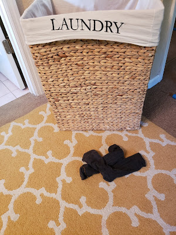





---

<html><head></head><body>
<figure class="attachment attachment--preview" data-trix-attachment="{&quot;contentType&quot;:&quot;image&quot;,&quot;height&quot;:400,&quot;url&quot;:&quot;https://1.bp.blogspot.com/-aIAxMRaKiPs/XYQc6o-cr7I/AAAAAAAFDug/xb2MxGSycewP9rk08L3znd9MkJSY_UF0ACNcBGAsYHQ/s400/2019-09-19.jpg&quot;,&quot;width&quot;:300}" data-trix-content-type="image"><figcaption class="attachment__caption"></figcaption></figure>

 

 

This week Paige continues to teach Darren what she learned at "Education Week". This episode we tackle managing problems, not solving problem, managing them. Some problems, like putting socks in the hamper,&nbsp; take a long to solve, but all problems can be managed.&nbsp;

<strong>&nbsp;Checking in </strong> 
<ul><li>Exacerbated by my kids, your kids. We are sensitive to this and what we actually do it.</li><li>Complaints aren’t fun but we need to deal with them</li><li>What complaints do we need to share?</li><li>You need to decide what is important</li><li>Only the couple can decide together.</li></ul>
<strong>&nbsp;Four-step problem solving </strong> 
<ol><li>Discuss &nbsp; Use speaker listening technique<ul><li>Structured way to communicate safely. The point is to create safety in the relationship.</li><li>I felt Z, when you did X, in situation Y.</li><li>Be respectful and be specific</li><li>Make sure you respect the rules</li><li>Taking time to discuss says, "I want to know and understand you better.</li><li>You are ready to move on when you both understand each other's Point of View</li></ul></li><li>Set an Agenda<ul><li>Pick a bite-sized piece to work on</li><li>ex - Problem is money - bite-size piece is talk about max out visa</li></ul></li><li>Brainstorm<ul><li>write down all your good ideas and how to address the problem</li><li>Try to make all suggestions positive - both in tone (not snarky) and in terms of what you can do rather than what to stop doing</li><li>Don't criticize or roll eyes</li></ul></li><li>Agree<ul><li>One of the reasons it's hard for couples to find a solution that sticks is that they try to find the perfect solution to the whole problem right now. That's not realistic.</li><li>Choose one idea you brainstormed together to experiment with, and set a timeframe to make it work.</li></ul></li></ol>
<strong>&nbsp;Regular Couple Meetings </strong> 
<ul><li>Once a weekly meeting to meet together to talk about issues and check-in. Regular maintenance meeting. Keep things small and manageable. 30 minutes</li><li>Keep a running list and limit what you talk about for 30 minutes</li><li>Dealing with problems does not mean solving it.</li><li>Share expectations</li><li>Become aware</li><li>Be willing</li></ul>
<strong>&nbsp;Lemonade Moment of the Week </strong> 
<ul><li>We have a dog. A small dog. A dog that seeks revenge by peeing in the house. We removed all of our carpet downstairs. Putting in carpet squares.</li></ul>
<strong>&nbsp;Links </strong> 
<ul><li><a href="http://lovetakeslearning.com/">http://lovetakeslearning.com</a>&nbsp;</li></ul>
 

 

 

 

<strong>
  <a href="https://www.patreon.com/wheresthelemonade" target="_donate" rel="payment" title="★ Support this podcast on Patreon ★">★ Support this podcast on Patreon ★</a>
</strong></body></html>

 Podcast Transcript 

