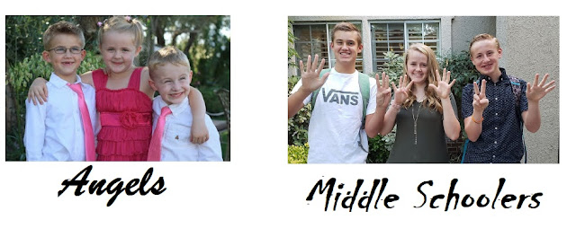





---

<html><head></head><body>
<a href="https://1.bp.blogspot.com/-NctRnqvQ9sY/XYrQVaXBERI/AAAAAAAFDwk/Vo6Sdul535ozmhZjvBL3k52_MrDuTIzsQCNcBGAsYHQ/s1600/WTL-26.jpg"> </a><figure data-trix-attachment="{&quot;contentType&quot;:&quot;image&quot;,&quot;height&quot;:274,&quot;url&quot;:&quot;https://1.bp.blogspot.com/-NctRnqvQ9sY/XYrQVaXBERI/AAAAAAAFDwk/Vo6Sdul535ozmhZjvBL3k52_MrDuTIzsQCNcBGAsYHQ/s640/WTL-26.jpg&quot;,&quot;width&quot;:640}" data-trix-content-type="image" class="attachment attachment--preview"><figcaption class="attachment__caption"></figcaption></figure>

 

Find out how Darren &amp; Paige handle Middle Schoolers that are going through "The Change" from perfect little kids to tweenies and teenagers with raging hormones and attitudes as they try and learn to become adults. Throw a blended family and two sets of parents and problems become even more difficult to manage.

<strong> Middle School aged kids </strong> 
<ul><li>Middle school is when Kids get their hormones, Puberty is just as hard on parents as it is on kids.</li><li>Kids are trying to figure out who they are.</li><li>Friendships</li><li>Social media, cell phones and the internet</li><li>Sex, Drugs, Alcohol</li><li>Faith, and Virtue</li></ul>
<strong> Add in Blending families </strong> 
<ul><li>Add on top of that Step-Parents, Step Siblings, etc.. and it can be a disaster.</li><li>Two homes to deal with</li><li>Complex schedules with more activities,</li><li>Doubled up chores and fun.</li><li>Carpools</li><li>Discipline</li><li>Rules are different</li><li>Easy to get lost in a Blended family. 10 siblings instead of a handful.</li><li>Kids at this age are already self-conscience about who they are and how they fit in.</li><li>Helping children feel loved. Normal kids have a hard time with this add-in a step-parent and that insecurity is heightened.</li><li>Don't disengage when kids act out it further contributes to parent-child discord and marital dissatisfaction.</li><li>Kids don't have control of the situation which adds to the stress and disillusionment of the current situation.</li><li>Parents are afraid to parent because they won't be a loved parent. You will compare yourself to your kid's step-parents or bio parent.&nbsp;</li></ul>
<strong> Survival Tips </strong> 
<ul><li>Demand and Give Respect</li><li>Get to know your kids' friends.</li><li>Talk openly with your kids about sex, drugs, and alcohol.</li><li>Do not pack your kids a bag.&nbsp;</li><li>Their clothes are their clothes.</li><li>They need some ownership and control over some things.</li><li>Know when to walk away with your middle schooler.</li><li>You and your spouse need to show a common front.</li></ul>
 

<strong> Lemonade Moment of the Week</strong>

Madeline is self aware enough to interview our Dog about being in a blended family. You have to see the video on youtube.&nbsp;

 

<strong> Links </strong> 
<ul><li><a href="https://www.familylife.com/articles/topics/parenting/ages-and-stages/tweens/30-tips-for-raising-middle-schoolers/">https://www.familylife.com/articles/topics/parenting/ages-and-stages/tweens/30-tips-for-raising-middle-schoolers/</a></li></ul>
  

<strong>
  <a href="https://www.patreon.com/wheresthelemonade" target="_donate" rel="payment" title="★ Support this podcast on Patreon ★">★ Support this podcast on Patreon ★</a>
</strong></body></html>

 Podcast Transcript 

