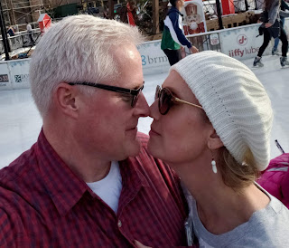





---

<html><head></head><body>
<figure class="attachment attachment--preview" data-trix-attachment="{&quot;contentType&quot;:&quot;image&quot;,&quot;height&quot;:274,&quot;url&quot;:&quot;https://1.bp.blogspot.com/-qPWVfvT4sb4/XGkDmRW9VGI/AAAAAAAExik/oBx9rrJr5PUJ8e9sc8T-vSZSAW3dbzT3wCPcBGAYYCw/s320/darrenpaige.jpg&quot;,&quot;width&quot;:320}" data-trix-content-type="image"><figcaption class="attachment__caption"></figcaption></figure>

 

 

 

Many times we are searching for the perfect lemonade when we are dealt lemons. We know if we are positive enough and with enough sugar, we can find good in anything thrown our way. But sometimes we need to adjust our expectations to fit the current situation. In this episode, we talk about finding our own lemonade in these tough situations.

<strong>&nbsp;Life can be hard </strong> 
<ul><li>Things don't always turn out the way you plan them.</li><li>Story of us finding ourselves in our 40s single with kids.</li><li>Over time we give up when our plans constantly fall through.</li><li>Paige was hit with constant disappointment and stopped planning</li><li>Darren lost control of his plans and went into a situational depression.&nbsp;</li><li>Even now things don't always work out the way we plan, but we have decided to find any goodness in the things that happen to us.</li></ul>
<strong>&nbsp;How to Stay Positive </strong> 

 
<ul><li>Be Grateful&nbsp;<ul><li>There is always something going right.&nbsp;</li><li>We did gratitude bucks with our kids&nbsp;</li><li>Attitude of Gratitude&nbsp;</li></ul></li><li>Look for silver linings&nbsp;<ul><li>Sometimes things that look really bad turn out to be good in the end&nbsp;</li><li>Very hard to look at "in the moment".&nbsp;</li><li>Look back at hard times for the good things about it.&nbsp;</li></ul></li><li>Don't give up&nbsp;<ul><li>Often the greatest doubts occur just before a breakthrough.&nbsp;</li><li>Perseverance is key here&nbsp;</li><li>You cannot give up. People need us.&nbsp;</li></ul></li><li>Look at the Big picture&nbsp;<ul><li>What direction do you want your life to head?&nbsp;</li><li>What are you new goals, you can create new situations?&nbsp;</li><li>What do you want to experience?&nbsp;</li><li>What kind of person do you want to be?&nbsp;</li></ul></li><li>Discouragement is just a trick&nbsp;<ul><li>It is a negative emotion.&nbsp;</li><li>It tricks you into dwelling into the very place you want to leave.&nbsp;</li><li>You have a destination far beyond where you are today.&nbsp;</li></ul></li><li>Keep reading positive things.&nbsp;<ul><li>Stay off the negative forums and find a forum that could help you with positive messages&nbsp;</li><li>Find a hobby that is uplifting.&nbsp;</li><li>Most forums are a place to hear how bad your situation is.&nbsp;</li><li>Is it keeping you down or building you up.&nbsp;</li><li>Find something is more uplifting, maybe outside of&nbsp;</li></ul></li><li>Have Fun&nbsp;<ul><li>Forget about your problem and do something different and fun.&nbsp;</li><li>Sometimes we get wrapped up in the problems that then paralyze us.&nbsp;</li></ul></li></ul>
<strong>&nbsp;Lemonade Moment of the Week </strong> 

We went to a renaissance faire. This is outside of our normal comfort zone, but it was fun to experience new things. And we like to support new things in our town.

 

<strong>&nbsp;Links </strong> 
<ul><li><a href="https://www.life-with-confidence.com/how-to-stay-positive.html">https://www.life-with-confidence.com/how-to-stay-positive.html</a></li></ul>
<strong>
  <a href="https://www.patreon.com/wheresthelemonade" target="_donate" rel="payment" title="★ Support this podcast on Patreon ★">★ Support this podcast on Patreon ★</a>
</strong></body></html>

 Podcast Transcript 

