





---

<html><head></head><body>
<figure data-trix-attachment="{&quot;contentType&quot;:&quot;image&quot;,&quot;height&quot;:640,&quot;url&quot;:&quot;https://1.bp.blogspot.com/-t2QVzw_rQx8/XbipxAHUWpI/AAAAAAAFHFg/fXHaSJ03mrIi0DBVWbgSCbKrZChLOP_EgCKgBGAsYHg/s640/20191017_124411.jpg&quot;,&quot;width&quot;:480}" data-trix-content-type="image" class="attachment attachment--preview">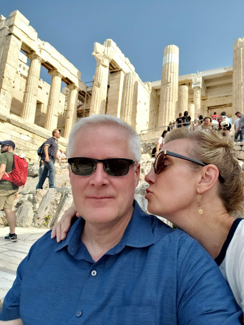<figcaption class="attachment__caption"></figcaption></figure>

 

In this episode, Darren and Paige spend some time together alone. No kids. This time in Greece. Follow their adventures to Athens, Santorini, and Peloponnese.

<strong> Why spending time alone together is important </strong> 
<ul><li>Recharge our relationship.</li><li>Put all of our worries behind and focus on each other.</li><li>Fall in love again.</li></ul>
<strong> Athens </strong> 

<figure data-trix-attachment="{&quot;contentType&quot;:&quot;image&quot;,&quot;height&quot;:320,&quot;url&quot;:&quot;https://1.bp.blogspot.com/--RgVNlZnuRw/XbipxDNgtJI/AAAAAAAFHFg/EEs3CuzDB2sG-J4PxuMJM8FsLeNTsnyEQCKgBGAsYHg/s320/20191016_194406.jpg&quot;,&quot;width&quot;:240}" data-trix-content-type="image" class="attachment attachment--preview">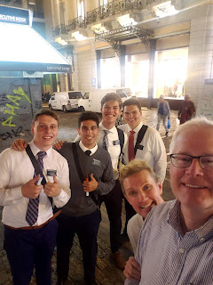<figcaption class="attachment__caption"></figcaption></figure>

 

<figure data-trix-attachment="{&quot;contentType&quot;:&quot;image&quot;,&quot;height&quot;:320,&quot;url&quot;:&quot;https://1.bp.blogspot.com/-LpH9qM85mqY/XbipxEXnutI/AAAAAAAFHFg/khnxQrOkvxUyuM9XHo57ZUyzHNNwvQy1QCKgBGAsYHg/s320/20191017_101808.jpg&quot;,&quot;width&quot;:240}" data-trix-content-type="image" class="attachment attachment--preview">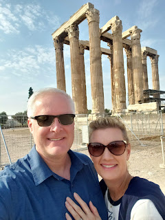<figcaption class="attachment__caption"></figcaption></figure>
<ul><li>We arrived in the late afternoon and checked into the Grande Bretagne. Great hotel.&nbsp;</li><li>We were tired and wanted to head to bed. But we could hear music in the park next to the hotel.&nbsp;</li><li>The best food that night came from a tip from the Missionaries of the Church of Jesus Christ of Latter-day Saints who we ran into in the square.</li><li>Great time in the park listening to music. This park was the center of musical talent every night we were there. See video on Greek rendition of Billy Jean.</li><li>Temple of&nbsp; Zeus,&nbsp;</li><li>Hadrian's Gate,&nbsp;</li><li>Acropolis Museum,&nbsp;</li><li>The next day we did the Athens thing and took the walk to the historical sites 20 000 steps.</li><li> </li><li>Acropolis Hill and the Parthenon on the Acropolis.&nbsp;</li><li>Greecian Agora and walked the touristy streets weaving in and out of shops of greek cotton and olive oil, and olive wood bowls, cutting boards, spoons etc.</li><li>We arrived at our hotel to find out the hotel was on lockdown and the police were there in riot gear. We only had to wait a couple of minutes to get in. It looks like we just missed all the fun.</li><li>day 2 more sites in Athens, Agora, Olympic Stadium, and more time in the shops.</li><li>Greek Opera where we had a great time. Darren caught up on some sleep.&nbsp;</li></ul>
<figure data-trix-attachment="{&quot;contentType&quot;:&quot;image&quot;,&quot;height&quot;:320,&quot;url&quot;:&quot;https://1.bp.blogspot.com/-BFA_s8QVR6E/XbipxA1aY1I/AAAAAAAFHFg/7T4AMTaZXYcKQDIzd872C9kw99l4gdp7wCKgBGAsYHg/s320/20191017_205618.jpg&quot;,&quot;width&quot;:240}" data-trix-content-type="image" class="attachment attachment--preview">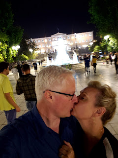<figcaption class="attachment__caption"></figcaption></figure>

<figure data-trix-attachment="{&quot;contentType&quot;:&quot;image&quot;,&quot;height&quot;:344,&quot;url&quot;:&quot;https://img1.blogblog.com/img/video_object.png&quot;,&quot;width&quot;:425}" data-trix-content-type="image" class="attachment attachment--preview"><figcaption class="attachment__caption"></figcaption></figure>

Paige runs the end of a marathon in the Olympic Stadium

 

<figure data-trix-attachment="{&quot;contentType&quot;:&quot;image&quot;,&quot;height&quot;:320,&quot;url&quot;:&quot;https://1.bp.blogspot.com/-ZkMqlVNFtDY/XbipxHcAyQI/AAAAAAAFHFg/pSLtVwfbefwchIIKVD2tjZJpQeZiPtSGACKgBGAsYHg/s320/20191018_100158.jpg&quot;,&quot;width&quot;:240}" data-trix-content-type="image" class="attachment attachment--preview">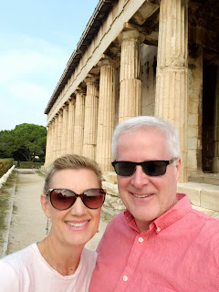<figcaption class="attachment__caption"></figcaption></figure>

<figure data-trix-attachment="{&quot;contentType&quot;:&quot;image&quot;,&quot;height&quot;:344,&quot;url&quot;:&quot;https://img1.blogblog.com/img/video_object.png&quot;,&quot;width&quot;:425}" data-trix-content-type="image" class="attachment attachment--preview"><figcaption class="attachment__caption"></figcaption></figure>

Riot Police out our Hotel

 

<figure data-trix-attachment="{&quot;contentType&quot;:&quot;image&quot;,&quot;height&quot;:320,&quot;url&quot;:&quot;https://1.bp.blogspot.com/-aqGhU-SGWtA/XbipxP2ecVI/AAAAAAAFHFg/X6bD_NSznY4PhZd7oQGzHJullDKSXJa4QCKgBGAsYHg/s320/20191018_113559.jpg&quot;,&quot;width&quot;:240}" data-trix-content-type="image" class="attachment attachment--preview">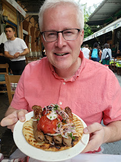<figcaption class="attachment__caption"></figcaption></figure>

<figure data-trix-attachment="{&quot;contentType&quot;:&quot;image&quot;,&quot;height&quot;:344,&quot;url&quot;:&quot;https://img1.blogblog.com/img/video_object.png&quot;,&quot;width&quot;:425}" data-trix-content-type="image" class="attachment attachment--preview"><figcaption class="attachment__caption"></figcaption></figure>

Billy Jean Greek Style in the park across from our Hotel

 

 

&nbsp;&nbsp;

<figure data-trix-attachment="{&quot;contentType&quot;:&quot;image&quot;,&quot;height&quot;:320,&quot;url&quot;:&quot;https://1.bp.blogspot.com/-bQZRzsMhqiU/XbipxIy0edI/AAAAAAAFHFg/eh5dAiRxJ-ETM0ZGthwXwc-8n8Cm_6KbQCKgBGAsYHg/s320/20191018_160033.jpg&quot;,&quot;width&quot;:240}" data-trix-content-type="image" class="attachment attachment--preview">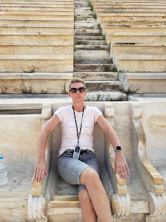<figcaption class="attachment__caption"></figcaption></figure>

 

 

 

 

 

 

 

 

 

 

 

 

 

 

<strong> Santorini </strong> 

 

<figure data-trix-attachment="{&quot;contentType&quot;:&quot;image&quot;,&quot;height&quot;:320,&quot;url&quot;:&quot;https://1.bp.blogspot.com/-W8wMZ0ZBtx8/XbkcuoOKmlI/AAAAAAAFHHQ/Xyr3dFhy8LkjT_x0z60Ki1IsaJMkc9JawCNcBGAsYHQ/s320/2019-10-29%2B%25282%2529.jpg&quot;,&quot;width&quot;:212}" data-trix-content-type="image" class="attachment attachment--preview">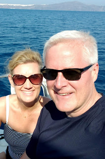<figcaption class="attachment__caption"></figcaption></figure>

 

<figure data-trix-attachment="{&quot;contentType&quot;:&quot;image&quot;,&quot;height&quot;:400,&quot;url&quot;:&quot;https://1.bp.blogspot.com/-I5nCW2WPEvE/XbizWQok5rI/AAAAAAAFHGU/SckN7Vc0b7k-oPJ1x5adw09PpdboOJNOwCKgBGAsYHg/s400/20191020_123427.jpg&quot;,&quot;width&quot;:300}" data-trix-content-type="image" class="attachment attachment--preview">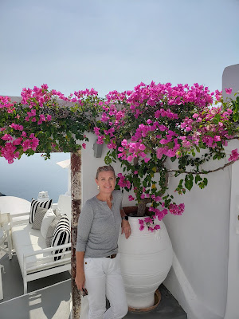<figcaption class="attachment__caption"></figcaption></figure>
<ul><li>Checked into an amazing hotel The Mystic. Built into the side of the cliffs of the Santorini Volcano with views of the underwater caldron that are to die for. Happens that in 1956 some people did when an earthquake completely destroyed this part of the island.</li><li>Sailing cruise across the caldron&nbsp;</li><li>Swam in the volcano. It was warm and very sulfuric. Very fun. The second volcano we have swum in.</li><li>Saw several beaches of different colors: Black, Red, White, Green,</li><li>Sunset on the cruise was incredible.</li><li>Next day. Shopping and visits to Ancient Thera. You need good shoes for this hike. It is quite the trek.</li><li>Darren had Octopus, Lots of Great Meats and Pita Bread</li></ul>
<figure data-trix-attachment="{&quot;contentType&quot;:&quot;image&quot;,&quot;height&quot;:344,&quot;url&quot;:&quot;https://img1.blogblog.com/img/video_object.png&quot;,&quot;width&quot;:425}" data-trix-content-type="image" class="attachment attachment--preview"><figcaption class="attachment__caption"></figcaption></figure>

<figure data-trix-attachment="{&quot;contentType&quot;:&quot;image&quot;,&quot;height&quot;:400,&quot;url&quot;:&quot;https://1.bp.blogspot.com/-uSHgIhKctdQ/XbizWcyhVMI/AAAAAAAFHGU/G8HFD_Rz37oCkZS8wfVfbvscx6wvZb9NACKgBGAsYHg/s400/20191020_123507.jpg&quot;,&quot;width&quot;:300}" data-trix-content-type="image" class="attachment attachment--preview">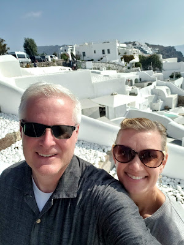<figcaption class="attachment__caption"></figcaption></figure>

<figure data-trix-attachment="{&quot;contentType&quot;:&quot;image&quot;,&quot;height&quot;:400,&quot;url&quot;:&quot;https://1.bp.blogspot.com/-sCP4jdjn98Q/XbizWXfDk4I/AAAAAAAFHGU/vTBptMJqR7gcGBH3mDNLzahpZbxZIXcZQCKgBGAsYHg/s400/20191020_152615.jpg&quot;,&quot;width&quot;:300}" data-trix-content-type="image" class="attachment attachment--preview">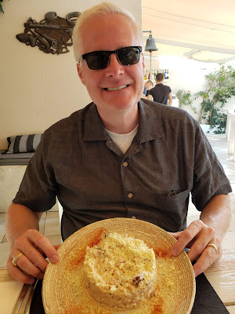<figcaption class="attachment__caption"></figcaption></figure>

 

<figure data-trix-attachment="{&quot;contentType&quot;:&quot;image&quot;,&quot;height&quot;:400,&quot;url&quot;:&quot;https://1.bp.blogspot.com/-PxAMrbKnB44/XbizWWY1UJI/AAAAAAAFHGU/5ijTy57ryUEHhDaAMdpuKgTxjwF9nEMXwCKgBGAsYHg/s400/20191020_134418.jpg&quot;,&quot;width&quot;:300}" data-trix-content-type="image" class="attachment attachment--preview">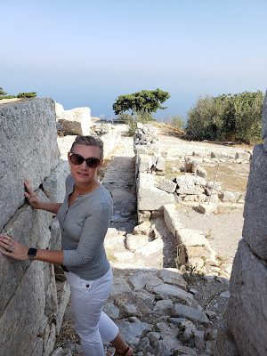<figcaption class="attachment__caption"></figcaption></figure>

<figure data-trix-attachment="{&quot;contentType&quot;:&quot;image&quot;,&quot;height&quot;:400,&quot;url&quot;:&quot;https://1.bp.blogspot.com/-iyhu6x96z94/XbizWatigYI/AAAAAAAFHGU/SAqlFJJdlZUu70Mcvhk3fLSubB0HOcmtQCKgBGAsYHg/s400/20191020_152605.jpg&quot;,&quot;width&quot;:300}" data-trix-content-type="image" class="attachment attachment--preview">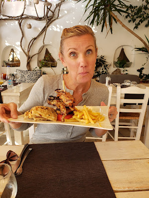<figcaption class="attachment__caption"></figcaption></figure>

 

 

<figure data-trix-attachment="{&quot;contentType&quot;:&quot;image&quot;,&quot;height&quot;:640,&quot;url&quot;:&quot;https://1.bp.blogspot.com/-iMd4iws81Co/XbkcdBLAUHI/AAAAAAAFHHM/e0Cmzysa0iUeHhW7j3VZioKnxpI3PxEUACNcBGAsYHQ/s640/2019-10-29.jpg&quot;,&quot;width&quot;:480}" data-trix-content-type="image" class="attachment attachment--preview">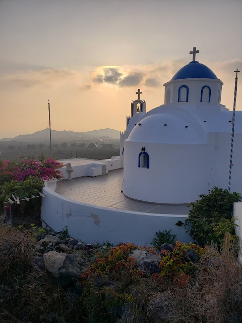<figcaption class="attachment__caption"></figcaption></figure>

 

 

 

<strong> Peloponnese (Road Trip)&nbsp; </strong> 

<figure data-trix-attachment="{&quot;contentType&quot;:&quot;image&quot;,&quot;height&quot;:320,&quot;url&quot;:&quot;https://1.bp.blogspot.com/-bGw0N18OtNs/XbkZG73dc3I/AAAAAAAFHHA/49I7vHoBOFsumc-_GxoywgyEBvQCkTlGACKgBGAsYHg/s320/20191021_110258.jpg&quot;,&quot;width&quot;:240}" data-trix-content-type="image" class="attachment attachment--preview">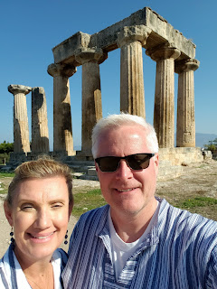<figcaption class="attachment__caption"></figcaption></figure>
<ul><li>Corinth - Ancient Corinth, Acropolis at Corinth, Lots of dogs all over the place. The countryside is all Farmland. Olive trees, vineyards, and orange groves.</li><li>Nafplion - Seaport city tailor-made for cruise ships. Great food and great little shops.</li><li>Drive to Olympia. We found the most beautiful countryside in the mountains of Greece. Small mountain towns (Lampeia), Sheep everywhere. Very green and different from other parts of Greece.&nbsp;</li><li>Olympia - A must see but hard to get to. We had dueling GPS systems one in the car and one of our phone that could not agree, Both were wrong. Took us down some ancient road that does not exist anymore.</li><li>Patras</li><li>Delphi</li></ul>
<figure data-trix-attachment="{&quot;contentType&quot;:&quot;image&quot;,&quot;height&quot;:320,&quot;url&quot;:&quot;https://1.bp.blogspot.com/-ZeixbDQhavA/XbkZG4tmHvI/AAAAAAAFHHA/1CrYux7_RjINU2OBL0-yBaftmJtMMfAoACKgBGAsYHg/s320/20191021_111357.jpg&quot;,&quot;width&quot;:240}" data-trix-content-type="image" class="attachment attachment--preview">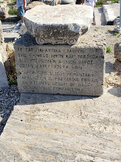<figcaption class="attachment__caption"></figcaption></figure>

<figure data-trix-attachment="{&quot;contentType&quot;:&quot;image&quot;,&quot;height&quot;:344,&quot;url&quot;:&quot;https://img1.blogblog.com/img/video_object.png&quot;,&quot;width&quot;:425}" data-trix-content-type="image" class="attachment attachment--preview"><figcaption class="attachment__caption"></figcaption></figure>

&nbsp; &nbsp; &nbsp; Lighting the Olympic Torch in Olympia

 

<figure data-trix-attachment="{&quot;contentType&quot;:&quot;image&quot;,&quot;height&quot;:320,&quot;url&quot;:&quot;https://1.bp.blogspot.com/-BGUWdFYdpL0/XbkZG8GRPZI/AAAAAAAFHHA/o37UNSmQSwcu-r3tFVAAbhlvTOdpxKRlwCKgBGAsYHg/s320/20191021_113943.jpg&quot;,&quot;width&quot;:240}" data-trix-content-type="image" class="attachment attachment--preview">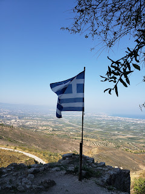<figcaption class="attachment__caption"></figcaption></figure><a href="https://1.bp.blogspot.com/-BGUWdFYdpL0/XbkZG8GRPZI/AAAAAAAFHHA/o37UNSmQSwcu-r3tFVAAbhlvTOdpxKRlwCKgBGAsYHg/s1600/20191021_113943.jpg">&nbsp; </a> 

<figure data-trix-attachment="{&quot;contentType&quot;:&quot;image&quot;,&quot;height&quot;:320,&quot;url&quot;:&quot;https://1.bp.blogspot.com/-e8Ve9Ca8fSA/XbkZG6kyAWI/AAAAAAAFHHA/TGw60iA6-_4t6P8vAnS-Lda1y6SMWCUXwCKgBGAsYHg/s320/20191022_141451.jpg&quot;,&quot;width&quot;:240}" data-trix-content-type="image" class="attachment attachment--preview">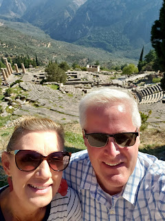<figcaption class="attachment__caption"></figcaption></figure>

 

<strong>Interesting people we met </strong> 

A couple from France (Second marriage for him, first for her, married 21 years she is from Romania he is french they currently live in Paris. He was president of an energy company in France, she is a doctor.

 

A young couple from Zurich originally from Munich Germany. He is working on his Ph.D. and she has an MBA in Technology Management working for re-insurance.

 

 

<strong> Food</strong>

<figure data-trix-attachment="{&quot;contentType&quot;:&quot;image&quot;,&quot;height&quot;:400,&quot;url&quot;:&quot;https://1.bp.blogspot.com/-LsQVgTFsXok/XbkZG2cMPjI/AAAAAAAFHHA/cuIsTC4xOCkqyVrCeWHoLNPgoZB5cfRrQCKgBGAsYHg/s400/20191022_204919.jpg&quot;,&quot;width&quot;:300}" data-trix-content-type="image" class="attachment attachment--preview">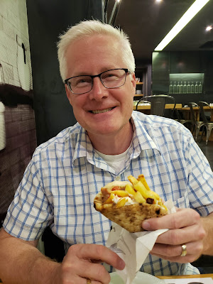<figcaption class="attachment__caption"></figcaption></figure>

<figure data-trix-attachment="{&quot;contentType&quot;:&quot;image&quot;,&quot;height&quot;:400,&quot;url&quot;:&quot;https://1.bp.blogspot.com/-6egEwsxSQxg/XbkZG19sfoI/AAAAAAAFHHA/9bwrpvwcmSoWf2LvD5I3bHQB9ex5dW9rQCKgBGAsYHg/s400/20191022_154329.jpg&quot;,&quot;width&quot;:300}" data-trix-content-type="image" class="attachment attachment--preview">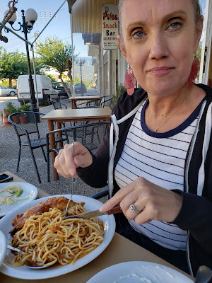<figcaption class="attachment__caption"></figcaption></figure>

<figure data-trix-attachment="{&quot;contentType&quot;:&quot;image&quot;,&quot;height&quot;:400,&quot;url&quot;:&quot;https://1.bp.blogspot.com/-FFe9huXFNiI/XbkZG1knllI/AAAAAAAFHHA/2bLTUlhDKlI6vdvhmBSRwRlX4awE-2VNwCKgBGAsYHg/s400/20191022_154323.jpg&quot;,&quot;width&quot;:300}" data-trix-content-type="image" class="attachment attachment--preview">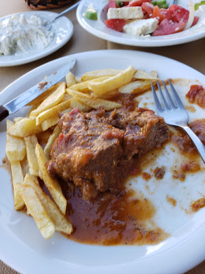<figcaption class="attachment__caption"></figcaption></figure>

&nbsp;<figure data-trix-attachment="{&quot;contentType&quot;:&quot;image&quot;,&quot;height&quot;:400,&quot;url&quot;:&quot;https://1.bp.blogspot.com/-KWRsJI2vbrM/XbkZGzds4XI/AAAAAAAFHHA/DCgaKS6MmPkxtIegU5I8dgFhwnfFLqIQQCKgBGAsYHg/s400/20191022_153417.jpg&quot;,&quot;width&quot;:300}" data-trix-content-type="image" class="attachment attachment--preview">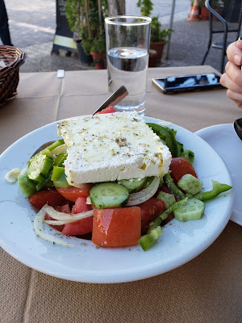<figcaption class="attachment__caption"></figcaption></figure>

 

 

 

<strong> Links </strong> 
<ul><li><a href="https://www.greecetravel.com/delphi/arachova.htm">https://www.greecetravel.com/delphi/arachova.htm</a> - Patras -&gt; Delphi -&gt; Athens</li><li><a href="https://trimmtravels.com/driving-greece-discovering-athens-to-olympia/">https://trimmtravels.com/driving-greece-discovering-athens-to-olympia/</a> - Athens -&gt; Corinth -&gt; Nafplion -&gt; Olympia</li></ul>
<strong>
  <a href="https://www.patreon.com/wheresthelemonade" target="_donate" rel="payment" title="★ Support this podcast on Patreon ★">★ Support this podcast on Patreon ★</a>
</strong></body></html>

 Podcast Transcript 

