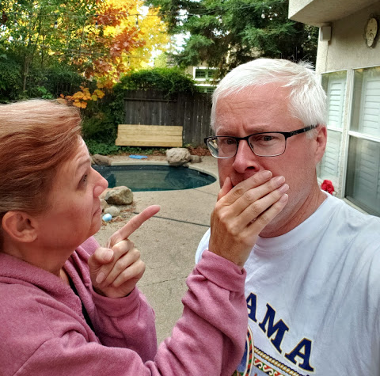





---

<html><head></head><body>
<figure data-trix-attachment="{&quot;contentType&quot;:&quot;image&quot;,&quot;height&quot;:475,&quot;url&quot;:&quot;https://1.bp.blogspot.com/-_Wxi5mmWKgk/XcwtIs0QWqI/AAAAAAAFHXo/ts98eVoT5mcwEGbrCca95n0Q45BKh6_NgCNcBGAsYHQ/s640/boundries.png&quot;,&quot;width&quot;:480}" data-trix-content-type="image" class="attachment attachment--preview"><figcaption class="attachment__caption"></figcaption></figure>

In this episode, we talk about setting and sticking to boundaries as a step-parent. Boundaries with step kids and ex-spouses.

<strong> Talking negatively about your spouse's ex </strong> 
<ul><li>Never in front of the kids or around the kids.</li><li>Kids hear everything. Be cautious</li><li>Talking to your spouse about their ex.</li><li>Be careful about negative conversations with anyone else.</li></ul>
<strong> Disciplining your stepchildren </strong> 
<ul><li>What about kids being raised together.</li><li>"NACHO kids" and "this is my house"</li><li>Age of the children matter.</li><li>Stick to your guns or let things go?</li></ul>
<strong> Trying to take the place of your spouse's ex </strong> 
<ul><li>Don't be tempted to try and replace your step-kids biological parent.</li><li>Missing, significant mental illness, death, etc... are not good reasons&nbsp;</li></ul>
<strong> Putting yourself in the middle&nbsp; </strong> 
<ul><li>Between your spouse and his/her children</li><li>Don't fight for love and affection, while it may be tempting to get on your stepkids good side by disagreeing with your spouse, this is not a good idea and will backfire at some point. The uniformed front is the best offense.</li><li>Between your spouse's ex and his/her children</li><li>Remember you are not the parent. It is not your place to try to override the other parent's decisions regarding the children.</li></ul>
<strong> Ignoring the wishes of your spouse's ex (in relation to the children) </strong> 
<ul><li>&nbsp;The kids need to see you <a href="http://divorcedmoms.com/articles/5-strategies-for-a-civilized-stepmom-relationship">respect their other parent</a> and that you are a good role model for them.&nbsp;</li><li>For example, if you know that they don't want your child watching a certain show, or spending the night with certain kids, etc. It is best to try to honor those wishes.&nbsp;</li><li>You would want your kid's stepparent to honor your wishes.</li></ul>
<strong> Engaging in a parenting discussion with your spouse and his/her ex </strong> 
<ul><li>Stay in your lane.</li><li>This has been a lot of years of learning.&nbsp;</li><li>Very rare cases when you need to get involved as a stepparent. Let the bio parents take care of the issues but be a support to your spouse.</li><li>It is best if you can attempt to have a good relationship with your spouse’s ex if possible.</li></ul>
<strong> Feeling jealous when your spouse and his/her children want some one-on-one time. </strong> 
<ul><li>Many children whose parents are in new relationships feel insecure and might think their parent loves their new spouse more than they love them. It is important for the kids to have a close bond with both parents and it could become a significant family problem if you as the stepparent have a problem because of that.</li></ul>
<strong> Lemonade Moment of the Week</strong>
<ul><li>David being sick and having some alone time.</li></ul>
<strong>
  <a href="https://www.patreon.com/wheresthelemonade" target="_donate" rel="payment" title="★ Support this podcast on Patreon ★">★ Support this podcast on Patreon ★</a>
</strong></body></html>

 Podcast Transcript 

