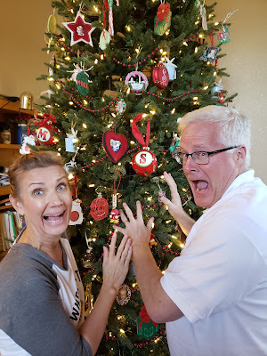





---

<html><head></head><body>
<a href="https://1.bp.blogspot.com/-SBjF2L-uMD8/XgWO7Io_ocI/AAAAAAAFJlU/vhOQbcTNawgGbHV5tJfqzil6_BroE9DwgCKgBGAsYHg/s1600/20191226_151115.jpg"> </a><figure data-trix-attachment="{&quot;contentType&quot;:&quot;image&quot;,&quot;height&quot;:400,&quot;url&quot;:&quot;https://1.bp.blogspot.com/-SBjF2L-uMD8/XgWO7Io_ocI/AAAAAAAFJlU/vhOQbcTNawgGbHV5tJfqzil6_BroE9DwgCKgBGAsYHg/s400/20191226_151115.jpg&quot;,&quot;width&quot;:300}" data-trix-content-type="image" class="attachment attachment--preview"><figcaption class="attachment__caption"></figcaption></figure>

 

Christmas is a wonderful time to reflect and give thanks. But it is often a time of stress, college kids returning home, and in-laws visiting. All of the normal pressures of "Christmas Expectations" is compounded when you add a blended family. Sharing time with your kids, duplicate presents, and who gets to take the kids to the latest "Star Wars" are just some of the things you have to worry about.

<strong> Things that cause stress </strong> 
<ul><li>Kids coming home from college</li><li>Work parties</li><li>Family parties</li><li>Meal planning</li><li>Feeling like you need to entertain all the time</li><li>Making sure everyone has the "right" number of presents</li><li>Sharing time with your ex ( Added pressure to do fun things when you have the kids)</li><li>Being alone at Christmas (All kids gone at their other parent's house)</li><li>Getting the best gift for your spouse</li></ul>
<strong> Managing kids stress</strong>
<ul><li>Having a set schedule is important. Even our adult kids like having a schedule. Not pulled between parents.</li><li>Who buys presents and when? And for whom?</li><li>Tradition overlap?</li><li>Who gets to take the kids to the latest Star Wars movie?</li></ul>
<strong> Tips for managing Christmas stress </strong> 
<ul><li>Set realistic expectations. No Christmas, Hanukkah Kwanzaa or other holiday celebration is perfect. ...</li><li>Be proactive. ...</li><li>Keep things in perspective. ...</li><li>Remember what's important. ...</li><li>Take time for yourself.</li></ul>
<strong> Links </strong> 
<ul><li><a href="https://www.focusonthefamily.com/marriage/christmas-expectations/">https://www.focusonthefamily.com/marriage/christmas-expectations/</a></li><li><a href="https://www.idealhome.co.uk/news/top-ten-reasons-christmas-stress-revealed-217392">https://www.idealhome.co.uk/news/top-ten-reasons-christmas-stress-revealed-217392</a></li></ul>
<strong>
  <a href="https://www.patreon.com/wheresthelemonade" target="_donate" rel="payment" title="★ Support this podcast on Patreon ★">★ Support this podcast on Patreon ★</a>
</strong></body></html>

 Podcast Transcript 

