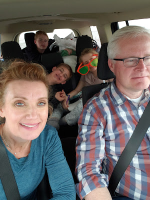
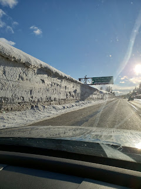
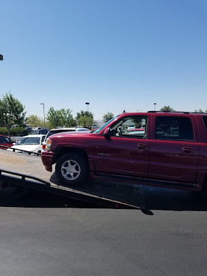





---

<html><head></head><body>
<figure data-trix-attachment="{&quot;contentType&quot;:&quot;image&quot;,&quot;height&quot;:400,&quot;url&quot;:&quot;https://4.bp.blogspot.com/-yxAiZAVvmr4/XJHCFPEuCQI/AAAAAAABUrU/yPQGd4YvBVImhDOTlid531fRSjdB7qgDQCKgBGAs/s400/20190310_122708.jpg&quot;,&quot;width&quot;:300}" data-trix-content-type="image" class="attachment attachment--preview"><figcaption class="attachment__caption"></figcaption></figure>

 

 

This episode is about surviving and maybe even enjoying, road trips with your family.&nbsp; They can really be a time of bonding (or total stress!) with some preparation. Food, audible, games and electronics can get you through it!!&nbsp;

<strong> Road trips can build memories: </strong> 
<ul><li>We just got back from a quick trip to visit our new Grand-baby Zoey Anne. We left on Thursday night and came home on Sunday. So we were in the car for 23 hours an in Utah for 40 hours. Totally worth it!</li><li>Long road trips are something uniquely American, and even more so in Western America.&nbsp;</li><li>Memories of long road trips growing up. Do you remember when your mom or dad lost it? Or do you remember the restaurant that you always stopped at? &nbsp;</li><li>Darren's family took several trips from Central CA to Southern CA to visit grandma. He remembers the road trips more than all of the places we stayed. The "Tickle Tummies" south of four corners outside of Mojave.</li><li>Paige remembers the long trek from OK to Disney World with their camper. So fun!</li><li>The story of Ruby dying in St George and how we ended up renting two cars to drive home. We drove across Nevada to Death Valley and turned a sad time for a family into a trip we would remember.</li></ul>
<strong> &nbsp;Trips, a time of bonding and/or a time of stress: </strong> 
<ul><li>Use this time to bond with your kids.</li><li>Audible is your friend for long trips, it's important to find a book that everyone in the car can listen to and will enjoy. This can be difficult when you have kids of all ages in the car.<ul><li>It will give you something to talk about after your trip and even during your trip.</li><li>Even if they are on other electronics, make sure they don't have headphones in.&nbsp;</li></ul></li><li>Be mindful of the amount of time the kids are on electronics.&nbsp;</li><li>We travel to Utah a lot. Half of our Kids live there and all of our grand-kids live there. So we know the road. Finding common places to stop and eat or stay the night gives us a tradition that the kids enjoy. Like Long John Silvers in Winnemucca, NV. Paige's favorite.</li><li>Jumping on beds in hotel rooms and other silly things. Sorry, Marriott...</li><li>Swimming in the middle of winter at hotels on long trips.&nbsp;</li><li>Kids are a captive audience you can basically talk to them about anything.</li><li>Find unusual things to do along the long trip. A 20-minute detour may be worth it.</li></ul>
<strong> Dangers of the long road trip: </strong> 
<ul><li>The infamous Donner Pass, snow, sleet, rain, freezing ice, freezing fog.</li><li>How to not to get too comfy in the car. Don't read your phone in the car or you'll get car sick.</li><li>Darren tells his story of falling asleep when driving across I 80 from California to Utah and the accident that happened.</li></ul>
<strong> Tips for long road trips: </strong> 
<ul><li>DVDs for little kids are great. But it drives parents crazy. When the kids got older we started books on tape.</li><li>Making long trips into multiple days making sure you have plenty of good snacks in the car that don't make too big of a mess.&nbsp;</li><li>Seating the kids in the car in strategic places, very important.</li><li>Being prepared for the car sick kid. It's okay to throw clothes away and buy new ones at Target or Walmart along the way.&nbsp;</li><li>Limit the fluids so you do not have potty breaks every 30 minutes.&nbsp;</li><li>Make sure you get a hotel that serves breakfast. Kids love that. Julianne said she loved free breakfast. I love free food. (all of her food is free...)</li><li>Pack so you don't have to unpack the whole car to stay one night at a hotel along the way.</li><li>Tips on arriving home, empty the car immediately it will never empty itself no matter how long you wait.<ul><li>Everyone helps clean out the car and empty the car when we get home.</li></ul></li></ul>
<strong> Useful links </strong> 
<ul><li><a href="https://www.smartertravel.com/family-road-trips/">https://www.smartertravel.com/family-road-trips/</a></li><li><a href="https://www.travelchannel.com/interests/family/articles/family-road-trip-survival-guide">https://www.travelchannel.com/interests/family/articles/family-road-trip-survival-guide</a></li><li><a href="https://localadventurer.com/great-american-road-trips/">https://localadventurer.com/great-american-road-trips/</a></li><li><a href="https://www.wheresthelemonade.org/2019/03/ode-to-ruby.html">https://www.wheresthelemonade.org/2019/03/ode-to-ruby.html</a> - Ode to Ruby our car.</li></ul>
 

<figure data-trix-attachment="{&quot;contentType&quot;:&quot;image&quot;,&quot;height&quot;:320,&quot;url&quot;:&quot;https://4.bp.blogspot.com/-VUMmHbMJ7ao/XJHBy9EKSXI/AAAAAAABUrM/dUlnaD00EG40S2yeA1X_y18H3IIV7XiVACKgBGAs/s320/20190310_180333.jpg&quot;,&quot;width&quot;:240}" data-trix-content-type="image" data-trix-attributes="{&quot;caption&quot;:&quot;Snow at Donner Summit&quot;}" class="attachment attachment--preview"><figcaption class="attachment__caption attachment__caption--edited">Snow at Donner Summit</figcaption></figure>  

<figure data-trix-attachment="{&quot;contentType&quot;:&quot;image&quot;,&quot;height&quot;:400,&quot;url&quot;:&quot;https://2.bp.blogspot.com/-k0MRN38JLa8/WWPornuc6uI/AAAAAAAEV00/3UJsr9I2_38cxKDb2K8DA5p8sUqyIoBngCLcBGAs/s400/20170703_114137.jpg&quot;,&quot;width&quot;:300}" data-trix-content-type="image" data-trix-attributes="{&quot;caption&quot;:&quot;Our beloved Ruby&quot;}" class="attachment attachment--preview"><figcaption class="attachment__caption attachment__caption--edited">Our beloved Ruby</figcaption></figure> D&amp;P

<strong>
  <a href="https://www.patreon.com/wheresthelemonade" target="_donate" rel="payment" title="★ Support this podcast on Patreon ★">★ Support this podcast on Patreon ★</a>
</strong></body></html>

 Podcast Transcript 

