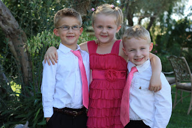
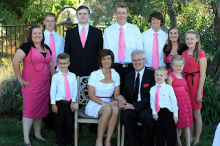
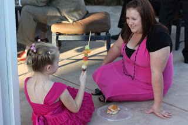





---

<html><head></head><body>
<figure data-trix-attachment="{&quot;contentType&quot;:&quot;image&quot;,&quot;height&quot;:320,&quot;url&quot;:&quot;https://4.bp.blogspot.com/-HHpXa7xRwVE/XJsDwHtHJEI/AAAAAAAEyYg/O4jzztoRJ54Fg1VTb0MdSvMVcZzDTHxLwCLcBGAs/s320/IMG_0524.JPG&quot;,&quot;width&quot;:213}" data-trix-content-type="image" data-trix-attributes="{&quot;caption&quot;:&quot;Engagement Picture&quot;}" class="attachment attachment--preview"><figcaption class="attachment__caption attachment__caption--edited">Engagement Picture</figcaption></figure>

 

<strong>Love does not conquer all </strong> 
<ul><li>For those of you that think everything has been rosy. It has not.</li><li>This has brought up some tension and memories of the hard times. Sacramento Airport.</li><li>We were naive enough that we thought love would be able to handle all of the problems we faced. That helped but was not enough.</li><li>Everything was hard.<ul><li>Meshing kids. We had two 16-year-olds that were completely different from different kinds of friends. One very social and another not very social at all. You cannot force them to be friends, and they didn't want to be. Now they are really good friends.</li><li>Meshing rules. Is there a double standard for some of the kids? Or is everything the same?</li><li>Meshing discipline. Understanding boundaries with step kids were hard. Older kids and younger kids.</li><li>Expectations for a clean house.&nbsp; Darren's idea of clean is picked up. Not clean. Paige wanted things cleaned.</li></ul></li></ul>
<strong> Logistics of a blended family </strong> 
<ul><li>Moving<ul><li>Logistics. What to keep what to throw out? Where do we fit everything? Two households crammed into one place.</li><li>Moving kids from schools, friends, church. etc..</li><li>Paige and kids trying to overcome feeling like guests in the house.</li></ul></li><li>Finances were hard<ul><li>Food was hard, what to cook, what did kids like what did they not like. How much to cook.</li></ul></li><li>Going to church in the same congregation as Darren’s Ex-Wife<ul><li>Whose friends are whose?&nbsp;</li><li>Who can I talk to?&nbsp;</li><li>Who do I vent to, etc?</li></ul></li><li>Going out to dinner was a challenge. Soda or water? Why was it contentious?</li><li>Remember your kids in the changes<ul><li>Kids have such little control over the situation so they want to have some control over the situation. Mountain Dew (Jake), Jacob with his long hair.</li><li>The kids need to feel like they have some control and some say.&nbsp;</li></ul></li></ul>
 

<strong> Marriage counseling and other help that&nbsp; got us through it </strong> 
<ul><li>Marriage Counseling was a big win for us.</li><li>The night we got engaged was our first counseling session.</li><li>Consistently working with a counselor allowed us to establish communication patterns faster than normal. Something we needed to navigate all of the stuff we brought with us. Kids, Exes, jobs, debt, etc…</li><li>Empathy - Get in the trenches with each other. Instead of getting upset with what they are feeling, try and understand what they are feeling. And why they are feeling that.</li><li>Give your spouse the benefit of the doubt. Assume the best first.</li><li>Don’t find fault with your spouse, you will find it.</li><li>Communication, laughter, alone time, intimacy, not wanting to fail.</li></ul>
 

<strong> Funny moment of the week</strong>

Darren had an allergic reaction to sunscreen and turned into the guy from Hitch. He had to take Benedryl for the flight home.

 

 

&nbsp;

 

&nbsp;

 

&nbsp;

<figure data-trix-attachment="{&quot;contentType&quot;:&quot;image&quot;,&quot;height&quot;:213,&quot;url&quot;:&quot;https://4.bp.blogspot.com/-qZf9WaB-hz8/XJsFucagJyI/AAAAAAAEyY8/63qMY9BCXzQWrPQN-KvTcyK-rZ8JWAxnwCLcBGAs/s320/IMG_0952.JPG&quot;,&quot;width&quot;:320}" data-trix-content-type="image" class="attachment attachment--preview"><figcaption class="attachment__caption"></figcaption></figure>

&nbsp;

<figure data-trix-attachment="{&quot;contentType&quot;:&quot;image&quot;,&quot;height&quot;:213,&quot;url&quot;:&quot;https://4.bp.blogspot.com/-a4-wTlJBJ_o/XJsFuVRbkzI/AAAAAAAEyZA/_sdqYJ7Zpv4EfBRDJv45Ku_TvwUlFUeXgCLcBGAs/s320/IMG_0961.JPG&quot;,&quot;width&quot;:320}" data-trix-content-type="image" class="attachment attachment--preview"><figcaption class="attachment__caption"></figcaption></figure>

&nbsp;

<figure data-trix-attachment="{&quot;contentType&quot;:&quot;image&quot;,&quot;height&quot;:213,&quot;url&quot;:&quot;https://4.bp.blogspot.com/-enLjICqbtik/XJsFunRUnQI/AAAAAAAEyZE/eXIU-fSL-WMT2512_es8Wxh-4pCNj0z6gCLcBGAs/s320/IMG_1184.JPG&quot;,&quot;width&quot;:320}" data-trix-content-type="image" class="attachment attachment--preview"><figcaption class="attachment__caption"></figcaption></figure>

&nbsp;

 

&nbsp;

 

 

 

  

<strong>
  <a href="https://www.patreon.com/wheresthelemonade" target="_donate" rel="payment" title="★ Support this podcast on Patreon ★">★ Support this podcast on Patreon ★</a>
</strong></body></html>

 Podcast Transcript 

