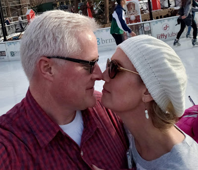
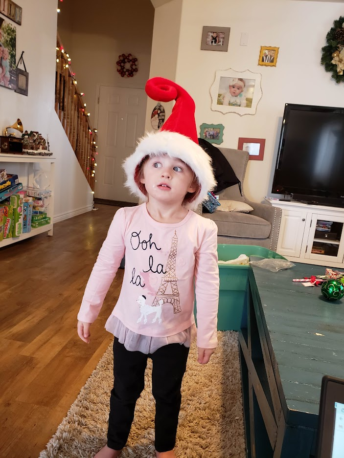





---

<html><head></head><body>
<figure data-trix-attachment="{&quot;contentType&quot;:&quot;image&quot;,&quot;height&quot;:343,&quot;url&quot;:&quot;https://2.bp.blogspot.com/-twq04qVf-L4/XKgomWogtfI/AAAAAAAEywM/oS1g9eMJ64YUgjUK-nlbSK91oQnANaBuwCLcBGAs/s400/darrenpaige.jpg&quot;,&quot;width&quot;:400}" data-trix-content-type="image" class="attachment attachment--preview"><figcaption class="attachment__caption"></figcaption></figure>

Transparency in marriage is a hot topic in social media right now. The constant pull between personal privacy and sharing everything with your spouse has several couples at odds and is lighting up the blended family social groups. In this episode, we discuss how we tackle this hard issue.

<strong> Start with a mutual understanding </strong> 
<ul><li>Both Paige and I had trust issues because of our previous relationships.</li><li>Come up with an agreement that bans secrets from your marriage.</li><li>Your spouse is the one person that you should be completely open with.</li><li>A mutual understanding of transparency helps hold you accountable.</li><li>For us that meant:<ul><li>Everything has to out in the open: Email, texts, account passwords, etc.</li><li>Watch out for land mines of trust (Triggers from a previous relationship)</li><li>Remind each other that we are not the person from the previous relationship.</li></ul></li></ul>
<strong> Give your spouse first priority </strong> 
<ul><li>If you have good or important news, your spouse should be the first one to know.</li><li>Darren has a friend who found out his daughter had her baby through social media instead of a phone call while he was watching other Grandkids.&nbsp;</li><li>Don’t go to your friends first. We share with our spouse first due to respect and love for them.<ul><li>Sometimes you want a specific reaction that you know your friend will give to you, but you need to still tell your spouse first.</li></ul></li></ul>
<strong> Have obvious and open accounts </strong> 
<ul><li>Share passwords on all social media, email, phones, etc..</li><li>All of our texts can be viewed by each other at any time.</li><li>Email is easily accessible and readable by each other.</li><li>All online accounts are known by both of us and we have complete transparency with communication.</li><li>Make sure your online accounts clearly state your marital status. And that you are happy to be married.</li><li>Communication is also shared that we have with our ex-spouses.</li><li>From the National Law Review: (Social Media is affecting relationships)<ul><li>1/3 of all legal action in divorce cases are precipitated by affairs started online.</li><li>81% of attorneys find evidence worth presenting on social media.</li><li>66% involving divorce employe Facebook as one of their principle evidence sources.</li></ul></li></ul>
<strong> Talk about everything often </strong> 
<ul><li>A danger sign is when you start sharing more details of your life with friends than your spouse. Especially someone of the opposite sex.</li><li>We have an agreement that we are not alone with someone of the opposite sex. Sometimes that is unavoidable, but we make every effort.&nbsp;<ul><li>A story of Darren not telling Paige about a co-worker and Christmas shopping for Paige.</li></ul></li><li>The bad news is important news too. Do not withhold bad news from your spouse.&nbsp;<ul><li>Your spouse is there to help you and not tear you down.</li><li>You and your spouse are going through this life together.</li><li>If you are afraid to share bad news with your spouse because you are worried about their reaction. You need to seek counseling.</li></ul></li><li>When you stop sharing with your spouse, walls of distrust start building up.</li></ul>
<strong> Let your guard down </strong> 
<ul><li>Allow your spouse to know you intimately, personally, closely like no one else can know you.</li><li>This often requires hurts, disagreements, and regular forgiveness.</li><li>“We are imperfect people who understand perfect love.”</li></ul>
<strong> Links </strong> 
<ul><li><a href="https://www.allprodad.com/how-to-be-transparent-in-your-marriage/">https://www.allprodad.com/how-to-be-transparent-in-your-marriage/</a></li><li><a href="https://www.natlawreview.com/article/family-law-social-media-evidence-divorce-cases">https://www.natlawreview.com/article/family-law-social-media-evidence-divorce-cases</a></li></ul>
 

<strong> &nbsp;Funny moment of the Week </strong> 

From our daughter Rachel we learned that our Granddaughter Emma wanted to become a dog.

" Emma threw a fit today because she wanted me to make her a "real puppy "... ummm... what? Can the terrible threes be over with already?

I even tried like putting bowls of water and food on the ground and having her fetch. But she just kept freaking out and saying she wasn't a real puppy and was still a girl."

 

<figure data-trix-attachment="{&quot;contentType&quot;:&quot;image&quot;,&quot;height&quot;:937,&quot;url&quot;:&quot;https://lh3.googleusercontent.com/Ud5zlW8EkOxjIQ9b3uLhtjyu8lCVM9szFmkxgILusZU-9Sck_Xd7S9doJz3YWJx6RvAnXfST-GFSOviyJdSWN6NTefmqDzf26FmNlWpSAoItNIDVn0i7QTyxiEfIIllAXrZC9Z81yq7lt6PtweTBGl_cWi294WLNBY3Skb1s8INRl-pkcI_H-o1KyKOhd8hUPlcKMmmVqhDV1AmzUlDXVMGT8maJxiRL_eQk2WxHKOlc8ZMj3euuclnSrQWMZVUC8YMCsB3a4HDoZb4tCkIeoBShzJbSlTbS9ikWzwYn8ucTIGKkwE2T3QZR1i1QmyKzJT-rA_6lFKwmRleNw4_ZCFLjZ3FLJNCE9zTPaLfaAb0F2upiIp6aM0VBtnJoaBV0w5l4pPUtVxN5Q3htdfbFrhXISfEq7LE1p59xwnvcGNKqbLLbXd91jOAsY_kneJoFgJfk5XL2LpRsIThSn14C5UUIAyxs6wqH_RmHwPtCch8ev99aScoaDRQEU7nUikUkA2EW0l9UZP2OfCzsSgXuV2TfnSoxTXsFHt2tDHRAwv4s67QQ8guwlAjOZTOZAaXdgIXqIgWlpVtOE4eplH7mZJ4-fAOR134_qzDjp9vqivIxboVvAtC-Th9FJ-7nVPgzfilcYP4cpvG7Bc3up26mu0NNyC5DjhVj=w703-h937-no&quot;,&quot;width&quot;:703}" data-trix-content-type="image" class="attachment attachment--preview"><figcaption class="attachment__caption"></figcaption></figure> Our little Emma Jane

 

  

<strong>
  <a href="https://www.patreon.com/wheresthelemonade" target="_donate" rel="payment" title="★ Support this podcast on Patreon ★">★ Support this podcast on Patreon ★</a>
</strong></body></html>

 Podcast Transcript 

