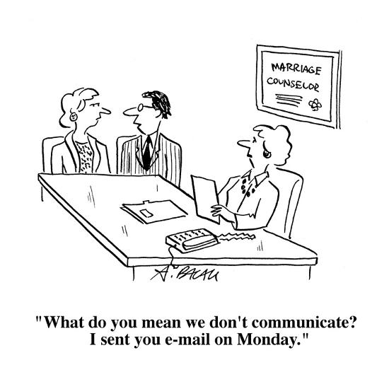





---

<html><head></head><body>
 <figure data-trix-attachment="{&quot;contentType&quot;:&quot;image&quot;,&quot;height&quot;:550,&quot;url&quot;:&quot;https://imgc.allpostersimages.com/img/print/u-g-PGRYFV0.jpg?w=550&amp;h=550&amp;p=0&quot;,&quot;width&quot;:550}" data-trix-content-type="image" class="attachment attachment--preview"><figcaption class="attachment__caption"></figcaption></figure>

 

We had to go to marriage counseling to resolve a problem that has bubbled up over time. In this episode find out how we have used marriage counseling to strengthen our marriage and help us feel like we can tackle the problems thrown at us (with some help of course).

<strong> Counseling in the Beginning </strong> 
<ul><li>We started counseling the day we got engaged.</li><li>Our counselor taught us how to communicate and empathize with each other.</li><li>We spent time getting in the trenches with each other.</li><li>Learned to give each other the benefit of the doubt.</li><li>Periodically we go back to a counselor to get a refresh and help us work through problems.</li></ul>
<strong> Benefits of Counseling </strong> 
<ul><li>Both parties get impartial advice</li><li>A safe environment for honesty</li><li>An opportunity to unburden resentment and frustration</li><li>A forum to rebuild trust</li><li>Creating an attachment bond</li></ul>
<strong> Effectiveness of Marriage Counseling</strong>
<ul><li>The motivation of both partners and time, play an important role in success.</li><li>Find a "good fit" counselor for you and your partner.</li><li>Don't wait too long to reach out for help. (average people wait 6 years to get advice)</li><li>Realize that there will be conflict at times (ups and downs).</li><li>7 tips to deal with differences:<ul><li>Create a relaxed atmosphere to spend time with your partner to talk</li><li>Don't give up personal goal or hobbies</li><li>Support one another's passions</li><li>Learn to resolve conflicts skillfully. Don't avoid conflict work through it.</li><li>Establish open-ended dialogue</li><li>Avoid the blame game</li><li>Be realistic about the timeline for change with a counselor.</li></ul></li></ul>
<strong> Links </strong> 
<ul><li>&nbsp;<a href="https://www.psychologytoday.com/us/blog/couples-thrive/201905/5-ways-marriage-counseling-can-save-troubled-marriage">https://www.psychologytoday.com/us/blog/couples-thrive/201905/5-ways-marriage-counseling-can-save-troubled-marriage</a></li><li><a href="https://www.gottman.com/blog/timing-is-everything-when-it-comes-to-marriage-counseling/">https://www.gottman.com/blog/timing-is-everything-when-it-comes-to-marriage-counseling/</a>&nbsp;</li></ul>
<strong>
  <a href="https://www.patreon.com/wheresthelemonade" target="_donate" rel="payment" title="★ Support this podcast on Patreon ★">★ Support this podcast on Patreon ★</a>
</strong></body></html>

 Podcast Transcript 

