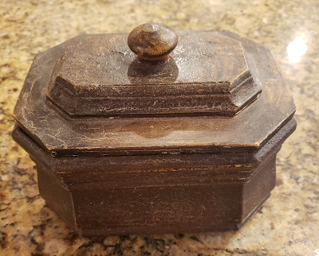





---

<html><head></head><body>
<figure data-trix-attachment="{&quot;contentType&quot;:&quot;image&quot;,&quot;height&quot;:321,&quot;url&quot;:&quot;https://1.bp.blogspot.com/-qpYudqNB0Hg/XhU_CiZb8yI/AAAAAAAFKPo/n2n8R06H3GkOIMu75vlUeiybxAH4gP8-gCNcBGAsYHQ/s400/box.png&quot;,&quot;width&quot;:400}" data-trix-content-type="image" class="attachment attachment--preview"><figcaption class="attachment__caption"></figcaption></figure>

 

 

We have been setting goals with our kids every year at the beginning of the year since we started blending families. We would spend a day after new years day and talk to the kids about the importance of setting and achieving goals. We would write our goals down and then put them in a box in the entertainment center. Then the next year at New Year's day we would dust off the box and look at the goals stored inside. These weren't goals, just forgotten wishes.

 

<strong> Teaching about Goals </strong> 
<ul><li>Braking things down into categories: Physical, Intellectual, Social, Spiritual</li><li>Writing goals down. What is a goal what are steps to achieve a goal</li><li>Family goals</li><li>Sharing goals with each other</li><li>New years resolutions</li></ul>
<strong> Goals not Wishes (papers in a box) </strong> 
<ul><li>Discover,</li><li>Plan,</li><li>Act</li><li>Reflect</li><li>Vision boards</li><li>Asking for help to achieve goals (resources, money, lessons, etc...)</li></ul>
<strong> Blending Families additional coordination </strong> 
<ul><li>Family goals may be different in each home.</li><li>Inconsistency between homes</li><li>Coordinating between parents</li><li>Be careful to not have conflict goals or rewards</li></ul>
<strong> Lemonade Moment of the Week</strong>

We didn't get to see our granddaughters over Christmas, so we worked in the kitchen and family room, painting and building. Check out the picture.

 

<figure data-trix-attachment="{&quot;contentType&quot;:&quot;image&quot;,&quot;height&quot;:480,&quot;url&quot;:&quot;https://lh3.googleusercontent.com/-hl54pqlhz3o/XhUmp7YFt9I/AAAAAAAB3gQ/7MtwiyrBnAUoW6mwoFLGFPoOdE7nSIELACK8BGAsYHg/s640/2020-01-07.jpg&quot;,&quot;width&quot;:640}" data-trix-content-type="image" class="attachment attachment--preview"><figcaption class="attachment__caption"></figcaption></figure>

  

<strong>
  <a href="https://www.patreon.com/wheresthelemonade" target="_donate" rel="payment" title="★ Support this podcast on Patreon ★">★ Support this podcast on Patreon ★</a>
</strong></body></html>

 Podcast Transcript 

