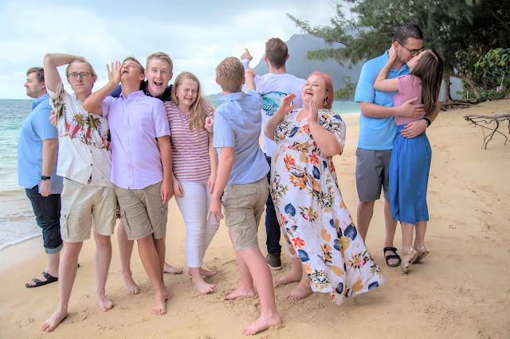





---

<html><head></head><body>
<figure data-trix-attachment="{&quot;contentType&quot;:&quot;image&quot;,&quot;height&quot;:426,&quot;url&quot;:&quot;https://1.bp.blogspot.com/-lgfKMpNphgM/XpcN3AZbzaI/AAAAAAAFNpc/uVPdxUGO2K0_Psq6gQHf6h-peQQs6udOgCNcBGAsYHQ/s640/Christmas2019-2.jpg&quot;,&quot;width&quot;:640}" data-trix-content-type="image" class="attachment attachment--preview"><figcaption class="attachment__caption"></figcaption></figure>

 

 

Nine years ago when we got married we had the perfect vision of blending our families. Of course, we wanted it to be like a nuclear family with white picket fences and a dog. What we ended up with was several different family groups and plenty of lessons learned. But we love our blended family and constantly nurture and feed it. Check out how we got there in this episode.

 

<strong> Blending 4+6 (2+5) </strong> 
<ul><li>We wanted to create one big family not have 3 separate families</li><li>3 little ones are being raised together.</li><li>Hard for the older kids to feel part of all of&nbsp;</li><li>Still a separation between the older kids. The kids need to feel like they still have a bond with the kids they grew up with.</li><li>You cannot force this.</li><li>During the COVID pandemic we have seen many blended families feeling the familial relationships even more.</li><li>It can become very divisive for families</li><li>It is ok to make sure that the kids feel ok about the different family relationships.&nbsp;</li><li>We recognize the different family units</li><li>We try hard to do things all together.</li><li>We plan things together.</li><li>We have a Marco Polo&nbsp;</li><li>Grandbabies help bring the family together.</li><li>Finding fun things to do together. (Hot Lava on the play ground, Obstacle course)</li><li>Allow individuals to be part of their own family.</li><li>Invite kids to participate and encourage them but don't demand it.</li><li>Everyone always goes to the Hawaii trip.</li><li>Kids will be closer to who they grew up with.</li><li>Patience is important</li><li>It may never get to where you had in your head it would be.</li><li>Celebrate the little successes</li><li>Make sure that you don't forget where the kids came from. Strawberry shortcake.&nbsp;</li></ul>
<strong> Tips from the experts (Not Us) </strong> 
<ul><li>A Blended family does not mean we all act as one nuclear family. It means we are adjusted to the new situation.</li><li>Sibling Rivalry<ul><li>Make sure the parents are on the same page with discipline</li><li>No blaming bio kids</li><li>Consequences and rewards need to be the same regardless of how it used to work.</li><li>Avoid placing labels on the kids. Good and bad</li></ul></li><li>Everyone needs attention<ul><li>Set a set schedule to give kids individual time</li><li>Both parents attend events</li><li>Monthly outings</li></ul></li><li>You feel like different families<ul><li>It takes time to build a shared history</li><li>Begin need traditions</li><li>Make transitions fun. Get an ice cream.</li><li>Give times to grief</li></ul></li><li>Mistakes are made, by kids and adults. Move on.</li></ul>
 

 

 

  

<strong>
  <a href="https://www.patreon.com/wheresthelemonade" target="_donate" rel="payment" title="★ Support this podcast on Patreon ★">★ Support this podcast on Patreon ★</a>
</strong></body></html>

 Podcast Transcript 

