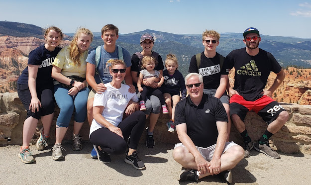
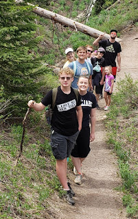
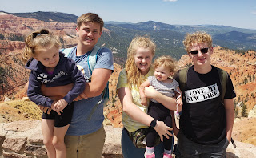
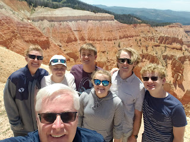
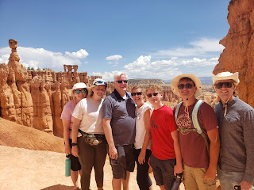
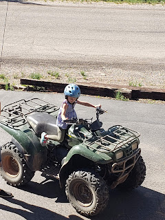





---

<html><head></head><body>
<figure data-trix-attachment="{&quot;contentType&quot;:&quot;image&quot;,&quot;height&quot;:373,&quot;url&quot;:&quot;https://1.bp.blogspot.com/-or9gB0CBY5k/Xv3z_ZnXh5I/AAAAAAAFRxc/gfK5ZCEYIBQC11pFdWm_hweATtRb3GkIwCK4BGAsYHg/w625-h373/wtl-brianhead.jpg&quot;,&quot;width&quot;:625}" data-trix-content-type="image" class="attachment attachment--preview"><figcaption class="attachment__caption"></figcaption></figure>

 

Darren and Paige spend a week away from the world with the family. No COVID, no riots, just the forests, canyons, and family. Learn how we disconnect from our worldly cares and have a fun time decompressing.

 

 

 
<ul><li>Important to get away from the bad news of COVID, riots, etc..</li><li>COVID is still there and we followed the social distancing guidelines.</li><li>We took a trip from Northern California to a remote cabin in Southern Utah. Brian Head, UT</li><li>Thanks to Mom and Dad for letting us use your cabin.</li></ul>
Traveling with 7 adult size people
<ul><li>Our son Jacob loves MiniVans. When we tried to put everyone stuff in the minivan I was worried we could not fit it. Jacob found more storage.</li><li>.Option to take two cars. Jacob did not want to drive rather sit on the hump in the back.</li><li>The 10 hour trip in the car with 7 adult size people. Sitting arrangement is the most important thing</li><li>Traveled the loneliest highway in the US. Fallon, NV to Ely, NV is 250 Miles with 2 towns between. 4 hours of nothingness. Austin population 190, Eureka population 600.</li><li>Antilope, Cows, Deer, Chipmunks, Moving road (spiders or locusts)</li></ul>
 

Our week at 10,000 ft.
<ul><li>Getting used to the altitude (drink lots of water, humidifier, lack of sleep, head aches, nose bleeds)</li><li>Babies did great this time. First time our granddaughter came up to the cabin she was sick the whole time.</li><li>Our plan was not to have a plan. Just relax, take some hikes, enjoy no news, ride ATVs and have fun.</li><li>3 hikes that we had fun on.<ul><li>Cedar Breaks Elevation 10,500 ft.&nbsp;</li><li>Alpine Pond - 2 mile hike with 500 feet elevation change. Very simple hike we took our granddaughters (1 and 4 years old).</li><li>Ramparts overlook - 4 mile hike with 1500 feet elevation change. Very hard hike.</li><li>Bryce canyon - 4 mile hike Queen's garden and Navajo loop. Moderate hike.</li></ul></li><li>One day in St. George visiting family.&nbsp;<ul><li>Great Honolulu Grill for lunch.</li><li>fun time with family and parents.</li></ul></li></ul>
<figure data-trix-attachment="{&quot;contentType&quot;:&quot;image&quot;,&quot;height&quot;:320,&quot;url&quot;:&quot;https://1.bp.blogspot.com/-fKggX9Qf5JM/Xv348l_aIHI/AAAAAAAFR2g/cvOSlbTCG38aJCfcZXP6oGHCx4uSl68TACK4BGAsYHg/s320/wtl-bh1.jpg&quot;,&quot;width&quot;:200}" data-trix-content-type="image" class="attachment attachment--preview"><figcaption class="attachment__caption"></figcaption></figure>

 

<figure data-trix-attachment="{&quot;contentType&quot;:&quot;image&quot;,&quot;height&quot;:197,&quot;url&quot;:&quot;https://1.bp.blogspot.com/-KaKNXlDHESs/Xv3488jIrKI/AAAAAAAFR2o/En3ewhD43tcIzQKZ41Y4cRj4TeaIJsxtwCK4BGAsYHg/s320/wtl-bh2.jpg&quot;,&quot;width&quot;:320}" data-trix-content-type="image" class="attachment attachment--preview"><figcaption class="attachment__caption"></figcaption></figure>

<figure data-trix-attachment="{&quot;contentType&quot;:&quot;image&quot;,&quot;height&quot;:240,&quot;url&quot;:&quot;https://1.bp.blogspot.com/-16FY98BbFl4/Xv36RM56PBI/AAAAAAAFR5M/hRp96BE0DEcBDaPZsFX4NghBGXXkUSHbwCK4BGAsYHg/s320/20200625_145824.jpg&quot;,&quot;width&quot;:320}" data-trix-content-type="image" class="attachment attachment--preview"><figcaption class="attachment__caption"></figcaption></figure>

 

<figure data-trix-attachment="{&quot;contentType&quot;:&quot;image&quot;,&quot;url&quot;:&quot;https://1.bp.blogspot.com/-G7U8GDdmsw4/Xv36RVMS8DI/AAAAAAAFR5Q/sBW25Qiab7YtXb9DLgR7suOXQGZYsWgDwCK4BGAsYHg/s320/20200626_115927.jpg&quot;,&quot;width&quot;:320}" data-trix-content-type="image" class="attachment attachment--preview"><figcaption class="attachment__caption"></figcaption></figure>

 

<figure data-trix-attachment="{&quot;contentType&quot;:&quot;image&quot;,&quot;height&quot;:320,&quot;url&quot;:&quot;https://1.bp.blogspot.com/-3KBC7OsNY6A/Xv36vqc1JfI/AAAAAAAFR5k/SdvuwBmMt6cv5M63i5B5DfJCzoGKOXT2gCK4BGAsYHg/s320/20200624_165526.jpg&quot;,&quot;width&quot;:240}" data-trix-content-type="image" class="attachment attachment--preview"><figcaption class="attachment__caption"></figcaption></figure>

 

 

<a href="https://1.bp.blogspot.com/-fKggX9Qf5JM/Xv348l_aIHI/AAAAAAAFR2g/cvOSlbTCG38aJCfcZXP6oGHCx4uSl68TACK4BGAsYHg/s1498/wtl-bh1.jpg">  </a> 

<strong>
  <a href="https://www.patreon.com/wheresthelemonade" target="_donate" rel="payment" title="★ Support this podcast on Patreon ★">★ Support this podcast on Patreon ★</a>
</strong></body></html>

 Podcast Transcript 

