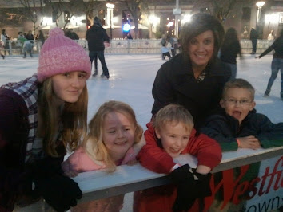





---

<html><head></head><body>
&nbsp;

<figure data-trix-attachment="{&quot;contentType&quot;:&quot;image&quot;,&quot;height&quot;:266,&quot;url&quot;:&quot;https://lh3.googleusercontent.com/-itp6BQErieU/YElbv2isUfI/AAAAAAAFaXM/tKtWzF6j7Is7ehsdtwbAGk--e3PnZlSjwCNcBGAsYHQ/w354-h266/2011-12-17%25252017.09.31.jpg&quot;,&quot;width&quot;:354}" data-trix-content-type="image" class="attachment attachment--preview"><figcaption class="attachment__caption"></figcaption></figure>

 

In this episode we revisit traditions. We start questioning some of the traditions we stuck with when we first blended after one of our kids mentioned how busy Christmas is and how it would be nice if it was a bit slower.&nbsp;

Why Traditions are important:
<ul><li>They give us a foundation to build our lives on</li><li>They give us a sense of roots and belonging</li><li>We asked the kids what they thought<ul><li>The Younger kids had a different perspective than the older kids&nbsp;</li><li>They can only remember the traditions that we currently have</li><li>They have some that are doubled up</li></ul></li><li>Older kids remember<ul><li>Some of the traditions when we were still married to their parents. Some we have dropped</li><li>Some of the traditions that we continue to do give them a sense of belonging to this new family</li></ul></li><li>Building Traditions in Blended Families<ul><li>Keep Traditions (Combining)</li><li>Choose one over another</li><li>Creating new ones</li></ul></li></ul>
Keeping or SlashingTraditions:
<ul><li>Keeping both traditions for the same event</li><li>Sausage Fondue and Eggs Benedict - combined Christmas breakfast</li><li>Sausage Fondue is from Paige’s first husbands family</li><li>Giving the kids an ornament is from Paige’s first husbands family</li><li>Acting out the Nativity</li><li>Fondue on Christmas Eve</li><li>Easter baskets&nbsp;</li><li>Carving Pumpkins. Only kids like, we wouldn't mind if it went away ;)</li><li>Adjusting to the aging kids.</li><li>Introducing new conditions</li></ul>
Evaluating and Creating New ones:
<ul><li>We tried a new tradition of going to a tree farm to get a Christmas tree for a few years.<ul><li>ended up at home depot to get a tree</li><li>we now have a fake tree.</li></ul></li><li>Ice cream for dinner (fail, everyone was sick). Dinner for dessert</li><li>Monday night swim parties</li><li>Swimming at Christmas</li><li>Ikea Scavenger Hunt</li><li>Valentine days auction</li><li>Dancing before bed</li><li>Reading Scriptures never really took hold until Dallin challenged us to read scriptures consistently, which is now 7 years and going</li><li>Ice Skating at Christmas every year (No one totally enjoys this, everything hurts, and we are cold, but it is fun. ;)</li><li>Cooking competition</li></ul>
<strong>
  <a href="https://www.patreon.com/wheresthelemonade" target="_donate" rel="payment" title="★ Support this podcast on Patreon ★">★ Support this podcast on Patreon ★</a>
</strong></body></html>

 Podcast Transcript 

