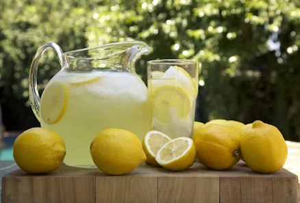





---

<html><head></head><body>
<figure data-trix-attachment="{&quot;contentType&quot;:&quot;image&quot;,&quot;height&quot;:296,&quot;url&quot;:&quot;https://lh3.googleusercontent.com/-ELKl1gJGAtI/X_0qL1H4QyI/AAAAAAACKVU/O2y5_14BTSkeNW9ueLz98UDBKrWLdPkMwCLcBGAsYHQ/w438-h296/image.png&quot;,&quot;width&quot;:438}" data-trix-content-type="image" class="attachment attachment--preview"><figcaption class="attachment__caption"></figcaption></figure>

  

There are many studies on the adverse effects of divorce and the trials of blended families. In this episode, Darren &amp; Paige are only looking at the "Lemonade" of blended families. That is right put on your "Rose Colored Glasses" and look at all of the benefits of a blended family. If you want all of the hard things that come with a blended family check out all of our other episodes. :)&nbsp;
<h1>For the kids</h1><ul><li>More Christmas presents</li><li>Two birthdays,</li><li>Two of the holidays</li><li>More Grandparents</li><li>Bonus parents.</li><li>Kids can see a better model of a relationship. If you are moved past the old baggage.</li><li>I broader world view. More aunts and uncles, grandparents and parents.</li><li>Kids tend to become more flexible because of conflict resolution and multiple households.</li><li>Kids typically score higher on emotional skills: forgiveness, generosity, and negotiation.</li><li>More siblings. Sam would be an only child 100% of the time. Not just 50%.</li></ul><h1>For the Parents</h1><ul><li>Sometimes we don't have the kids. Some alone time.</li><li>Sometimes a step-parent can fill a gap in the bio-parents. My kids' step Dad is a captain for sailing. and an Architect.</li><li>Sometimes kids bring different perspectives or talents to the family.</li><li>If you can move past old baggage, you can be more realistic about your relationship.</li><li>Financial stability over a single parent. More than one source of income.</li><li>Kids might be more honest with step-parents, be prepared to listen and take the input.</li><li>Learning to love not just by instinct. More kids to love.</li><li>Different world view. Blended Families include_relative _includes/in-laws and the families are already grown up.</li><li>We make sure we have learned from our mistakes of our first marriage.</li><li>Teaches patience.</li></ul><h1>How to make Lemonade</h1><ul><li>Some of our kids did not start out liking the whole blended family.</li><li>We have to approach things and find Lemonade.</li><li>Make a conscious effort to be part of it.</li><li>Try and find something positive out of something really bad.</li><li>It takes effort and flexibility.</li></ul><h1>Lemonade Moment of the Week</h1>
Darren getting older gave us an excuse to go out. But everything is locked down. Except the drive-in.

<strong>
  <a href="https://www.patreon.com/wheresthelemonade" target="_donate" rel="payment" title="★ Support this podcast on Patreon ★">★ Support this podcast on Patreon ★</a>
</strong></body></html>

 Podcast Transcript 

