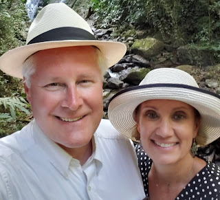





---

<html><head></head><body>
&nbsp;

<figure data-trix-attachment="{&quot;contentType&quot;:&quot;image&quot;,&quot;height&quot;:291,&quot;url&quot;:&quot;https://1.bp.blogspot.com/-SnUJxnJf3lU/YBISsP9LeNI/AAAAAAAFYi0/Xm3L6-hhKIIpcrsx4hHZx-5SBgTH_Q2vwCNcBGAsYHQ/s320/panama.jpg&quot;,&quot;width&quot;:320}" data-trix-content-type="image" class="attachment attachment--preview"><figcaption class="attachment__caption"></figcaption></figure>

 

We recently had facebook and google give us reminders of where we were 2 years ago today. What came up is the inception of our podcast. On a trip to Panama for a "getaway" of time "alone together", we dreamt up a crazy idea of podcasting our experiences of blending a large family. In today's episode, we went back and listened to our first episode, and wrote down what we thought.

 

Our Thoughts from our first podcast
<ul><li>Dating was incredibly difficult. Remembering details about people is not my strength so I kept a spreadsheet. I actually dated two women that both had a daughter named Amanda. Not good to confuse the two. :)</li><li>We knew so little back then when we first started. We had lots of topics to talk about and had to learn how to talk about tough subjects without harming the kids or the relationship with their parents.</li><li>I hate COVID and I need to go on a trip with my wife to re-energize and re-connect again.</li><li>We need to continue to learn more as we continue to experience new things as a couple together.</li><li>This last year we had several new experiences with adult children moving in, moving out, and getting married.</li><li>This time was a trying time for Darren as he was changing jobs and moving his career in a different direction.</li></ul>
Lemonade Moment of the Week

A broken toilet turns into a full bathroom remodel. Up side we have a new bathroom and new tools.

<strong>
  <a href="https://www.patreon.com/wheresthelemonade" target="_donate" rel="payment" title="★ Support this podcast on Patreon ★">★ Support this podcast on Patreon ★</a>
</strong></body></html>

 Podcast Transcript 

