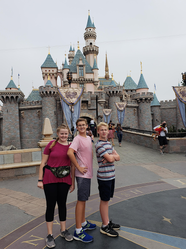





---

<html><head></head><body>
<figure data-trix-attachment="{&quot;contentType&quot;:&quot;image&quot;,&quot;height&quot;:240,&quot;url&quot;:&quot;https://lh3.googleusercontent.com/-zERFI3PXVxo/YCQX7wOXq6I/AAAAAAAFZ5A/sdAG3QbpnMAwddtwyhSRv31nJO-WX1zCwCNcBGAsYHQ/image.png&quot;,&quot;width&quot;:180}" data-trix-content-type="image" class="attachment attachment--preview"><figcaption class="attachment__caption"></figcaption></figure>

 

 

Disneyland Dad Syndrome is real and affects blended families every day. It is so prevalent that there is a legal definition for it. So how do you become a Disneyland Dad? How do you deal with a Disneyland Dad? Darren &amp; Paige give their insight into this problem in Blended Families.

What is a Disneyland Dad
<ul><li>Legal Definition</li><li>Only having fun when you are with the kids</li><li>No rules, responsibilities, or discipline</li><li>Indulging in gifts.</li></ul>
Why you become a Disneyland Dad
<ul><li>Intentional - deliberately overindulges the kids to undermine the other parent.</li><li>Un-intentional - Trying to have fun with his kids with limited time that they have with the kids.</li><li>"Visitation" - is a term that makes it seem like your kids are just visiting and therefore you want to use the very limited time doing fun things not school work or chores. etc...</li><li>Frequency of seeing the kids play a big part.</li><li>When we see the kids - Weekends and Evenings. Most families have fun on the weekends. Stay up late, excursions etc..</li><li>How to avoid being a Disneyland Dad</li><li>The parents do not have the same schedules or circumstances. School with homework, weekends only. etc..</li><li>Be consistent</li><li>Be involved</li><li>Encourage responsibility</li><li>Teach them</li><li>Consistently discipline. - Mom's rules don't matter at Dad's house. Not good.</li></ul>
Dealing with a Disneyland Dad
<ul><li>Connect with your kids - The quality time is more important</li><li>Focus on your own relationship with your children. - You cannot control what the other parent does.</li><li>Let it go!! - Don't get stuck in frustration and anger.</li><li>This is not a competition. Children are not consumer whose love is bought by stuff or entertainment</li><li>If you compete you lose.&nbsp;</li><li>Being Present. Tune in.&nbsp;</li><li>Don't say negative things about your co-parent.</li><li>Have fun and play. Does not need to cost money.</li><li>Have confidence in your parenting. don't compare yourself to the co-parent.</li></ul>
 

Lemonade Moment of the Week

The pinhole leak turned out to be a nail that slowly leaked.

<strong>
  <a href="https://www.patreon.com/wheresthelemonade" target="_donate" rel="payment" title="★ Support this podcast on Patreon ★">★ Support this podcast on Patreon ★</a>
</strong></body></html>

 Podcast Transcript 

