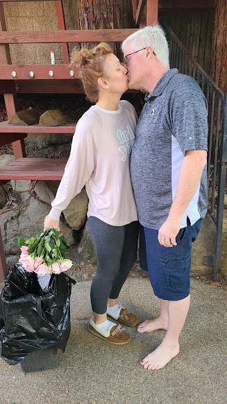





---

<html><head></head><body>
&nbsp;<figure data-trix-attachment="{&quot;contentType&quot;:&quot;image&quot;,&quot;height&quot;:582,&quot;url&quot;:&quot;https://lh3.googleusercontent.com/-Bac_0p_7Aso/YDbFjrDUcVI/AAAAAAAFaMI/tKUe--Kb3JMIDcQs22fHPpC05LYdWedqQCNcBGAsYHQ/w328-h582/20210224_094900.jpg&quot;,&quot;width&quot;:328}" data-trix-content-type="image" class="attachment attachment--preview"><figcaption class="attachment__caption"></figcaption></figure>

 

Have you ever wondered why Valentine's Day is so stressful? We can tell you why. Expectations vs Reality. Listen to the latest "Where's the Lemonade?" to hear how Darren &amp; Paige handle or don't handle this curious holiday so well.

And Yes that is Paige throwing away flowers that Darren got her for Valentine's Day. :)

Valentine's Day
<ul><li>Most wanted gifts for women (Big loving gestures, some love it,&nbsp; and some hate it)<ul><li>Card</li><li>Flowers</li><li>Chocolate</li><li>Jewelry</li></ul></li><li>Most wanted for men&nbsp;<ul><li>Sex</li><li>Chocolate</li></ul></li><li>Does your valentines day feel like Saint Valentine's Day Massacre was 1929.</li></ul>
Expectations and Reality
<ul><li>Inequality in the holiday</li><li>More pressure on men than women for this holiday<ul><li>Women expect men to do something romantic for Valentine's Day</li><li>So why (80% of cards are bought by women)?</li><li>Mostly for kids and grandkids</li></ul></li><li>Our first Valentine's Day disaster<ul><li>Ballons on the ceiling, holes in the ceiling</li></ul></li><li>Our second Valentine's Day disaster</li><li>Gas station card at the last hour. after a 10-hour drive in the car in the snow.</li><li>Setting expectations: Paige tells Darren exactly what she expects for the holiday (but then apparently doesn't mean it)</li><li>Communicate your needs as long as they are not ridiculous</li></ul>
Ideas for Valentine's Day
<ul><li>For men to women&nbsp;<ul><li>Put some thought into your gift</li><li>Keep it simple. Do something different on that day. Something outside of the ordinary</li><li>Darren does not get Paige flowers on Valentine's Day. He does it throughout the year.</li><li>A card with a handwritten note might be just what she needs</li></ul></li><li>For women to men<ul><li>I want to just get through this holiday without making her too disappointed</li></ul></li><li>We have changed the holiday to be a fun family dinner auction. In celebration of the feast of St Valentine.<ul><li>Thanks, Survivor</li><li>It takes the pressure off of having something extremely romantic and instead is something fun with the kids</li><li>This doesn't mean we don't do something romantic around that time</li></ul></li></ul>
Links
<ul><li>https://www.proflowers.com/blog/the-history-of-valentines-day</li><li>https://www.shropshirestar.com/entertainment/features/2020/02/08/valentines-day-2020-team-weekend-ponder-what-men-and-women-really-want/</li><li>https://en.wikipedia.org/wiki/Feast_of_Saint_Valentine</li></ul>
<strong>
  <a href="https://www.patreon.com/wheresthelemonade" target="_donate" rel="payment" title="★ Support this podcast on Patreon ★">★ Support this podcast on Patreon ★</a>
</strong></body></html>

 Podcast Transcript 

