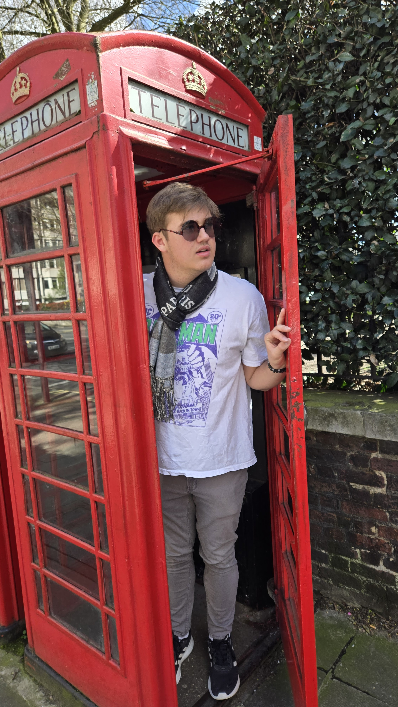
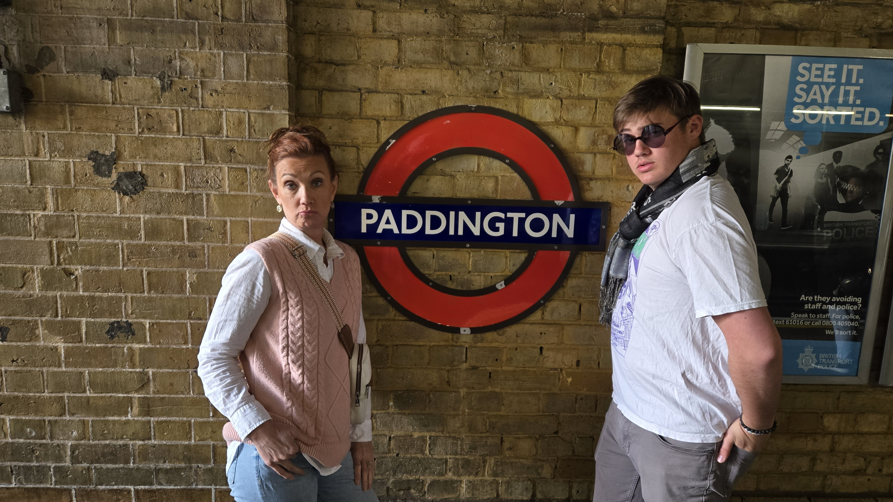
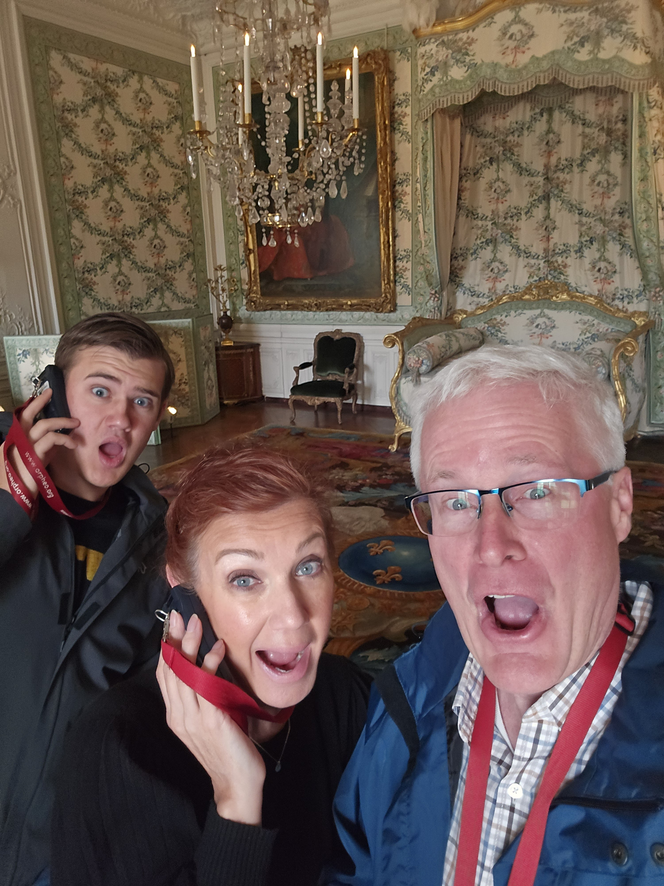
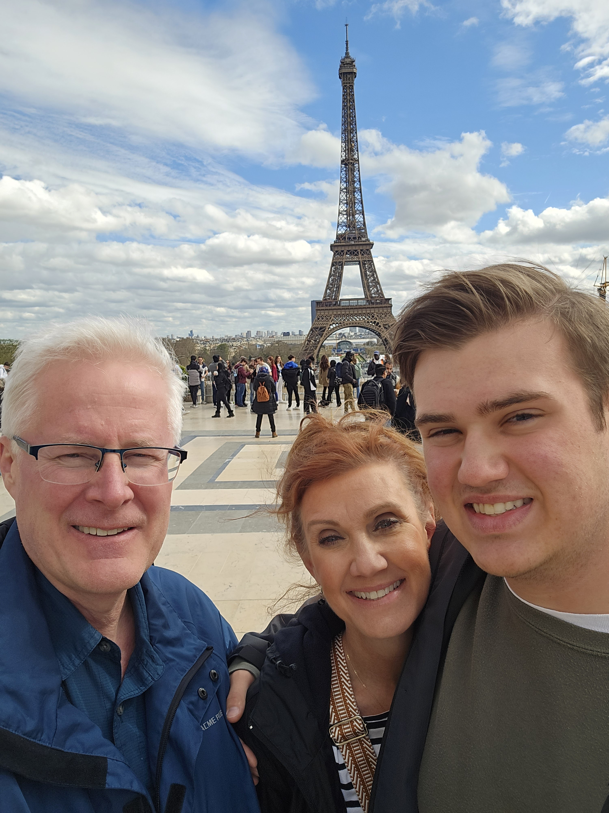





---

We all know that family vacations are meant to relax, unwind, and spend some quality time with our loved ones. But, how do you ensure a smooth and enjoyable trip when your travel companions are unpredictable, opinionated, and passionate teenagers? Based on the experiences of one family who recently traveled abroad during their spring break to Italy, we reveal some important tips that could make your next family overseas trip a lot easier.

## Involving Teens in Travel Planning: Fostering Excitement and Learning

Traveling with teenagers is all about giving them a sense of ownership and understanding their unique perspectives and interests. This starts right from the planning stage. By involving teenagers in decision-making, you not only allow them to contribute meaningfully but also keep their enthusiasm and interest alive throughout the journey.

Guiding them to form opinions about various options in different cities gives an opportunity for everyone to learn about new locations together. Keeping room for flexibility can ensure that the plans are adjusted as per the evolving interests and energy levels of young travelers. By doing this, you make them feel considered and in charge, reducing their possible resentment of being dragged into the trip.

## Handling Different Personalities: Striving for Balance

Handling different personalities during a vacation is another challenge that requires both patience and strategy. Your stoic bookworm may want nothing more than to quietly immerse themselves in the intricacies of the local culture and history, while your fiery, outgoing teen could want to try everything the locale has to offer.

The families who experienced these personality differences amongst their children when abroad highlighted the importance of personal space and independence. Allow your children the time and room to follow their own interests, within reasonable boundaries of safety and time. Allow them to play games, read books and even explore museums independently. This way, they can enjoy their vacation in their own ways.

## Optimal Vacation Planning: Balancing Preferences and Participation

To foster an environment that encourages both - enjoying the moment and creating unforgettable memories together, it is necessary to ensure everyone's preferences are considered and everyone feels involved in the planning process. 

This family’s experience teaches us a significant truth - to have a memorable and enjoyable family vacation, especially with teenagers, it's important that we listen, compromise, and accommodate everyone's preferences and styles. The objective should be to create a balance between group activities and individual exploration. 

Traveling offers an excellent opportunity to bond with our children, understand them better, and make unforgettable memories together. Remember, the success of your family vacation largely depends on how open, flexible, and considerate you are during your travel planning and execution stages. Don't forget to involve your teenagers in the decision-making process and you will enjoy a smoother and memorable journey together.

 Podcast Transcript 

1

They're like, I'm just being draggedalong for what?

Mom and Dad want. To take a lot of this.

And this. Paige, and this is.

Where lemonade. Where we. Talk about.

I don't know if they would say it,but it might be an yeah.

They said I live in 24. Yes.

And we said, well no one is up there.

And no one house.

And they wouldn't because.

Today's episode.

Had them traveling to Europe.

Yeah.

With teens.

But our kids are spoiled rotten.

And that is a fact.

Our younger kids,sometimes our older kids are still like,

I can't believe that the younger kidsget to do what they do.

So last last year for spring break,we took the Three Amigos,the three youngest on aof springbreak trip to Italy, of all places.

We did.

We kind of let Madeline pickbecause that was her last spring break.

So that was her senior year? Yep,that was her senior year.

So she got she chose Italy and that'swhere we went with the Three Amigos.

And that was a lot of fun.

We did it kind of on the cheap.

We did an Air BnB out in the countryand we use points.

Same sort of thing for Sam, for

Sam Spring Bake by himself,no siblings with himand he wanted to go to London and Paris.

I can't even imagine as as kids at 18,

Could you imagine your parents going,

Hey, we're going to take you to London?

Paris? No.

But I did go when I was 15.

My parents took me to Hawaiibecause my dad had a work thing there.

That was that was my highlight. I was.

So are we indulging our kids too much?

Is that. I don't know. Are we? Yes.

I think our older kids would say yes. Yes.

All the kids would say yes.

Yeah, my older kids would be like,

I got a backpackmy senior year for graduation.

That's right. Yeah. They did, didn't they?

That's about what they got.

Yeah, well, times change, guys.

Times change.

And there's nowhen we went our trip to Italy,it was fascinatingwatching the three Amigos.

Madeleine is probably the most moderate.

Yeah, Of all the kids,everything was in moderation.

I want to go to the museums. It was fun.

I've had enough of the museums.

Let's go back to the Airbnb and chill.

Yeah. Here. Look at the countryside.

Sam was like,

I need to read every single plaquein front of every single photo or paintingor sculpturein every museum that we walk by.

Well, and he wanted to be gone.

He was like, We're in Italy.

We need to be gone from 8 a.m.in the morning until ten at night, becausewhy would we just sit at the Airbnb?

We're in Italy.

So that was.

Sam, That was him and David was.

We have to leave the Airbnb.

Why? I just want to play on my switch.

I just want to play on my switch in Italy.

In Italy.

Why do we need to leave and go anywhere?

I understand.

I think part of that was their age.

I think part of it was their age.

And then also it is their personalities.

It is their personality.

I mean, it really is David is a homebody.

He would rather be at homeand go do things with his friends and playsome video games,then go to a foreign country.

Honestly, he No. No, no.

I totally. Agree.

So it was a different trip.

The their energy is different,you know, I mean, liketheir personalities were different.

So that was a very different trip, tryingto manage and please three teenagers.

Three teenagers.

That was a challenging trip for us, right?

Yeah. Yeah, absolutely.

So this trip was Sam much easierbecause we only had to pleaseone person over here.

He run us ragged.

He he thinks that's hilariouswhen we say that.

He's like, What do you mean?

I ran you ragged.

Like we didn't do anything.

Like, we weren't running a marathon.

We weren't, you know, we would be gonefrom.

Eight in the morning till 11:00.

And yeah, we would meet for breakfastat 830, leave the hotel by nine.

This was almost every single day.

And we would get back at like 1130at night.

Yeah.

And he was like, okay, that was,that was an okay day.

Wow. So and we're like,we're exhausted. He's like, Why?

We're like.

We're on a nap at 334 Nap.

We did get a nap on one daywe got a nap, but.

Well, that's because we woke up at 4 a.m.to go catch a train. Yeah.

We figured it out.

But you did some investigationon investigation?

Well, you're. You're.

You're a research arm of our corporationhere.

I did.

I did some research into getting some tipsfor traveling with teens.

And we did pretty good.

Then We did pretty good.

We did a lot of the things that were werein the articles about tips.

So and there was a couple that we didn'tdo, but maybe we didn't need to.

Anyway,

We can talk about our tips and trips.

Yeah. So let's hear our tips and tricks.

Yeah, you did tips and tips Trip. Yeah.

Now we can't even talk.

Tips and tricks and tricks.

Yes. One of the first thingsand we did pretty well with this wasyour teenager needs to be involved inwhat's going on on the trip so ask themwhat do you want to do in these cities?

And most of the time

Sam didn't know what was even available.

Yeah, so we had to sit down with themand that was kind of fun.

Sit down, says, Well, there's this andthis is what happened at that location.

When you travel in Europe,it's all about history.

Yeah, yeah.

No, it's it's really important,especially now for us.

We had already beento both of these places multiple times,so it might have been a different tripif it was all of our first time.

Do you.

Know? I agree.

So because we had done all the things,you know,most of the things we had done,most of them already,we really were letting Sam run with itand go, What do you want to do?

Because we suggested some things.

Yeah, it really did.

Because he didn't like it.

So like he knows to go to this museum.

Tower of London?

Yeah. Yeah.

Like we were like, Do you want to go to

Victoria and Albert Museum?

He's like, I've never heard of it.

You, I mean, like, right,

Of course, things like that. Butit's really, reallyimportant to have your teens involved.

If you just say,

I think I think if you just say, Here'syour itinerary, this is what we're doing.

I think that's a mistake.

I do, too, because then then the kidshaven't bought into it right?

They're like, I'm just being draggedalong to what mom and Dad want to do. man.

If my kids said that after

I took them to Europe, I would be livid.

But I don't know that they would say it,but it might be.

Way it might be in their head.

But if they said that out loud, I would.

I would blow gasket.

Yes. Well, no one has said.

That and no one else.

And they wouldn'tbecause we had them in the plane.

Yeah,exactly.

So there's a tip for you right there.

Don't plan your trip for your teen.

If you're taking a teen on a trip,get them involved.

Show them what it's kind of like.if you want to do that,then we have to rent a caror we're going to have to take the A trainor the subway or busses, whatever.

Just get them involvedand see how much it really is.

And they'll buy into it.

They'll, they'll, they'll be a part of it.

Well and give them options. Right.

You don't have to go. Okay.

Tell me what you want to do on Tuesdayin London.

Well, they're a teen, so guess what?

If it's a especially if it's a boy teen,they're not going to look up what to do.

They're gonna be like,

I don't know what's there to do.

If it was a girl,she might research and. Come on.

We did have to cross.

Rachel loves Paris,so she knew everything we wanted to do.

And we took her to Paris.

Julien.

She knew everything she wanted to do.

Yeah.

Madeleine When we went to Italy,she knew everything she wanted to say.

Right.

And Amanda, when Amanda was with us,she knew what she wanted to do.

We left when we took our three girls.

We let them.

Each pick a day and a day was theirs.

They could plant however they wanted.

And that was great.

Yes, that worked out.

That worked out great.

So give them options.

Say okay. And we did that to you.

We were like, okay, Sam, on this daywe're going to go to the Tower of London.

Then after that, we could do this or thisor we could do this five.

Or six different things nearby, right?

This is this is what each portrays.

And guess what?

We didn't even there.

We made adjustments even on the trip.yeah. So having flexibility,not over planning.

Or you're not over plan.

Yeah, because, you know,you don't know how long the lines are.

No, don't over planand you want to have some flexibilityif you see somethingand you go, that is, that looks cool.

Yeah.

You want to have some flexibility.

So I'm a big fan of.

Yes, having something planned every daylike we do.

We have something planned every day.

We have an areathat we're going to be every day,but have some flexibility ofif you see something.

But, you know.

Do your researchupfront, do. Your research.

Obviously, like the kidsare not going to be much in the planningof the hotels or their rental carsor the transportation. Buttalk to them.

I mean,if you're going to like a tropical place,maybe they want to sit on the beachrather than go to the museumand you might have to compromiseif they go,

I just want to sit on the beachthe whole time, you know.

Well,how about if you sit on the beach two daysand then two days we do something right.

You got to compromise so that everybody'sgetting the trip that they want, right?

Or sit on the beachwhen the weather's nice and it's not.

Maybe in the afternoonswe go to museums or whatever, right?

So just make sure, like if youif your teen is like, I just want to siton the beach the whole timemaybe.

And you're like, No, that's notwhat we're doing.

You might be planning the wrong trip.

You maybe you need to be going on a tripwith just your spouseand not take your teens on.

You know what I mean?

You make sure you're planningthe right trip for your team and yourself.

I like that.

Yeah. Okay. The next tip here,

I'm really like this one.

And we actually did this one.

I didn't even know about this tip.

And that is let yourlet your child, your teenager, explorea little bit on their own.

Yeah, right.

Within reason or within reason, of course.

And of course, we're seeing teenslike we're not talking about ten,ten year olds or even 12 year olds,but 16 and up.

I think that, you know, they can explorea little bit on their own,especially in certain areas. Yeah.

So the first time I experiencedthis is when I actuallyhad a business trip to Japanand I took Jacob with me.

Jacob was 18 at the time, just turned 18and I said, Well, you know,

I got three days of meetings.

I know you can see Japan, we can goand tour things, what do you want to do?

And he goes, I'm going to take the subway.

I'm going to tour Tokyo myselfas an 18 year old and he did wonderfully.

I don't know that I would do thatin other countries in Europe.

Just send an 18 year old out on their own.

Yeah, you definitely have to look at the.

At the area.

Yeah,but with Sam, when we were in the museums,we did not sayyou have to stay with us. No,he kind of explored on hisown and there were a couple of timeswhere we are, man, we're Sam.

I know we did.

We were like,we would get on our life360 and be like,okay, he's in this area over here.

So we knew.

He was at least in the building.

And but, but that was greatbecause then you're not pushing your childto eitherstay with you or for the case of Sam,we're like, He wants to read everything.

I don't want to read everything.

Right? Exactly.

So we would find a nice place to sit downand relax a little bit.

And Sam was just enthralledand yeah, everything going on in museums.

So that worked out really well for usthat he didn't feel pressuredand we didn't feel likewe were nagging him right.

And I highly recommendand so does Rick Stevesget whenyou go to a museum, get the audio guide.

I saw some people that didn't havethe audio guide at so many places went toand I was like, it'sliterally if you're if you're spendingthe money to go on a trip to Europe,

I promise you,you can afford the €3 or the £3.

You know, both places are went to eurosand I promise you can afford that.

You went to Europe.

You can afford to get the audio.

But we.

Made a mistakebecause didn't. Make a mistake.

We did.

So Sam is a visual learner,not an auditory learner.

Yeah, he likes to read at all.

He likes to read all.

David is an auditory learner, Right?

So is Madeline. And so.

But we got the audio guide anyway,because what we found was the audioguide has more contentthan the plaques. Yes.

In front of things. Yep.

And for, for good reason.

It's expensive to print the plaquesand all these different languages andand all that. Soit was our last day, right?

It was. We were in Windsor. Yeah.

And Sam said, I don't need an audio guide,

I just will read the plaques we.

Had been to so many placesthat we had listened to the audio guide.

He was just like,

I'm done with the audio guide.

I'm just going to read the plaques.

And we're like, Okay,even though you and I have been to Windsormultiple times, four times now,

I think this was my third time.

I think it's your fourth time.

Still love. It.

Yeah, still love it.

It's still almost brand new to me.

And we were like, Yeah,we'll just read the plaques.

There are no plaques at Windsor, so.

Here'syour road, here's your big, huge tip.

If you're in Windsor, get the audio guide,audio guide because there is no plaque.

So we were

I was just reading the little kind ofplaque at the bottom of each of the like.

A painting. Painting.

And then I was lookingit up on my phone and go,

Charles this six.

Yeah. Charlesthe fifth. I know that story.

That was I had to look, it was a bigmistake, but Sam was just like, I'm done.

But there were no plaques.

So that was a little mistake that we made.

But he was just so done.

When we got done with it, he was like,

Well, that was kind of a mistake.

MCGOUGH It was.

But but you know what?

We got through Windsor in record time.

We sure did,because we weren't listening to anything.

The one thing that shocked methe most was how longsome of the things tape you forget,even though we've been there before.one of the things that we did,which still boggles my mindand it's great to go there it is.

The Harry Potter's soundstage.

Yeah. Kids love. It. The kids love it.

I love it. I think it's super cool.

But you put that right up therewith the Tower of Londonor Windsor and the history behind thatand that.

It's funny that it's such a big draw.

Yeah. And Sam spent more time in there.he loved it.

We were there for almost 5 hours.

He absolutely loved it.

He absolutely loved it.

Okay.

But back to one more thingabout letting them explore on their own.

Okay?

So we went to the Eiffel Tower and we

I had not done my research because I wassupposed to plan a lot of these things.

You have to.

But if you just FYI,if you want to go up in the Eiffel Tower,you have to book that months in advance.

Yeah, three or four months.

So I looked about two monthsbefore we went.

Everything was sold out.

So I was like, You know what?well,we're going to go to the Eiffel Tower.

We're going to see it.

He doesn't need to go up in it.

Well, you can buy when you're there.

You can buy the tickets to go to walk up.

And Sam wanted to do that.

He was like, well, I want to do that.

And we were like, Go for awesome, Bye bye.

We sat at a little cafeand had right underneath the Eiffel Tower.

There's a couple of food, foodtrucks for no better word.

And so we just sat thereand we had a little.

We had a hot chocolate, hot.

Chocolate and crescentand talked to this couple from Ottawa.

It was lovely talking to them and

Sam sent us pictures.

Yeah.

Sam went up and he loved itand that was okay.

That was okayto send him up on up on his own.

Yeah.

And it was great because later that dayhe wantedto go up into the Arctic Triumph, which isno slacker on the stairs.

That was like 267 stairs.

So we were gladwe hadn't done the Eiffel Tower.

We would have killed us.

Thought it killed us to do both.

So anyway, so don't be afraidto let them do a few thingson their own within reason.

Yeah.

And most of the places are pretty safe.

Yeah.

In in Europe and in parts of Asia. Yep.

All right, next one.

Now, some people might disagree with this.

Some people might disagree with this oneto make sure that I mean,and it's not a make sure hopefullywhatever hotel or Airbnb you're staying athas wi fiand I think you should make sureyou have an international planon your phone.

Now, some people might be going,why you're going to Europe?

Why does your kid need to be on theirphone? You know what peoplethat isjust the reality of the life of the worldthat we live in, right.

Like.

And yes, does there need to be a balance?

Absolutely.

Like there was a couple of timeswe were like, Sam,stop looking at your phoneand look out the window. Right.

But we only had to say that,

I think once or twice.

And then he was likelooking out the window because I was like,

You are in Paris, you are in London.

And I think we only had to say itonce or twice.

But they need to still be ableto send pictures to their friendsand stay in contact with their friends.

But I think even more important than thatis a safety thing.

Yeah. So. Right.

If you do get separated or anything,they have a way of contacting youand calling you.

If you do use things like Life360,which we did,we could see where he was atif we got separated.

Of course. It wasn't always very accurate.

There was one morningwhere Sam was not answering.

We were supposed to meet for breakfast.

He wasn't answering his phone.

We called him on the hotelphone. He wasn't answering.

We went knocked on the door.

He wasn't answering.

And so we're like, Well,maybe he decided to get up and go explore.

And we're looking at Life360 and he'shere, He's there, he's here, he's there.

It's bouncing.

We're like, What? So he was.

Then we noticedhe was bouncing around, too. Yes.

So he was in his hotel roomjust taking a shower.

So, yeah.

And that was one thingthat kind of threw us off.

Sam can sleep through alarmslike there's no tomorrow.

He can.

I don't know how he'sgoing to survive in college.

He can.

We'll see.

So there were a couple of timeswhere I had to go wake him up. Yep.

Pounding on his door.

Because he was in his own hotel roomthe entire time.

Yeah.

Yeah, He had his own hotel room,which there was one timehe had a huge hotel room.

And I was like to add, you know,how many friends here because it was.

Yeah.

We got, he got, I got an upgrade in andyeah, it was his room which was hilarious.

But I just, I don't

I think to say like heyyou're not going to use your phonethe whole time we're goneor you'renot going to contact your friendsor you're not to play a video gamethe whole time you're gone.

I feel like that'sa little extreme.

And so for us, when we got back at nightto our hotel room at 1130,

Sam, he would play on his switchor text his friends.

Which boy was funny because he playedhe played a couple of online gameswith his friends.

Yeah, at midnight because it was only liketwo in the afternoon right back here.

So and that was fine.

That was him winding down.

At the end of the day, it was fine, right?

But like you said, make sure that they areexperiencing where they're at.

And we did have to tell Sama couple of times, Hey, yeah, put,put your phone down.

We're driving through the countryside orwe took the Eurostar from Paris to London.

And I said, Isn't thisabsolutely gorgeous?

The countryside of Franceis absolutely gorgeous.

And I kept hitting him, saying, Look.

You couldn't say too much because you keptfalling asleep.

Well, yeah, that's part ofwhen I woke up. I'd say. Looks.

Yeah, exactly.

When you woke up.

So the next one isif they start getting homesicknow, this can happen.

Absolutely. Because things are different.

Very different than what they're used to.

The food, the culture, smells,transportation, all that stuff.

Yeah. I mean, where were you?

Most people are used to livingin a suburb, right?

And here we are in these big cities.

We're taking the tube everywhere.

Sam got pretty good at that.

We got pretty goodat being able to direct us like,we need to take the green lineto the red line, to the,you know, to get here and there.

And and that's and that's a great tip.

Yeah.

Show them a couple of timesand then let them and even force them.

Yeah. To do it.

We did that a few times.

We said, okay, Sam, you know, take usto the theater and he would figure it out.

Yeah, but if they do start to gethomesick, we didn't have this experience.

Not this time with Sam.

But if they do, they recommend it.

And some of the articlesthat to maybe watch something familiar.

So maybe you get together in a hotel roomand you watch, you know, a showthat you would normally watch at home.

Right.

Just to bring it back to somethingthat they're familiar with.

Like the Rookie.

That's our show, right?

That's our show right now. Yeah.

Just let them watch somethingthat makes them feelgood,you know, let them play their video game.

Just let them let them wind downand just let them do something familiarso that they are.

Because you don't want that homesicknessto last multiple. Days.

Exactly. Peed on on your trip.

Exactly. Yeah. Okay.

The next thingone of the things we enjoy the most inthese countries is eating youths.

This is one of the reasons we travelis to try the food.

And there is lotsof really interesting things,especially in big cities like London,where there's so many different culturesthat come into London.

A lots of different really cool placesthat you can eat to your homeworkahead of time and let your childmake some decisions around eating.

And if you had to travel withmultiple kidsand some friends of ours did this,they couldn'tget the kids to agree in the moment.

So they ate at five guys. Yeah,

They're like, You know what?

No one's going to agree.

Guess what I'm looking at rightnow? Across the street is a five guys.

That's where we're going.

So and as they said, it can. Be tough.

Twice as much as what they needed to.

But so give an assignment to to.

Hey, you're choosing the dinner tonight.

Yes, whatever you want to do.

Here's a general area we're going to beand it works out.

That can literally be one of the moststressful parts of the trip,is deciding where to eat every single day.

Usually breakfast is at your hotel,but lunch and dinner, it's it gets to beyou don't know it's unfamiliar to youso you can look online.

This place has five star,you know what I mean?

You you just don't know.

And trying to choose that every singleday, multiple times a day gets stressful.

So we had Samhelp us out on multiple occasions.

We would say, Sam, we even we would say,

What kind of food do you want to be like?

Thai food.

So within a weekwe'll find a Thai restaurant, right?

He wanted Indian food.

We had Thai. Grated.

We had African food he wanted to eat in.

Yeah,that one would have a little bit concernedbecause we were we were out at Stonehengeand we were driving backtowards Heathrow because we were leaving.

The next morningwe're staying up by the airport.

And I said, okay, Sam,find something near Heathrow.

And he goes, I want to try African food.

I said. Awesome, great. Yeah.

Then the part, the the place he pickedwas kind of in the ghetto.

Part of it was when we weregetting closer, I was like,

Do we want to eat here?

But it was wonderful.so the people were so nice.

Everyone in the restaurant was so nice,the food was so good.

So don't judge a book by its cover, right?

Because.

Because if he wouldn't havelook that up online,we would have drivenby that restaurant went Nope.

But he looked it up and,you know, it had great reviews.

And so, yeah, we wenteven though it did not have curb appeal.

No, it did not.

So that goes into another thing.

Use Yelp or use Google. Yes.

Look at look at what people are sayingabout it and look at a couple of reviews.

And it's good to at least,you know, explore different things.

Remember, you're in a different country.

Food's going to be different.

So explore different things.

Don'tjust find the nearest McDonald's. No.

Which exists everywhere. Everywhere.

And yeah, Burger

King Pizza, it's everywhere.

But if you help them pick out restaurants,

I'm sorry.

If they help you pick out where you'regoing to eat, then they can't blame you.

Like if they're like,you know, the food we had was, guess what?

You pick this restaurant.

So that's another reason why you have themhelp.

You choose restaurants, but.

Also don't complain if they picka restaurant that kind of went south.

Don't complain. Don't complain. No. Right.

I mean, because all you're doing is you'rejust telling themyou're not smart enough to to to choose.

Right now.

They already know.

Well and be a good example.

You don't just like you don't want themcomplaining every time you eat someplace.

Like a good example, right? Yep.

Exactly. Okay, last one.

Okay, this one.

This one. We actually did. Really this?

Yeah.

Discuss at the end of each daywhat they liked, what they didn't like.

So, you know, when you'remaybe at dinner or,you know, on the way backfrom your play or whatever.

And or you're back to the hotel or you.

Can talk about it at breakfastthe next day. Right.

And it's hard to say, hey,how was your day yesterday?

And find out find out what they like,what they didn't like.

And you may need to change course.

You may need to go,you know, sort of like you.

I really have not enjoyed,you know, riding the tube or

I really haven't enjoyed,you know, eating these places.

I really haven't enjoyedgoing to these museums.

You may have to change up your tripa little bit.

That's okay.

That's okay.

But yeah, but we we did that.

We would say all right, what was thewhat was the best thing we did yesterday.

Well, and we did kind of makesome adjustments to based off of thethe things that we saw.

Also, weather is a big deal.

Yeah it is.

So check the weather.

Make sure before you leave. Right.

Check the weather.

Make sure that you haveespecially in the spring, in the fallwhen weather's changing,make sure you have the typeof clothing that you need.

And then every morning when you leave,you may have to adjustwhen you're going to go do certain thingsbased off of the weather, which.

Which we. Did. We did.

We did.

We were like,okay, between ten and noon, it'sgoing to be pouring rain, so let's do thisinstead of that, you know, I mean.

Let's be inside.

Yeah, we're yeah, you may have to it,but overall, our trip was great.

Sam was a great traveler.

He wore us ragged.

He did. He was out, but he was great.

Never complained.

One time about anything.

Just was excited to be there.

Yeah. Yeah. A great trip.

Check out on our YouTube channel.

We'll put a coupletips and tricks that we learned,especially in the Louv.

We ran around a little crazy in the live.

We found some back doorsto help you get in faster.

So really interesting things.

So check out check out our YouTube channelfor some of those interactiveshowingsare limited in memory of the week.

Madeleine's home year.

Madeleine spin off in collegefor the last nine months.and she's home for the summer to workall summer long.

I'm so glad.

I don't know if the boys are all thatglad.

The boys are glad and not glad.

I'm just glad because it'snice to have a conversation with.

A female.

Gay teenagerthat actuallywants to have a conversation with meand that gives me more than three words.

So I am loving it.

Well, you and Madeleine are pretty close.

Yes, we are.

And so I say it's all lemonadethat she's home.

There's no lemons.

But the boys might saythere's a little bit of lemons.

Well, some of the lemons are.

Madeline's working,so she needs transportation.

We have two cars and three teenagers.

And one of those cars is a stick shiftthat only one of the teenagersknows how to drive. So we need to rent.

We have to remedy that.

There's some things we got to workon. Yeah.

I need my other two teenage driversto learn to drive stick. Yes.

So I had a little chatwith the boys last night and I said,

Listen, those cars are not your cars.

Those are family cars that Dad and I ownthat we areletting the family use

Now that Madeline is back.

Do not be upset with Madeline for herneeding a car.

Everyoneyou know you two are going to be comingback from college as well and needing.

So I said, we're all going to workthis out and it's not Madeline's fault.

We're all going to work it out.

We have three people and two carsand we're going to work it outand it might be a day by daybasis and Madeleine might go,

I need to take you to schoolor I need to take you to work. Right?

We'll work it out every day.

We will work it out.

And they were they seem to be fine. Well.

I think we should step backand let them work it out.

Yeah. And just saythree people, two cars.

You guys, like I said.

Right now, there's only one carthat Madeline can drive.

You know,

I guess she doesn't know how to drive up.

So I'll.

Be working.

On. I'll be doing some teaching for sure.

I'm going to be happywhen they're gone because ourwe got our new insurance adjustment today.my goodness.

You know, I want to talk about that.

Okay. We will talk about that.

But insuring three teenage drivers costsa lot of money.

Yes. Especially when one of those drivers.

Had a little accident.

Yeah. So let's not talk about it.

No, let's not talk about.

If you like today's episode.

Give us five stars on iTunes, Spotify,

Google.

And head to Facebook and like us.

And check out our blogat Where's Eliminate Talk.

Where you can leave questionsand comments.

Add. But most of all.

Go outand make some lemonade. You betcha, baby.

