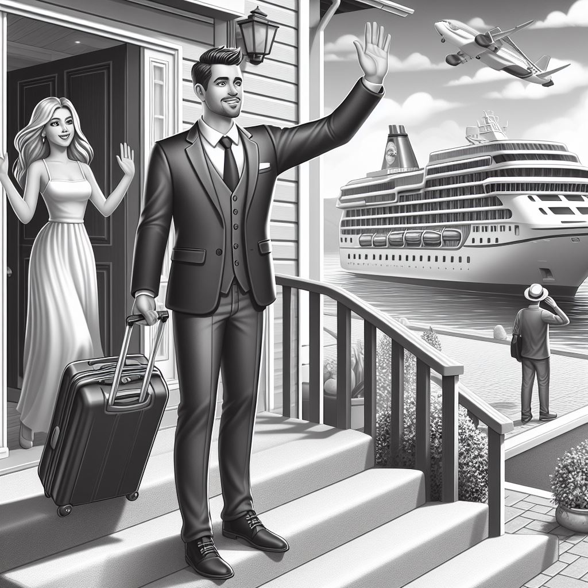





---

Your partner has an amazing job. They love what they do and they get to travel. How hard is it to be supportive when you are the one left home with all the daily tasks and they are enjoying lunches, dinners, parties, beaches, golfing, etc?

## Tips to cope with being home alone:

* Get up before your kids. Gives you time to get things organized before the chaos begins.

* Hire a sitter or ask a family member for help. It might save your sanity, even if it's just going to the store by yourself.

* Start bedtime early. By the end of the day everyone can be grumpy and tired. Without your partner to help in the nightime routine, it can be very hard. 

* Start early, be patient and get those kids to bed so you can have some alone time.

* Make contact with mom or dad, whoever is gone. It will be helpful for everyone if you can keep them in the loop.

* EASY DINNER!! Yes please. You dont need the stress of having to deal with everything alone and making a complicated dinner. Keep it easy, order out if possible, mac and cheese.

## Protect your relationship:

* Discuss things beforehand. How long will they be gone? What will they be doing? What are the expectations of communicating while apart? Are there expectations of things to get done? 

* Develop rituals while apart. “Landed” 

Talk daily. You need that time to connect and discuss what's happening on both sides. 

* Take time to have some intimate time before their trip and right after. 

Realize it's not a fairy tale. It's easy to feel like your traveling partner is seeing and doing amazing things during their work trips. It’s not all fun and games. A work trip is not a vacation…unless it is! Your partner is working, and they are tired from jet lag, sick of eating out, missing you and kids, they are lonely. 

* Be understanding. Don't let resentment build up.

## Take care of yourself:

* Socialize. Set up a playdate with friends if the kids are little. Go out to lunch with your bestie. Get out of the house.

* Look at your time alone as a positive. You don't have to share the TV. You can work on projects you have been putting off. Read a book and relax.

* Escape when they get home. Your partner might not want to manage the kids alone when they first get home, but it's good for them. Sleep in or get out alone.

* Think about the points your partner is racking up for a fun vacation together!!

# Links:

https://intermountainhealthcare.org/blogs/how-to-cope-when-your-partner-travels-often-for-work

# Lemonade moment of the week: 

Darren was out of town so Paige was lonely, but the lemonade is she got a lot done around the house. Pantry, closet, office all clean. And…. had the tv all to herself, and didn't eat big meals.

# GenAI Images

 Podcast Transcript 

1

All right. On today's episode.

Why do you go on cruiseswithout me, Darren?

Have fun on your work cruise.

I thought it was Have fun on your. Work.

Without me.

Okay, let's try it again.

Like what I said.

But I.

To make it.

Hello, This is. Darren, and this is Page.

And this is.

Where the lemonade where we talk about.

What happenswhen life through you, lemons.

You make some lemonade.

Maybe some weeks. It's lemons.

Yes. And weeds.

It's just lemons.

Yeah.

On today's episode.

Have fun on your work cruise without me.

Thanks, honey.

All right.

Recently, we had a big sales kickoff.

It's the first time we've had a wholesales team together in seven years,and they decided to save moneyand take everyone on a cruise.

So when you say we and they,you mean your work?

My work at Intel?

Yes. Not.

Not Blue Door productions or blue doormedia.

That brings you. Where's the lemonade?

Yes. So your.

Work. My work took you on a cruise.

Took me on a cruise.

To the Bahamas. To the Bahamas?

You don't like cruises?

I've only been on one.

I need to try it again.

It was,you know, people called a boondoggle,but it saved us about 40%.

And all of our salespeople who came.

And it was interestingbecause we were stuck on a cruise.

People had to go to training sessions.

There wasn't anything elseto do on the cruise.

Everything was shut off.

So I thought it was actuallypretty genius.

But the optics not great.and when you land well,when you were like at port in the Bahamas,you had to go sit on the beach.

Do you lookdoes it look like I said, on the beach?

But, I mean, they were giving youtime to do that.

Yeah, we had three or 4 hours.

But now Nassau.

And Nassau, it was.

And it was at a private, private island.a private island. Private island?

Yeah, it was. It was a lot of fun.

And it was good to be with all mycolleagues that I haven't seen in years.

So that was kind of fun.

But how did you feel that timewhen I'm off, you know.

On a cruise. On a cruise without me?

Yeah.

It's. You don't. Like cruise.

I've only been on one.

And now that I have my relief band,maybe I would be maybe.

Like is.

No, I give you a hard timeabout going on the cruise.

Yeah, you do.

But does it?

I mean, would I like to go gone with you?

Of course.

Of course.

You know, if you're going togo to a beach, I want to go with you.

Of course.

But am I jealous or am I.

Was I upset? No, of course not.

Are you sure? Yeah.

Are you positive? I'm positive. All right.

I do know that some of my coworkers,their spouses were upset.

Upset? Like, upset, Upset.

You know that I wasn't upset.

I know you weren't upset.

I wasn't. Upset.

I can imagine where that could bea natural feeling, right?on a cruise.

Well, one of my friends.

We're not going to mention her name.

She was like she very much in place.

She was like,

Wait, he's going on a cruise with you?

And she it was very funnythat what she was implying. Likeshe was implying thatthat would not be a good placefor them to have a,you know, meetingsto have to have meetings.

She was just like,great, people are drinkingand people are in their swimsuits and,you know, without their spouses,this doesn't seem like a good idea.

So I think she was a little nervousfor me.

Are you?

I have to say, there wasthere was like in every salesconvention, there was a lot of alcohol.

I didn't see a lot of people inthe swimming pools and things like that.

Well, because it was a work worked cruise,like the optics of you'resupposed to be in trainingand Look at the.

Pool. That would not be great.

I did walk in between different sessionsa while they were going on because Iwas a coach for different sessions.

Right?

And I walked across the whole shipto get to the other side and I saw no one.

No. So everyone was.

Yeah, but I can see the optics of it.

And I understand what our friend.

What our friend.

Well, and I she's more your friendthan my friend now because, I mean.

She's like what's

Darren doing on that. Yeah,

I can see howif you are in a relationship,you know, marriages go like this, right?

They go through their ups and downs.

I mean, if anyone tells you differently,

I think they're fibbing to youbecause you do.

You have times where you're like, Yeah.

I'm so in. Love and timeswhere you're like,you don't really want tolook at you right now.

So if you're going through a time whereyou're having one of those low points,

I, I can see where if you'resending your spouse off on a cruiseand if you especially if your spousedrinks, luckily we don't drink.

So I don't have that worry.

Do you?

I mean, like I can see. How I can totally.

See the nervousness like, okay, well,you know, just make sure.

And we always try and do this.

Send your spouse off happy. Yes.

Do not have anargument before your spouse leaves town.

So you don't don'tdon't try to change something.

All right.

So there's some there's some really goodyou actually found some information on.

So I was like, am I going to be ableto find Urkel on like,what to dowhen your partner's out of town?

And I did find an article.

So it's I like this articlebecause I don't agree with a lot of it,and a lot of it doesn't apply to us.

And we will talk about that.

But, you know, so yeah, so this is whatthis article you know, this expertpsychologist, marriage therapist,was giving adviceon how to handle your spouse traveling.

And like I said, some of it

I agree with some some I don't.

I think it's interesting because we'retalking about my business trip.

But you go you've been on girls trips.

Yeah.

In fact, you were saying the other daywhen we were talking about being gone,you know how much we've been gonethis this half of the year.

You were like, I think you've been gonemore than I have, which isn't true.

I think I was on two trips without you.

Yeah, that's. Right. Yeah.

And you trips without you. But.

But they were fun trips.

They were really fun trips.

Yes. All the trips you go on.

Not that. Fun.

I take a red eye out sometimes.

I don't want to sleep in a hoteland I come home.

Yes, I was at Disneyland.

I was getting massages,you know, I was living the life.

So I think this applies to both.

Let's just say.

Yeah. Yeah.

Okay.

Here are some tips to copewith being home alone.

Yes. Being the one that's home alone.

Being the one at home alone. Yep.

All right.

What's the first one?

Now, I don't agree with this.

So this one isit said, Get up before your kids.

Give yourself time to get organizedbefore chaos begins.

I do that anyway.

Now, if I have little kids,

I mean, all of you need to also be awarewe have only right nowwe have three kids at homebecause our collegedaughter is home for the summer,but we have a junior and a senior.

They are extremely capableof getting themselves up.

And are you sure?

Yes. Well,sometimes they don't exactly wake up.

And you wake them up? Yes, I wake them up.

But I can see if you have little kidsthat you're dealing with.

You want some time alone?

Yeah. They're kind of just like,hey, what's his day going to look like?

You know what I mean? Like.

Especially if you're the night frame,if you're not the primary caregiver.

Yeah.

And you're now taking the responsibilityof everything.

Right? Right.

Where before you split it and you're goingto need a little extra time to,you know, get. Ready for the day. Yeah.

So I do like that. Right.

And when you're gone,

I do actually get up and

I make sure that Sam is awakebecause sometimes he has a hard time.

So I do get up, I go,

I wake him up and I go back to bed.

Yeah.

So, I mean, that boy,we could drop off the top of the roof.

Like, seriously?

All right, next one, hire a sitter or aska family member to help.

Yes, I definitely agree with this one.

Now, like I said,we are not at that point anymore.

But we have been is absolutely.

And it says, you know,this might save your sanity.

Do you I mean, like when you don't haveand this is actually for single parentsto write,like if you're just the single parentand you're just solo all the time,you need a break.

You need a break.

Sometimes there's no one there to like,you know, say, Hey,

I'm having a really bad time.

I need you to sit in my room.

I need a timeout for 30 minutes right?

So, all right.

So I think that's a good one.

Yeah. So far, it all looks good.

All right, start bedtime early.

Yeah. Once again.

This is if you have little kids. Yes.

I don't think that I know. I.

I like to start bedtime early. If.

If you're gone,the voice can do whatever they want.

I'm going to my. Our junior and senior.

We actually usually go to bedbefore they do.

As we absolutely do.

We're like, Well, goodnight.

We're going to bed.

We don't know what time.

I think it's funnybecause when I'm traveling, I stay up latebecause I'm working.

I don't feel I feel likeif I'm away from family, I need to work.

So in my hotel room,after we've done dinner or whatever,

I go back and I get a bunch of work doneand then I typically follow my laptop.

Well, typically you're on the East Coast,so it's 3 hours later anyway.

That is so.

Do you know what I mean? Yeah.

So yeah, yeah.

It says,you know, give yourself plenty of time.

So it's not like this crunch time.

It's just, hey,let's get through our bathtime routine.

Let's get through, you know, story time.

Let's have a nice slow pace to it.

Calm things down.

Yes, calm things down.

So I actually really like that, right?

It's just like,give yourself extra time for bedtime and,you know, get themto bed maybe a little earlier than normal,just so you can have some peace and quietafter they go to bed.

No, I make sense.

All right.

Next one, make contact with mom or dad.

Who's mom or dad or whoever's gone iswhat you're saying to your spouse, right?

Okay.

So make contact with your spouse.

Make contact with.

David. Yep.absolutely.

And it says that if you have little kids,you know, include them on the conversationlike, hey, here's Mommy,hey, here's Daddy.

And it makes everybody feela little more in the loop included.

Now, I had spotty coveragewhen I was on the cruise. So,yes, it was it was kind of weird becausewe could only talk maybe once a day.

It was so weird, yet it was so weirdbecause when you're out of town.

I normally will text you.

We usually talk in the morninglike you call me in the morning and,hey, you know, I just woke up andand then you probably call me like,

I have a break at lunchand you call me for a few minutesand then you call me after your meetings,and then you call me,you know, before you go to bedand we text.

I think this wasa dependency problem. Yeah.

Well, this was weird becausethere was not hardly any texting.

There was hard.

I mean, you call old maybe once a dayat night, like, it was so weird.

It wasit was so packed full of stuff to do.

And thendid the connect.

Connectivity was not right either.

So I started wonderingabout what my friend had said.

Yeah, thank you, friend.

What's Darren doing?

Why isn't he calling me?

Why isn't he texting?

And it did work one timewhen David called meand told me that there wasa little accident in the parking lot.

Yes, I'm glad that that workedbecause I wasn't available to take a call,so I'm glad that.

His mom wasn't either.

So I'm glad that he was ableto get in touch with you.

Yeah. Calmed everything down.

It worked out well. Yeah.

So try and talk every day.

And if you have little kids,try to include them in the conversationlike that. All right, easy. Dinner.

Okay.

Now, this 100 people. 100.

Do an easy dinner. 100%.

Yes. Do not do something complicated.

I mean, it is funny when you leave town.

I already know.

I can see the fast food bill goes.

No, no.

That last time we only ate out one timeand then I just.

I don't even like big meals, honestly.

And you know that about.

I know. So you said before you left you.

Would you like meto make you a bunch of food before I go?

And I'm like, That's so funny.

That's so. Sweet. Well,because it's so sweet.

When I was younger with my first wife,if she was leaving town,she left meals for me to prepare.

Just like me. Yeah.

I leave a list of all of the restaurantsin the area for Jared to go to.

No, I would not do that.

No, you would?

No, no, I would not, but.

Well, because I enjoy cooking.

So. Yeah, for me now.

Yes, That's a nice break. Yes.

But what this is sayingis don't do anything complicated.

Like that's the last thing you need.

At the end of the day, if you've hada long day with the kids by yourself,at the end of the day,do not now add some complicated dinner.

Like keep it simple right?

Like mac and cheese, hot.

You know, whatever.

You don't have to go out.

But keep it easy.

All right?

The next section is protectingyour relationship.

So we discuss things beforehand. What?

You know, like if I'm on a trip,this is my itinerary.

This is when I'm not going to be ableto communicate with youbecause I'm with a customeror I'm at a conference. Yes.

Or I'm in a placewhere I don't have cell coverage.

Yes. We communicate those things.

Right, So that you're not sitting theregoing, he hasn't answeredmy text in 4 hoursor she hasn't answered my phone call.

What are they doing?

So try and be very specificabout your day, like, hey,

I'm going to be in a conference.

What if there is an emergency?

I mean, we haven't really discussed that.

What if there is emergency?

I'm in a place where I can't get service,where you can't get a hold of me.

You know what?

This actually used to be our life beforecell phones.

Yeah, it's true. So.

But there wasn't.

There was one timewhere this actually happened,and you wanted to call my coworker.

Yeah.

Don't you remember?

You want to call him and say what?

I haven't heard from Darren.yes, Yes, I do remember that.

I had not heard from you all day.

Yeah, I was worriedand I was just about to call your coand your phone had dotyou took your. Yeah.

You were at like a conferenceand then your phone diedand you were then out for the next,like four or 5 hours with a dead phone.

And Yeah. I was not happy.

You were not happy.

So maybe having, having a alternatecommunication plan or a coworkerthat you know that they're with. Yes.

You could callthat. Would actually be great.

But yeah, but just be clear about whatyour plans are for the day so thatyou have those expectations of how,how much you're going to communicate.

Yeah. No, I like that. Yeah.

One thing we always do, even if we'retraveling together, we always text landedin. So yeah, develop develop ritualsabout your trips when you're apart.

And so you always,you always text me like through securityand then you text me landedyou are taking off.

And then, you know, if I, if I text youlanded, I'm going to call you soon, right?

Yep. As I walk to my rental caror whatever the case may be.

So I guess those are our rituals.

I don't know, really.

I mean, I guess if you have little kids,your rituals could be like, I'm going to.

Read a. Story.

Yes, Sally, Tonight. Exactly.

So, I mean, yeah.

All right. Talk daily.

We talked about. That.

We talked about that.

Take time to have some intimate timebefore and right after. Yes.

I said when I said, send your spouse offhappy.

Send your spouse off happy.

All right.

So that intimate time, time alone,it's important.

It's important.

And when they get back, you know,

I mean, don't have a headache.

It's important.

I know when we get back inlike ten or 11:00 at night, I.

Pretend to be asleep.

Yeah, exactly.

All right, This one, this is interesting.

Realize it's not a fairy tale.

What does this mean?

So I can see how, like,you were just on a cruise?

So. So you're.it was so great.

He's on this cruise. He'slaying by the pool.

He's having, you know, his virginpina coladas all day and wearing,you know, leis and you know what I mean?

Like, you're seeming like.

When you go on your trips.

Yes, exactly.

Yes. My tripsare the fairy tale years for not No.

But you.

I mean, like you're the one at homeand you're just seeing the funand you're like, great.

But what you don't realize isyou are on a workshop.

You were working 12 hours a day.

You know what I mean? Like. Well,what if it's not work?

What if it's a guy's weekend?

Well, then you just have to suck it up.

Suck,suck it up and go.

They're having fun.

And because they're having fun,they're going to come back homeand integrate space.

Great space.

Yeah, I like.

But it says don't want resentmentbuild up.

Like if you're starting to be like,listen, every trip you'reyou're having steak dinners every nightand I'm at home having mac and cheese,like how youhow can you work through that?

I set that steak aside for you.

But do you

I mean, like, say, you know what?

Hey, why don't justyou're going to be gone for five days.

One of those days,

I'm going to take the kidsand we're going to have a nice mealor something like that.no, no.

I just don't want the resentmentbuild up about things like that.

Okay.

All right.

Next, big categories.

Take care of yourself.

First one, socialize.

Don't miss out on your friends. Yes.

So the person at home.

Yes. Take time.

Make a plate out with your friends. Right.

If you have little kids,go to the park, whatever.

And if you have older kids, maybe,you know, go out to lunch.

Go out to dinner.

Just have a little bit, getout of the house and have some some fun.

All right.

This last time, this one's interesting.

The next one,

Look at the time by yourself as positive.

Yeah.

You had a hard time with thisbecause there were no kids around either.

Yes, the kids were not around.

Sam was actually housesittingfor some house and dog sitting.

And so I was.

I was home alone all a lot like a lot.

A lot like for four days.

But what I'm saying in that 44.

No, it was actuallyyou were gone for six days.

Yeah. But Sam was the one gone for four.

But I mean he was at work, you know,

I mean he went to schooland he was at work, like he really wasn'taround very much. So,you know, Ilook at it as a positive.

So, yeah, you have timeat first I didn't actually.

At first I'm excited.

Like the first two days I'm like,

I'll get to watch whatever I want.

You get to watch what happened.

I know you like it.

So it's just this mindset, right? Yeah.

And I'm, you know, I get to just,you know, wander around the house doingwhatever I want, which I can do that, too.

But I said it's a mindset.

But, you know, you work on projectsyou've been putting off, read a book.

It's just saying, you know, look at itas a positive instead of I'm home alone.

Yeah, no, I like that. Yeah.

So what happenedlater on in the week for you though?

I get, I get lonely.

I do, I get mad. I'm glad I. Do.

I do.

Especially when, like,we you and I were barely communicatingand it was just like, this is so weird.

I'm lonely.

So I actually did a lot of thingswith friends because I was lonely.

So I was out and about a lot.

Okay.

Escape went to get escape.

Went to get home with escape.

When they get home. escapewhen they get home.gosh. So I.

I don't agree with this.

So this is saying,

I see what you're saying.

As soon as your partner gets homefrom their trip.

Go out and do something.

It says by yourself.

Like, like I'm done.

Your return. Yes.

That is what this article said. Might.

I think we both disagree with that.

Like as soon as they walk inand you're like,

I've just had five days with the kids.

I'm out.

I'm going out with some friends,or I'm just going to go do groceryshopping by myself, Whatever it is,

I thinkit's better to spendthe day or evening together and then maybethe next day like because when youwhen you travel, you're exhausted.

When you get home, the last thing you wantto do is be like, It's all one.

It's all you. Yeah.

Here's here's the kid.

I haven't used a diaper for 5 hours. Yep.

So I disagree with that.

Now it's just like you sleep in. Sure.

The next day say, Hey, is it, you know,can I sleep in?

Can you get up with the kids? Of course.

But as soon as you walk in the door.

No, I don't.

I don't think that's a good idea.

Okay, Now I like that.

All right. Next one.

Think of all the great I like this one.

Think of all the points, travel pointsyour partner's getting onon airlines or hotel stays. Yeah.

So this is another positive spin.

All right, I like the positives, right?

Because, hey, sometimesthat'll don't pay for a week vacation.

That's right.

It's racking up pointsfor a fun vacation to do later.

All right. I like that.

All right.

Our moment, the week.

It has to do with exactly what we werejust talking.

The lemon was I was out of town.

You were out of town?

Yes. I teach you. To me,that's eliminated.

And my wife misses mewhen I'm out of town.

That is 100% lemonade. And.

I like this.

And the lemonade is alsothat I got a lot done around the house.

I cleaned out the pantry.

We can actually walk into our food pantry,

You know.

It's amazing. We'll see how long it lasts.

It is amazing.

I'm like everybody better keep itthis way.

I have you cleaned. You cleaned my.

Office,

I clean the office, I clean closets.

So, no, I got a lot of things.

I should I should state my office.

No, not my office.

It's the family office becauseeveryone dumps their stuff in here.

Yeah, It's like someone's coming over.

Everyone put everything into the office.

So I got it all nice and organized. Yes,it looks very great.

Yeah. And I had the TV all to myself,and I didn't have to eat big meals.

But, yeah, that's a plus.

For you, because I seriously, I'm.

I prefer to have, like,a piece of toast for dinner.

So when you.

I know you don't get it, and so you makebig meals and then I, and I eat them.

I eat more of them.

As you do.

So I got to eat on my timeline and my.

Which you don't get to do when we travel.

I know.

Actually,that's one of the drawbacks of traveling.

Now I have to eat when.

Everyone else. Is.

If you like today's episode.

Give us five stars on iTunes, Spotify,

Google.

And head to Facebook and like us.

And check out our blogat Where's Eliminate Talk.

Where you can leavequestions and comments.

And but most of all.

Go out,make some lemonade. You betcha, baby.

