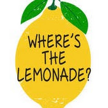
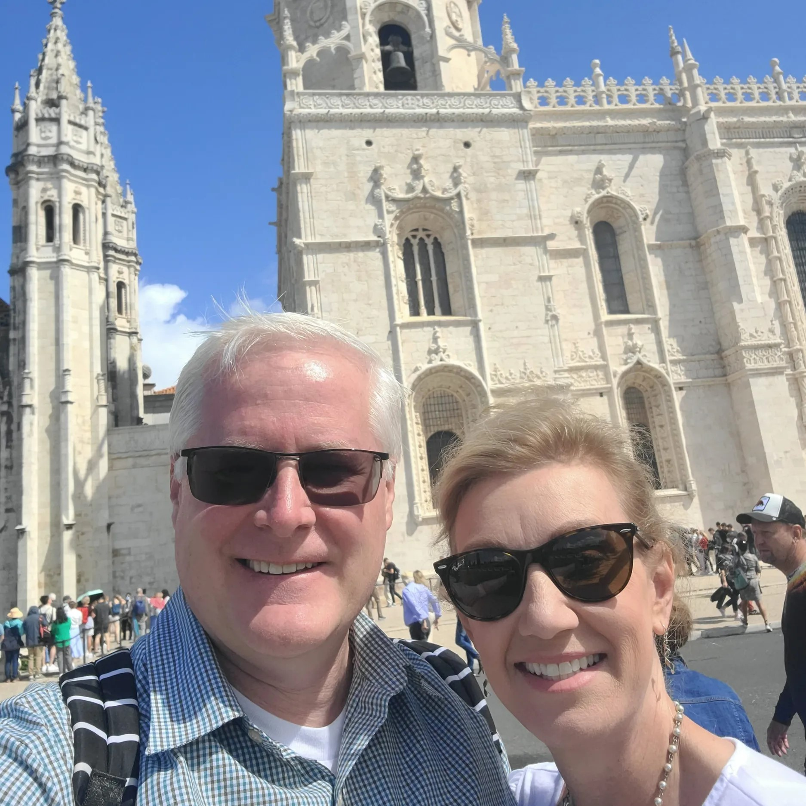
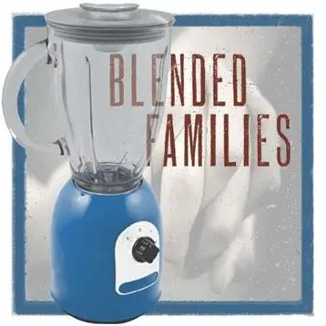
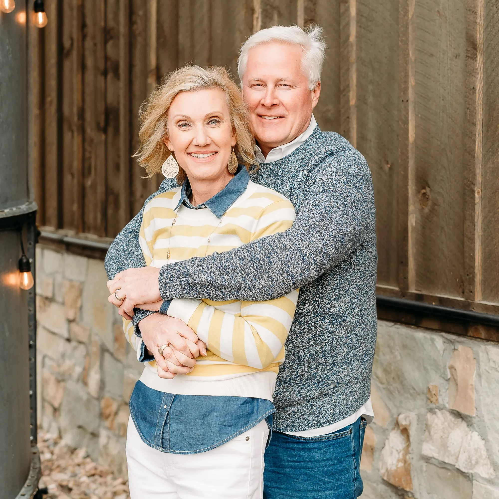
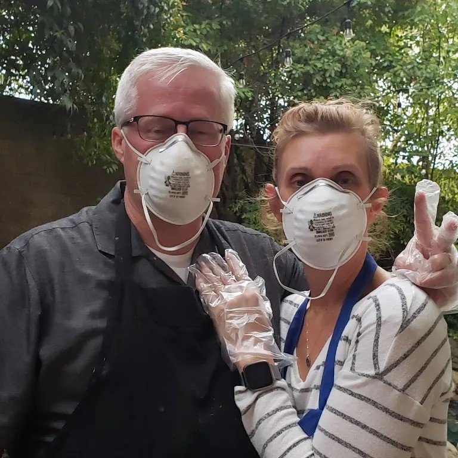

  

<h1>Where's The Lemonade</h1>
<h3> Finding lemonade when life gives you lemons.</h3>
  

  

    
  

&nbsp;

They say when life gives you lemons you should make lemonade. Making lemonade is not always easy or possible. For us, we found ourselves single in our 40's with kids at home and starting life over again. Luckily we found each other, online no doubt. When we began blending families, schedules, traditions, and laundry, we discovered lots of lemons. Our podcast is a reflection on how we get through the hard times and enjoy the good times on our new journey together, all with ten kids in tow. Sometimes when life gives you lemons, you make lemon squares. Lemonade might come later.

  

    
    Travel
  

  

    
    Blending Families
  

  

    
    Relationships
  

  

    
    Current Events
  




<h1>Episodes</h1>



    
    <a href="{{ page.url }}">{{ page.title }}</a> 
    {{ page.summary }}




